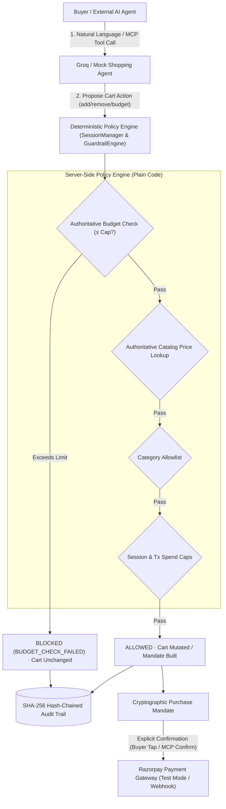

# Kaapi Copilot — AI Growth & Agentic Commerce

**Track 01: Agentic Storefront for Kaapi Roasters (D2C Filter Coffee)**

Kaapi Copilot transforms a D2C filter-coffee brand's storefront into an AI-agent-operated, guardrail-governed, transactable commerce engine. It supports both **Human Buyers (Journey A)** via conversational AI chat and **Autonomous AI Agents (Journey B)** via an MCP-compatible tool surface.

---

## 🛡️ Core Safety & Guardrail Architecture

The fundamental architectural invariant is: **The LLM is NEVER trusted with money, arithmetic, or cart totals.**



---

## 🚀 Key Features

### 1. Hard Server-Side Budget Enforcement
- When a buyer specifies a limit (*"Don't spend more than ₹500"*), the budget is stored authoritatively in session state outside the LLM.
- Every `add_to_cart` call is gated by server-side verification: `current_cart_total + catalog_price <= budget_limit`.
- Over-budget additions are rejected immediately with structured feedback (`ITEM_EXCEEDS_BUDGET`), preserving the cart untouched and logging `BUDGET_CHECK_FAILED` in the audit trail.

### 2. Full Cart Mutation & Contextual Intent
- **Real `remove_from_cart`**: Supports removing items via natural language (*"remove the steel filter"*, *"discard subscription from cart"*) or UI button.
- **Contextual intent disambiguation**: If a subscription is in the cart, *"discard/remove subscription"* removes it from the cart without erroneously triggering subscription-cancellation workflows.
- **Bulk budget pruning**: *"Remove everything above my limit"* selectively drops only items exceeding the budget.

### 3. Conversation State Machine
Session progression is governed by an explicit state machine:
`DISCOVERY` → `CART_BUILDING` → `CHECKOUT_REQUESTED` → `MANDATE_PENDING` → `PAYMENT_PENDING` → `PAYMENT_SUCCESS` / `PAYMENT_FAILED`
When the agent asks *"Would you like to checkout?"* and the buyer says *"yes"*, the agent cleanly initiates checkout rather than restarting product discovery.

### 4. 5-Stage Mandate Policy Engine
Before any payment call can occur, `MandateEngine.build_mandate()` executes 5 deterministic checks:
1. `cart_not_empty`: Cart must contain at least one item.
2. `price_matches_catalog`: Line prices are re-read from the catalog; LLM-invented prices are rejected.
3. `category_allowlist`: All SKUs must belong to approved merchant categories.
4. `transaction_spend_cap` & `session_spend_cap`: Global bounds (₹3,000 / ₹10,000) prevent runaway spend.
5. `buyer_budget_check`: Total must not exceed the buyer's active session budget.

### 5. Dual Journey Architecture
- **Journey A (Conversational UI)**: Real-time chat with Groq (`openai/gpt-oss-120b` or mock), dynamic cart updates, spend-guardrail status banner, explainability decision log, and Razorpay checkout simulation.
- **Journey B (Autonomous MCP Tool Surface)**: Complete MCP API surface (`/api/mcp/*`) allowing external AI buyer agents to autonomously list products, manage carts, build mandates, and confirm payments without human intervention — fully constrained by the same backend guardrails.

---

## 🛠️ Tech Stack & Provider Abstraction

| Component | Technology / Provider |
|---|---|
| **Backend** | Python 3.11+, FastAPI, Uvicorn, Pydantic |
| **Agent Intelligence** | Groq Chat Completions API (`openai/gpt-oss-120b` tool calling) + `MockShoppingAgent` fallback |
| **Payments** | Razorpay Python SDK (Test Mode Payment Links & Webhooks) + `MockPaymentProvider` |
| **Audit & Integrity** | SQLite with WAL mode, SHA-256 Hash Chain |
| **Frontend** | Pure HTML5/CSS3/Vanilla JS (zero build dependencies, dark mode) |

---

## 🏃 Running Locally & Testing

```powershell
# Run the complete test suite (74 tests, 9 modules)
python -m pytest kaapi_copilot/test/ -v
```

| Test Module | Tests | Coverage Area |
|---|---|---|
| `test_analytics.py` | 11 | Orders paid, upsell attach rate, AOV lift metrics |
| `test_api_regressions.py` | 6 | API endpoint contracts, real-style webhook mapping |
| `test_budget_and_cart.py` | 25 | Hard budget enforcement, over-limit rejection, bulk pruning, remove-from-cart |
| `test_groq_prompt_injection_boundary.py` | 5 | Prompt injection resistance, LLM boundary isolation |
| `test_guardrails.py` | 7 | 5-stage mandate policy engine, spend caps, catalog price re-verification |
| `test_idempotency_and_injection.py` | 7 | Duplicate checkout prevention, idempotent webhooks, injection hardening |
| `test_lifecycle_regressions.py` | 4 | Full session lifecycle, payment failure recovery, cart hold |
| `test_reference_resolution.py` | 3 | Natural language item references, contextual intent disambiguation |
| `test_upsell.py` | 6 | Upsell suggestion, one-per-turn cap, budget-aware upsell gating |
| **Total** | **74** | **All passing ✅** |

---

## ⚠️ Known Limitations

Spend caps and cart state (`_session_spend_paise`, `_mcp_carts`) are held in an in-memory Python dict and are not persisted to SQLite. This is intentional for a single-process demo deployment — all guardrail arithmetic remains authoritative — but these structures would need to migrate into the existing SQLite store to stay correct across server restarts or when running multiple Uvicorn worker processes. Additionally, MCP routes (`/api/mcp/*`) accept `session_id` as a plain request field with no bearer-token or cookie-based ownership check; this is acceptable for a test-mode demo environment but a production deployment would require proper session authentication to prevent one agent from acting on another's cart or mandate.

---

## 🔗 Protocol Alignment

Kaapi Copilot's architecture is conceptually aligned with several emerging agentic-commerce protocols, though it does not formally implement any of them.

**Purchase Mandate / MandateEngine** is conceptually aligned with AP2's *mandate* concept: before any money moves, `MandateEngine.build_mandate()` produces an explicit, inspectable authorization object that captures the exact cart, verified prices, and all guardrail outcomes. Money only moves after this object exists and is separately confirmed — the same philosophy as AP2's model of an explicit, structured authorization step between intent and execution.

**Explicit buyer/MCP confirmation step** is conceptually aligned with NPCI UAP's *user-authorization pattern*: neither Journey A nor Journey B can trigger a payment without an affirmative confirmation action (a buyer tap on the UI, or an explicit `confirm_purchase` MCP tool call). The system is designed so that no payment path is reachable without that step.

**MCP tool surface (`/api/mcp/*`)** is conceptually aligned with agent-to-agent commerce protocols such as ACP and x402 in that it exposes the storefront as an agent-readable, tool-callable API rather than a human-only UI — enabling external AI buyer agents to discover products, manage carts, and initiate payments programmatically through a structured tool interface.

---

## ⚙️ Environment Variables

Copy `kaapi_copilot/backend/.env.example` to `kaapi_copilot/backend/.env`. Key variables:

```env
AGENT_MODE=groq                        # "groq" or "mock"
GROQ_API_KEY=gsk_...
GROQ_MODEL=llama-3.3-70b-versatile

PAYMENT_MODE=razorpay                  # "razorpay" or "mock"
RAZORPAY_KEY_ID=rzp_test_...
RAZORPAY_KEY_SECRET=...
RAZORPAY_WEBHOOK_SECRET=...

ALLOWED_ORIGINS=*                      # See note below
TRANSACTION_SPEND_CAP_PAISE=300000
SESSION_SPEND_CAP_PAISE=1000000
```

`ALLOWED_ORIGINS=*` is suitable for local development and demo use only — a production deployment should set this to the exact frontend origin (e.g. `https://your-frontend.example.com`) to restrict cross-origin access. Incoming Razorpay webhook payloads are HMAC-SHA256 verified via `verify_webhook_signature()` in `razorpay_provider.py` before any order state is trusted, using `hmac.compare_digest` for constant-time comparison to prevent timing attacks.
