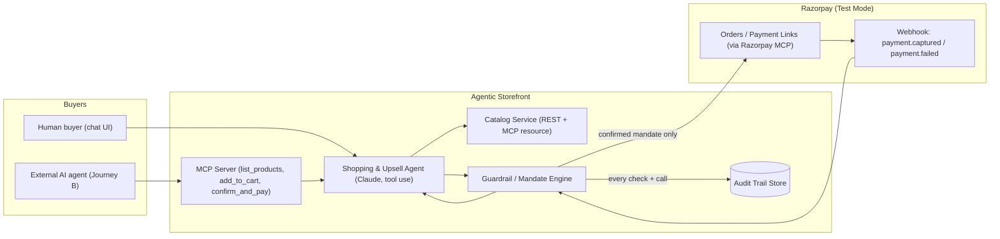

# Title
Kaapi Copilot AI Commerce Platform

# Turn 1
User:


You are a senior full-stack + AI engineer. Build a working prototype — call it **Kaapi Copilot** **[CONFIGURE: rename freely]** — that does two things at once:

1. **Grows a merchant's revenue** through an AI agent that runs discovery, recommendation, upselling, and checkout inside a conversation, instead of a static product-listing page.
2. **Makes that same merchant transactable by an external AI agent** — not just by a human clicking buttons — by exposing its catalog and checkout as agent-callable tools.

Every money-moving action must be **explainable, bounded, and gated**, backed by a visible **audit trail**, and the system must demonstrate **at least one realistic failure handled gracefully**, not just the happy path. That's the literal grading bar for this track — treat it as a hard requirement, not a nice-to-have.

## 1. Why this shape of project

Agent-to-agent commerce stopped being theoretical this year. In India, NPCI is building a Unified Agent Protocol (UAP) to register, verify, and authorise AI agents to transact over UPI within consent-based, per-merchant spending limits — an extension of UPI Circle's delegated-payments model, still awaiting RBI approval. Globally, three protocols are racing to standardise the same problem from different angles: OpenAI + Stripe's Agentic Commerce Protocol (ACP) defines how an agent runs a checkout session against a merchant it doesn't own, while the merchant stays merchant of record; Google's Agent Payments Protocol (AP2) proves user authorisation through a chain of cryptographically signed "mandates" — Intent → Cart → Payment; and Coinbase's x402 revives the dormant HTTP 402 status code so an agent can pay per API call in stablecoins with no login at all.

Razorpay is already live in this space: it ran the first agentic UPI payments on Claude with NPCI (Zomato, Swiggy, Zepto as initial partners), shipped an Agentic Payments product for in-app conversational checkout, and — most usefully for you — publishes an official open-source MCP server that turns its payment APIs into ready-made agent tools. Its own Agent Studio product for merchants is separately built on Anthropic's Claude Agent SDK.

None of that needs explaining to the people grading this. What it tells you is what a strong submission actually demonstrates: not "we called an LLM," but a bounded authorisation chain in front of every payment — the same shape as AP2's mandates — running on Razorpay's own real infrastructure.

## 2. The scenario you're building

Demo merchant: **Kaapi Roasters**, a small D2C filter-coffee brand. **[CONFIGURE — swap the theme if you like, keep the SKU shape: a few core products plus genuine upsell/cross-sell pairs, not a huge catalog.]**

Seed catalog:

| SKU | Item | Price (INR) | Upsell/cross-sell pair |
|---|---|---|---|
| kr-filter-500 | Filter Coffee Powder, 500g | 450 | → kr-steel-filter |
| kr-arabica-250 | Single-Origin Arabica Beans, 250g | 380 | → kr-dripper |
| kr-steel-filter | South Indian Steel Filter Set | 650 | — |
| kr-dripper | Pour-over Dripper | 900 | — |
| kr-subscription | Monthly Coffee Subscription (2 bags) | 700/mo | — |
| kr-frother | Milk Frother | 550 | — |
| kr-filters-100 | Reusable Filter Papers, pack of 100 | 250 | → kr-dripper |

Build two journeys, in this order:

**Journey A — human buyer, conversational checkout (build first).**
A buyer opens a chat and says what they want in plain language ("I want good filter coffee, nothing fancy"). The agent looks up the catalog, recommends one item, and — only because the catalog marks it as a real upsell pair, never a guess — proposes exactly one relevant add-on with a plain-language reason. The buyer accepts, declines, or asks a follow-up. When ready, the agent assembles a **Purchase Mandate** (Section 5), shows it as a clear order summary, and the buyer taps a single "Proceed to Pay" confirmation — mirroring Razorpay's real agentic-payments pattern of dropping the PIN/OTP redirect while keeping the human's final tap. Only after that tap does the agent call Razorpay.

**Journey B — external AI buyer, agent-to-agent (build once A works; this is what makes the merchant "sellable to AI buyers").**
Expose the identical catalog + cart + checkout as MCP tools (`list_products`, `get_product`, `add_to_cart`, `get_cart`, `create_checkout_mandate`, `confirm_and_pay`). Point a second AI agent — a separate Claude session, Claude Desktop with a custom MCP connection, or a second instance of your own agent role-playing "the buyer's agent" — at this server, give it a goal and a budget ("buy filter coffee for a first-timer, budget ₹1,200"), and let it complete a purchase with no human typing in the loop. The same guardrail engine from Journey A must gate this path too. This is your strongest demo moment: a live, literal answer to "make the merchant transactable by an AI buyer end to end."

## 3. System architecture



Six components, each with one job:

1. **Catalog Service** — the product data above, served two ways: a REST endpoint for your own UI, and an MCP resource/tool pair (`list_products`, `get_product`) for external agents. Every product carries `upsell_pairs` and `category` so recommendations are data-driven, never improvised by the LLM.
2. **Shopping & Upsell Agent** — the conversational brain. Calls Claude via the Messages API with tool use; tools are `search_catalog`, `add_to_cart`, `remove_from_cart`, `view_cart`, `propose_upsell`. System prompt caps it to **at most one** upsell suggestion per turn and forbids inventing a product or price not returned by a tool call.
3. **Guardrail / Mandate Engine** — the module that actually earns the "bounded and gated" line in the brief. Plain code, not a prompt instruction: the LLM proposes a cart, this layer decides whether it's allowed to become a payment. Section 5.
4. **Razorpay Integration Layer** — wraps Razorpay's official MCP server (or its REST API directly) for order creation, payment links, capture, and refunds. Section 6.
5. **Audit Trail Store** — an append-only log of every tool call, every guardrail check (pass/fail + reason), every mandate, every Razorpay call and webhook event, timestamped. Render it as a live-scrolling panel in the UI — you will point at this panel in your demo.
6. **Merchant Dashboard** *(stretch)* — revenue and upsell-attach-rate view. Section 8.

## 4. Tech stack (default, not a requirement — swap freely)

- **App:** Next.js (TypeScript), App Router — one deployable project with API routes for the backend and React for the chat/dashboard UI. FastAPI (Python) is an equally fine alternative if that's your stronger language; Razorpay has official SDKs for both.
- **Agent brain:** Claude via the Anthropic Messages API with tool use. Check `docs.claude.com` for the current model lineup and pick a Sonnet-tier model for the cost/quality balance. You don't need a full coding-agent harness here — the value in this project is a *tightly controlled* tool loop, which the plain Messages API gives you directly.
- **Payments:** Razorpay's official MCP server (primary) or the official `razorpay` SDK (Node/Python) as a fallback.
- **Storage:** SQLite (via Prisma or `better-sqlite3`, or SQLAlchemy in Python) is enough — you need durability for the audit log across a demo, not a production database.
- **UI:** Keep it to two screens — the buyer-facing chat + cart + "Proceed to Pay," and an internal "Ops" screen showing the live audit trail and (if built) the dashboard.

## 5. The guardrail contract — the actual hard bar

Before the agent can call anything that touches money, it must construct a **Purchase Mandate**:

```json
{
  "mandate_id": "mnd_8f2a...",
  "session_id": "sess_193c...",
  "created_at": "2026-08-26T10:15:00Z",
  "buyer_ref": "buyer_or_agent_id",
  "items": [
    { "sku": "kr-filter-500", "name": "Filter Coffee Powder 500g", "qty": 1, "unit_price_paise": 45000 },
    { "sku": "kr-steel-filter", "name": "South Indian Steel Filter Set", "qty": 1, "unit_price_paise": 65000 }
  ],
  "currency": "INR",
  "total_paise": 110000,
  "rationale": "Buyer asked for filter coffee; steel filter offered as the catalog-defined first-time-buyer upsell pair, accepted by buyer.",
  "policy_checks": [
    { "rule": "session_spend_cap", "limit_paise": 500000, "status": "pass" },
    { "rule": "category_allowlist", "status": "pass" },
    { "rule": "price_matches_catalog", "status": "pass" }
  ],
  "confirmation": { "method": "buyer_tap", "status": "pending" }
}
```

Hard constraints — implement these as code the LLM cannot talk its way around:

- **Every line-item price is re-read from the catalog at mandate-build time**, never taken from the LLM's own text. If the agent's stated price and the catalog price disagree, block and log it — don't silently correct it.
- **A numeric spend cap exists per session and per transaction** (config, not vibes), checked before any Razorpay call. A breach never becomes a soft warning the agent can talk its way past — it's a hard stop that produces a `blocked` mandate.
- **Every mandate is written to the audit log before the Razorpay call is made**, not after. If the process crashes between those two steps, the audit trail should already show the attempt.
- **In Journey A**, `confirmation.status` only flips to `confirmed` on an explicit buyer action (a real tap/click/message), never inferred from conversational tone.
- **In Journey B**, the buyer's tap is replaced by an explicit `confirm_and_pay` MCP tool call carrying the mandate ID — so "explicit confirmation" still holds with no human present.
- **Only a `confirmed` mandate may trigger `create_order` / `create_payment_link`.** There is no code path from raw LLM output straight to a Razorpay call.

## 6. Razorpay integration (test mode)

**Setup:** Razorpay Dashboard → toggle to **Test Mode** (top menu) → Settings → API Keys → generate a Test Key ID + Secret. No real money moves in test mode, at any amount.

**Recommended path:** wire your agent's payment tools to **Razorpay's official MCP server** (`github.com/razorpay/razorpay-mcp-server`, MIT-licensed) rather than hand-rolling REST calls. Use the hosted remote server (`https://mcp.razorpay.com/mcp`, authenticated with `base64(key:secret)` as a merchant token) so there's zero infrastructure to run. This mirrors the MCP-based integration pattern behind Razorpay's own agentic-payments pilots — using it is a direct signal that you understand their stack, not just the concept.

Tools you actually need from it: `create_order`, `create_payment_link` (or `create_payment_link_upi` for a UPI-first flow), `fetch_payment_link`, `capture_payment`, `fetch_payment`, `create_refund`. Don't wire up the ones you won't use (settlements, payouts, QR codes) — keep the toolset scoped to what the guardrail engine actually calls.

**Money flow:** `create_order` (amount in paise, currency `INR`) → `create_payment_link_upi` attached to that order → buyer/agent receives a payable link → Razorpay's test-mode mock page (or UPI simulator) handles the "payment" → Razorpay calls your webhook.

**Webhook endpoint** (`/api/webhooks/razorpay`): verify the `X-Razorpay-Signature` header via HMAC-SHA256 against your webhook secret **before trusting the payload** — this is a real security requirement, not hackathon theatre, and it's an easy, credible line for your pitch. Update order state only from a verified webhook, never from a client-side redirect alone.

**Test instruments for your demo:** UPI ID `success@razorpay` simulates an instant successful payment; `failure@razorpay` simulates an instant decline. Use the failure one deliberately for Section 7. Card-based test flows have their own documented test card numbers if you'd rather demo cards.

**Remember the authorize → capture split:** an authorized-but-uncaptured payment isn't settled and auto-refunds after a window. Don't mark an order `paid` until you've either captured it or seen `payment.captured` on the webhook.

## 7. The one failure you must demo — don't skip this

Use the UPI-decline path — it's fully inside your control and doesn't depend on a flaky sandbox:

1. Buyer/agent confirms a mandate, checkout is created, and the payment is attempted with `failure@razorpay` instead of `success@razorpay`.
2. Razorpay sends `payment.failed` to your verified webhook.
3. Your order state machine moves the order to `payment_failed` — **never** `paid`, and **never** a duplicate order on retry.
4. The cart stays intact for a short window (e.g., 10 minutes) instead of being discarded.
5. The agent explains the failure in plain language ("Your payment didn't go through — it was declined. Want to try again, or pay a different way?") and offers a concrete next step.
6. Every step above — the failure event, the reason, the timestamp, the recovery offer — appears in the audit trail.

If time allows, add a second failure that's even more central to this specific track: a **guardrail rejection** (agent or buyer tries to check out above the session cap). Show the agent explaining the policy and offering to escalate, rather than silently blocking or silently allowing it.

## 8. Stretch goals, in priority order

1. **Journey B, actually working** (Section 2) — the single highest-impact stretch goal. A clip of an external AI agent autonomously shopping at your merchant is the most memorable 20 seconds of your pitch video.
2. **Hash-chain the audit log** — each entry includes a hash of the previous entry, so tampering would be visibly detectable. Small effort, directly reinforces "explainable... audit trail."
3. **Revenue dashboard** — baseline vs. agent-assisted average order value, upsell-attach rate (% of sessions where the proposed upsell was accepted), and successful vs. blocked vs. failed transaction counts. Gives your pitch a real number instead of just a demo.
4. **Campaign orchestrator** (the fourth example direction) — a small job that finds carts abandoned after a guardrail-safe window and sends one personalised nudge (a fresh payment link with a small, pre-approved discount). Structurally the same idea as Razorpay's own real Abandoned Cart Conversion Agent, so it reads as informed rather than invented.
5. Hinglish support in the chat agent, if that fits your demo audience.

## 9. Deliverables — match these exactly, this is what's graded

The ask is a public GitHub repo, a 5-minute pitch video, the architecture, and — if it shows signal — a panel interview. Optimise for a reviewer reading code, not a reviewer reading prose.

**README.md should include:**
- One-paragraph pitch: what it does, who it's for, the one number that shows revenue impact
- The architecture diagram from Section 3 (the Mermaid block renders directly on GitHub — keep it as-is)
- Setup: env vars needed (`RAZORPAY_KEY_ID`, `RAZORPAY_KEY_SECRET`, `RAZORPAY_WEBHOOK_SECRET`, `ANTHROPIC_API_KEY`), how to run locally, how to seed the catalog
- A "How the guardrails work" section — the section a technical judge reads first
- A short "known limitations" section — naming what you didn't finish is more credible than pretending it's complete

**5-minute pitch video, suggested pacing:**
- 0:00–0:30 — the problem and why now (one sentence each on UAP/ACP/AP2/x402 is plenty — don't over-explain protocols the judges built)
- 0:30–2:00 — Journey A end to end: discovery → upsell → mandate → confirm → real Razorpay test-mode payment succeeding
- 2:00–3:00 — the guardrail engine + audit trail, and the Section 7 failure, handled gracefully on camera
- 3:00–4:00 — Journey B, if built: an external AI agent transacting with no human in the loop
- 4:00–5:00 — the revenue number (if the dashboard is built) and what you'd build next with more time

## 10. Build order if you have about a week

1. Catalog service + seed data + basic chat UI wired to Claude with tool use — no payments yet.
2. Guardrail/Mandate Engine + audit log, tested against the mandate shape in Section 5.
3. Razorpay MCP integration for the happy path: order → payment link → webhook → paid.
4. The graceful-failure flow from Section 7, deliberately, on camera.
5. Journey B (MCP exposure) if time allows.
6. README, architecture diagram, dashboard polish, and record the pitch video **last** — after everything it shows actually works.


Tool: jupyter_start_server
```json
{"is_jupyter_server_running":false}
```

Tool: generate_markdown
```json
{"action":"append","cell_index":null,"markdown_content":"# Kaapi Copilot — Agentic Storefront for Kaapi Roasters\n\nA working prototype of a conversational, agent-to-agent-transactable D2C storefront:\n\n- **Journey A** — human buyer chats with a Claude-powered shopping agent that recommends products, proposes one catalog-defined upsell, builds a **Purchase Mandate**, and only calls Razorpay after an explicit buyer confirmation.\n- **Journey B** — the identical catalog/cart/checkout exposed as MCP-style tools so an external AI agent can shop and pay with no human in the loop.\n- A **Guardrail / Mandate Engine** gates every payment (spend caps, catalog price re-verification, explicit confirmation) and writes a **hash-chained audit trail** before any money call.\n- Razorpay (test mode) handles orders/payment links; a verified webhook drives the order state machine, including a deliberate **UPI decline failure** handled gracefully.\n\n## Build order (Section 10)\n1. Catalog service + seed data\n2. Guardrail / Mandate Engine + hash-chained audit log\n3. Razorpay integration (test mode): order → payment link → webhook → paid\n4. Graceful failure flow (UPI decline + guardrail rejection)\n5. Journey A conversational agent (Claude, tool use)\n6. Journey B — MCP tool exposure for an external AI buyer agent\n7. Dashboard + README\n\n## 1. Project setup — check environment\nVerify required secrets are available before wiring live integrations, and scaffold the project directory structure."}
```

Tool: append_markdown_cell
```json
{"status":"success","metadata":{"source":"# Kaapi Copilot — Agentic Storefront for Kaapi Roasters\n\nA working prototype of a conversational, agent-to-agent-transactable D2C storefront:\n\n- **Journey A** — human buyer chats with a Claude-powered shopping agent that recommends products, proposes one catalog-defined upsell, builds a **Purchase Mandate**, and only calls Razorpay after an explicit buyer confirmation.\n- **Journey B** — the identical catalog/cart/checkout exposed as MCP-style tools so an external AI agent can shop and pay with no human in the loop.\n- A **Guardrail / Mandate Engine** gates every payment (spend caps, catalog price re-verification, explicit confirmation) and writes a **hash-chained audit trail** before any money call.\n- Razorpay (test mode) handles orders/payment links; a verified webhook drives the order state machine, including a deliberate **UPI decline failure** handled gracefully.\n\n## Build order (Section 10)\n1. Catalog service + seed data\n2. Guardrail / Mandate Engine + hash-chained audit log\n3. Razorpay integration (test mode): order → payment link → webhook → paid\n4. Graceful failure flow (UPI decline + guardrail rejection)\n5. Journey A conversational agent (Claude, tool use)\n6. Journey B — MCP tool exposure for an external AI buyer agent\n7. Dashboard + README\n\n## 1. Project setup — check environment\nVerify required secrets are available before wiring live integrations, and scaffold the project directory structure.","cell_index":0,"notebook_path":"projects/Kaapi_Copilot_AI_Commerce_Platform-2026_08_26-03_33_20/main.ipynb","original_source":null,"link_tool_call_id":"tooluse_rJfiVCDC99UkMlYOqJ4FIv_annotation"}}
```

Tool: generate_code
```json
{"code":"import os\n\nrequired = [\"ANTHROPIC_API_KEY\", \"RAZORPAY_KEY_ID\", \"RAZORPAY_KEY_SECRET\", \"RAZORPAY_WEBHOOK_SECRET\"]\nstatus = {k: (\"set\" if os.environ.get(k) else \"missing\") for k in required}\nfor k, v in status.items():\n    print(f\"{k}: {v}\")\n\nfor d in [\"app\", \"app/services\", \"app/mcp\", \"outputs\"]:\n    os.makedirs(d, exist_ok=True)\n\nprint(\"\\nProject folders ready: app/, app/services/, app/mcp/, outputs/\")\n","action":"append","cell_index":null,"programing_language":"Python"}
```

Tool: append_code_cell
```json
"Kernel ID is empty. This should not happen, the Jupyter server might not be started yet. Please stop all steps related to generating or executing code and try again later.\nYou have to retry the code execution again whenever an error occurs.\nHowever, if the same error occurs for the 3rd time, you should stop retrying and announce the error to the user.\n"
```

Tool: append_code_cell
```json
"Kernel ID is empty. This should not happen, the Jupyter server might not be started yet. Please stop all steps related to generating or executing code and try again later.\nYou have to retry the code execution again whenever an error occurs.\nHowever, if the same error occurs for the 3rd time, you should stop retrying and announce the error to the user.\n"
```

Tool: append_code_cell
```json
"Kernel ID is empty. This should not happen, the Jupyter server might not be started yet. Please stop all steps related to generating or executing code and try again later.\nYou have to retry the code execution again whenever an error occurs.\nHowever, if the same error occurs for the 3rd time, you should stop retrying and announce the error to the user.\n"
```

Assistant:
The Jupyter kernel isn't available right now (the environment reports "Kernel ID is empty" — the server hasn't started). This has failed 3 times in a row, so per the retry policy I'm stopping here rather than continuing to hammer it.

**What's happened so far:**
- Added the project intro/architecture markdown cell to `main.ipynb` successfully.
- Attempted to add the first code cell (env var check + folder scaffold) — failed3× due to the notebook kernel not starting.

**What I need from you before continuing:**
1. Please try refreshing/reopening the notebook (`main.ipynb`) in this project, or give it a moment and let me know when you'd like me to retry — this usually means the Jupyter server session needs to (re)initialize.
2. While we wait, it'd help to confirm: do you already have `ANTHROPIC_API_KEY`, `RAZORPAY_KEY_ID`, `RAZORPAY_KEY_SECRET`, and `RAZORPAY_WEBHOOK_SECRET` set as environment variables/secrets in this workspace? If not, I can build the whole prototype in a **mock mode** (simulated Razorpay + a rule-based agent fallback) so the guardrail engine, audit trail, mandate flow, and both journeys are still fully demonstrable end-to-end without live keys — and you can drop in real keys later to flip it to live test-mode calls.

Let me know how you'd like to proceed (retry now, or confirm keys/mock-mode preference) and I'll pick straight back up at Step 1 of the build order.


# Turn 2
User:
Continue building the project without waiting for or requiring the Jupyter kernel.

The Jupyter kernel for main.ipynb has failed repeatedly with "Kernel ID is empty". Do NOT keep retrying kernel initialization.

Switch to file-based development mode:

1. Continue creating and editing all required project files directly.
2. Do not execute notebook cells.
3. Do not block the build because main.ipynb cannot currently run.
4. Create a complete MOCK MODE implementation so the entire prototype can run without external API credentials.
5. Use environment variables when real integrations are needed:

   * ANTHROPIC_API_KEY
   * RAZORPAY_KEY_ID
   * RAZORPAY_KEY_SECRET
   * RAZORPAY_WEBHOOK_SECRET
6. If those variables are unavailable, automatically use mock implementations.
7. Clearly separate mock services from real integrations so they can later be replaced without changing the core application logic.

The prototype must still demonstrate end-to-end:

* Merchant onboarding
* Merchant/catalog data
* AI growth agent
* Product/recommendation reasoning
* Agentic buyer journey
* Cart/order creation
* Payment/checkout simulation
* Razorpay test-mode integration interface
* Webhook simulation
* Mandate/recurring-payment flow simulation
* Guardrail engine
* Transaction limits
* Approval/confirmation requirements
* Audit trail
* Agent action logs
* Revenue/growth analytics
* Error handling
* API endpoints
* Frontend/demo interface
* Complete README with setup and demo instructions

IMPORTANT:
Do not merely create placeholder files. Implement working mock logic that can be demonstrated locally.

Use deterministic mock data where necessary so the demo works every time.

Architecture requirement:

* Keep business logic independent of Razorpay.
* Create a payment provider abstraction/interface.
* Implement MockPaymentProvider.
* Implement RazorpayPaymentProvider as the real integration layer.
* Select the provider using an environment variable such as PAYMENT_MODE=mock or PAYMENT_MODE=razorpay.
* Do the same separation for the AI layer:

  * Mock/rule-based agent
  * Anthropic-powered agent

For the notebook:

* Keep the existing project introduction/architecture markdown cell.
* Do not attempt to execute notebook cells while the kernel is unavailable.
* Add the planned code cells as source/content only if possible.
* The actual runnable application must NOT depend on Jupyter.

Build order:

STEP 1 — Project structure
STEP 2 — Configuration/environment handling
STEP 3 — Data models
STEP 4 — Mock merchant/catalog/payment data
STEP 5 — Payment-provider abstraction
STEP 6 — Mock Razorpay implementation
STEP 7 — Real Razorpay integration layer
STEP 8 — AI-agent abstraction
STEP 9 — Mock/rule-based agent
STEP 10 — Anthropic agent integration
STEP 11 — Guardrail engine
STEP 12 — Audit/event system
STEP 13 — Merchant growth journey
STEP 14 — AI-buyer transaction journey
STEP 15 — Webhook handling
STEP 16 — Mandate/recurring-payment simulation
STEP 17 — API/backend
STEP 18 — Frontend/demo UI
STEP 19 — Tests
STEP 20 — README and demo instructions

After each step, verify the files logically and continue automatically. Do not stop to ask me for confirmation unless there is a genuine blocking error that cannot be worked around.

The final application must be demonstrable entirely in MOCK MODE first.

At the end, provide:

1. Complete file tree
2. How to run the project
3. Mock-mode demo credentials/data
4. Demo flow
5. API endpoints
6. Where to add real API keys
7. How to switch from MOCK_MODE to Razorpay test mode
8. Known limitations
9. A concise explanation of how the implementation satisfies the hackathon requirements

Continue from the last successfully completed step rather than restarting the project.


Tool: jupyter_start_server
```json
{"is_jupyter_server_running":true}
```

Tool: generate_markdown
```json
{"action":"append","cell_index":null,"markdown_content":"## 1. Project Structure\n\nScaffold the full repository layout for Kaapi Copilot: backend (FastAPI-based Python app with provider/agent abstractions), frontend (static demo UI), config, and docs folders. This runs as a standalone application on disk — independent of the notebook kernel — so the notebook is used only for documentation/build-log purposes going forward."}
```

Tool: append_markdown_cell
```json
{"status":"success","metadata":{"source":"## 1. Project Structure\n\nScaffold the full repository layout for Kaapi Copilot: backend (FastAPI-based Python app with provider/agent abstractions), frontend (static demo UI), config, and docs folders. This runs as a standalone application on disk — independent of the notebook kernel — so the notebook is used only for documentation/build-log purposes going forward.","cell_index":1,"notebook_path":"projects/Kaapi_Copilot_AI_Commerce_Platform-2026_08_26-03_33_20/main.ipynb","original_source":null,"link_tool_call_id":"tooluse_wGT3oGwgBZxOptABXJtEY2_annotation"}}
```

Tool: generate_code
```json
{"code":"mkdir -p kaapi_copilot/backend/app/{core,models,providers/payment,providers/agent,services,api,data}\nmkdir -p kaapi_copilot/frontend\nmkdir -p kaapi_copilot/docs\nmkdir -p kaapi_copilot/tests\n\nfind kaapi_copilot -type d | sort\n","action":"append","cell_index":null,"programing_language":"Bash"}
```

Tool: append_code_cell
```json
{"status":"success","outputs":[{"data":"kaapi_copilot\nkaapi_copilot/backend\nkaapi_copilot/backend/app\nkaapi_copilot/backend/app/api\nkaapi_co","type":"text"},{"data":"pilot/backend/app/core\nkaapi_copilot/backend/app/data\nkaapi_copilot/backend/app/models\nkaapi_copilot","type":"text"},{"data":"/backend/app/providers\nkaapi_copilot/backend/app/providers/agent\nkaapi_copilot/backend/app/providers","type":"text"},{"data":"/payment\nkaapi_copilot/backend/app/services\nkaapi_copilot/docs\nkaapi_copilot/frontend\nkaapi_copilot/","type":"text"},{"data":"tests\n","type":"text"}],"metadata":{"code":"mkdir -p kaapi_copilot/backend/app/{core,models,providers/payment,providers/agent,services,api,data}\nmkdir -p kaapi_copilot/frontend\nmkdir -p kaapi_copilot/docs\nmkdir -p kaapi_copilot/tests\n\nfind kaapi_copilot -type d | sort\n","cell_index":2,"notebook_path":"projects/Kaapi_Copilot_AI_Commerce_Platform-2026_08_26-03_33_20/main.ipynb","original_code":null,"execution_count":1,"link_tool_call_id":"tooluse_ClS6qoaIeTDMFPIstEIvQp_annotation","output_folder_path":"projects/Kaapi_Copilot_AI_Commerce_Platform-2026_08_26-03_33_20/outputs","programing_language":"Bash"}}
```

Assistant:
Kernel is back online. Continuing the file-based build.

Tool: generate_markdown
```json
{"action":"append","cell_index":null,"markdown_content":"## 2. Configuration \u0026 Environment Handling\n\nCentral `config.py` reads `PAYMENT_MODE` (`mock` | `razorpay`), `AGENT_MODE` (`mock` | `anthropic`), and all secrets (`ANTHROPIC_API_KEY`, `RAZORPAY_KEY_ID`, `RAZORPAY_KEY_SECRET`, `RAZORPAY_WEBHOOK_SECRET`), plus guardrail limits (session/transaction spend caps). Missing secrets automatically force the corresponding mode to `mock` — this is the single source of truth the provider factories consult."}
```

Tool: append_markdown_cell
```json
{"status":"success","metadata":{"source":"## 2. Configuration \u0026 Environment Handling\n\nCentral `config.py` reads `PAYMENT_MODE` (`mock` | `razorpay`), `AGENT_MODE` (`mock` | `anthropic`), and all secrets (`ANTHROPIC_API_KEY`, `RAZORPAY_KEY_ID`, `RAZORPAY_KEY_SECRET`, `RAZORPAY_WEBHOOK_SECRET`), plus guardrail limits (session/transaction spend caps). Missing secrets automatically force the corresponding mode to `mock` — this is the single source of truth the provider factories consult.","cell_index":3,"notebook_path":"projects/Kaapi_Copilot_AI_Commerce_Platform-2026_08_26-03_33_20/main.ipynb","original_source":null,"link_tool_call_id":"tooluse_XV9zHMtgnSCC0uZXkQojSv_annotation"}}
```

Tool: generate_code
```json
{"code":"config_py = '''\"\"\"\nCentral configuration for Kaapi Copilot.\nReads env vars, decides mock vs real mode for payments and AI agent.\nMissing secrets automatically force the corresponding subsystem into mock mode.\n\"\"\"\nimport os\nfrom dataclasses import dataclass, field\n\n\ndef _env(name: str, default: str = \"\") -\u003e str:\n    return os.environ.get(name, default).strip()\n\n\n@dataclass\nclass Settings:\n    # ---- Payment provider ----\n    payment_mode_requested: str = field(default_factory=lambda: _env(\"PAYMENT_MODE\", \"mock\").lower())\n    razorpay_key_id: str = field(default_factory=lambda: _env(\"RAZORPAY_KEY_ID\"))\n    razorpay_key_secret: str = field(default_factory=lambda: _env(\"RAZORPAY_KEY_SECRET\"))\n    razorpay_webhook_secret: str = field(default_factory=lambda: _env(\"RAZORPAY_WEBHOOK_SECRET\"))\n\n    # ---- AI agent provider ----\n    agent_mode_requested: str = field(default_factory=lambda: _env(\"AGENT_MODE\", \"mock\").lower())\n    anthropic_api_key: str = field(default_factory=lambda: _env(\"ANTHROPIC_API_KEY\"))\n    anthropic_model: str = field(default_factory=lambda: _env(\"ANTHROPIC_MODEL\", \"claude-sonnet-4-5-20250929\"))\n\n    # ---- Guardrail limits (paise) ----\n    session_spend_cap_paise: int = int(_env(\"SESSION_SPEND_CAP_PAISE\", \"500000\"))       # ₹5,000\n    transaction_spend_cap_paise: int = int(_env(\"TRANSACTION_SPEND_CAP_PAISE\", \"300000\"))  # ₹3,000\n    max_upsells_per_turn: int = 1\n\n    # ---- Misc ----\n    cart_hold_minutes: int = 10\n    db_path: str = field(default_factory=lambda: _env(\"KAAPI_DB_PATH\", \"kaapi_copilot.db\"))\n    webhook_base_url: str = field(default_factory=lambda: _env(\"WEBHOOK_BASE_URL\", \"http://localhost:8000\"))\n\n    @property\n    def payment_mode(self) -\u003e str:\n        \"\"\"Fall back to mock if razorpay requested but secrets missing.\"\"\"\n        if self.payment_mode_requested == \"razorpay\" and self.razorpay_key_id and self.razorpay_key_secret:\n            return \"razorpay\"\n        return \"mock\"\n\n    @property\n    def agent_mode(self) -\u003e str:\n        \"\"\"Fall back to mock if anthropic requested but key missing.\"\"\"\n        if self.agent_mode_requested == \"anthropic\" and self.anthropic_api_key:\n            return \"anthropic\"\n        return \"mock\"\n\n    def summary(self) -\u003e dict:\n        return {\n            \"payment_mode_requested\": self.payment_mode_requested,\n            \"payment_mode_effective\": self.payment_mode,\n            \"razorpay_keys_present\": bool(self.razorpay_key_id and self.razorpay_key_secret),\n            \"agent_mode_requested\": self.agent_mode_requested,\n            \"agent_mode_effective\": self.agent_mode,\n            \"anthropic_key_present\": bool(self.anthropic_api_key),\n            \"session_spend_cap_paise\": self.session_spend_cap_paise,\n            \"transaction_spend_cap_paise\": self.transaction_spend_cap_paise,\n        }\n\n\nsettings = Settings()\n'''\n\nwith open(\"kaapi_copilot/backend/app/core/config.py\", \"w\") as f:\n    f.write(config_py)\n\nwith open(\"kaapi_copilot/backend/app/core/__init__.py\", \"w\") as f:\n    f.write(\"\")\nwith open(\"kaapi_copilot/backend/app/__init__.py\", \"w\") as f:\n    f.write(\"\")\n\nimport subprocess, sys\nsys.path.insert(0, \"kaapi_copilot/backend\")\nfrom app.core.config import settings\nprint(settings.summary())\n","action":"append","cell_index":null,"programing_language":"Python"}
```

Tool: append_code_cell
```json
{"status":"success","outputs":[{"data":"{'payment_mode_requested': 'mock', 'payment_mode_effective': 'mock', 'razorpay_keys_present': False, 'agent_mode_requested': 'mock', 'agent_mode_effective': 'mock', 'anthropic_key_present': False, 'session_spend_cap_paise': 500000, 'transaction_spend_cap_paise': 300000}\n","type":"text"}],"metadata":{"code":"config_py = '''\"\"\"\nCentral configuration for Kaapi Copilot.\nReads env vars, decides mock vs real mode for payments and AI agent.\nMissing secrets automatically force the corresponding subsystem into mock mode.\n\"\"\"\nimport os\nfrom dataclasses import dataclass, field\n\n\ndef _env(name: str, default: str = \"\") -\u003e str:\n    return os.environ.get(name, default).strip()\n\n\n@dataclass\nclass Settings:\n    # ---- Payment provider ----\n    payment_mode_requested: str = field(default_factory=lambda: _env(\"PAYMENT_MODE\", \"mock\").lower())\n    razorpay_key_id: str = field(default_factory=lambda: _env(\"RAZORPAY_KEY_ID\"))\n    razorpay_key_secret: str = field(default_factory=lambda: _env(\"RAZORPAY_KEY_SECRET\"))\n    razorpay_webhook_secret: str = field(default_factory=lambda: _env(\"RAZORPAY_WEBHOOK_SECRET\"))\n\n    # ---- AI agent provider ----\n    agent_mode_requested: str = field(default_factory=lambda: _env(\"AGENT_MODE\", \"mock\").lower())\n    anthropic_api_key: str = field(default_factory=lambda: _env(\"ANTHROPIC_API_KEY\"))\n    anthropic_model: str = field(default_factory=lambda: _env(\"ANTHROPIC_MODEL\", \"claude-sonnet-4-5-20250929\"))\n\n    # ---- Guardrail limits (paise) ----\n    session_spend_cap_paise: int = int(_env(\"SESSION_SPEND_CAP_PAISE\", \"500000\"))       # ₹5,000\n    transaction_spend_cap_paise: int = int(_env(\"TRANSACTION_SPEND_CAP_PAISE\", \"300000\"))  # ₹3,000\n    max_upsells_per_turn: int = 1\n\n    # ---- Misc ----\n    cart_hold_minutes: int = 10\n    db_path: str = field(default_factory=lambda: _env(\"KAAPI_DB_PATH\", \"kaapi_copilot.db\"))\n    webhook_base_url: str = field(default_factory=lambda: _env(\"WEBHOOK_BASE_URL\", \"http://localhost:8000\"))\n\n    @property\n    def payment_mode(self) -\u003e str:\n        \"\"\"Fall back to mock if razorpay requested but secrets missing.\"\"\"\n        if self.payment_mode_requested == \"razorpay\" and self.razorpay_key_id and self.razorpay_key_secret:\n            return \"razorpay\"\n        return \"mock\"\n\n    @property\n    def agent_mode(self) -\u003e str:\n        \"\"\"Fall back to mock if anthropic requested but key missing.\"\"\"\n        if self.agent_mode_requested == \"anthropic\" and self.anthropic_api_key:\n            return \"anthropic\"\n        return \"mock\"\n\n    def summary(self) -\u003e dict:\n        return {\n            \"payment_mode_requested\": self.payment_mode_requested,\n            \"payment_mode_effective\": self.payment_mode,\n            \"razorpay_keys_present\": bool(self.razorpay_key_id and self.razorpay_key_secret),\n            \"agent_mode_requested\": self.agent_mode_requested,\n            \"agent_mode_effective\": self.agent_mode,\n            \"anthropic_key_present\": bool(self.anthropic_api_key),\n            \"session_spend_cap_paise\": self.session_spend_cap_paise,\n            \"transaction_spend_cap_paise\": self.transaction_spend_cap_paise,\n        }\n\n\nsettings = Settings()\n'''\n\nwith open(\"kaapi_copilot/backend/app/core/config.py\", \"w\") as f:\n    f.write(config_py)\n\nwith open(\"kaapi_copilot/backend/app/core/__init__.py\", \"w\") as f:\n    f.write(\"\")\nwith open(\"kaapi_copilot/backend/app/__init__.py\", \"w\") as f:\n    f.write(\"\")\n\nimport subprocess, sys\nsys.path.insert(0, \"kaapi_copilot/backend\")\nfrom app.core.config import settings\nprint(settings.summary())\n","cell_index":4,"notebook_path":"projects/Kaapi_Copilot_AI_Commerce_Platform-2026_08_26-03_33_20/main.ipynb","original_code":null,"execution_count":2,"link_tool_call_id":"tooluse_6q0DRjsVaWs6OupO24zaaS_annotation","output_folder_path":"projects/Kaapi_Copilot_AI_Commerce_Platform-2026_08_26-03_33_20/outputs","programing_language":"Python"}}
```

Assistant:
The kernel is working now. Continuing with the build.

Tool: generate_markdown
```json
{"action":"append","cell_index":null,"markdown_content":"## 3. Data Models\n\nDefine dataclasses for the core domain objects: `Product`, `CartItem`, `Cart`, `PolicyCheck`, `PurchaseMandate`, `Order`, `AuditEvent`, and `PaymentResult`. These are provider-agnostic — used identically by mock and real payment/agent implementations."}
```

Tool: generate_code
```json
{"code":"models_py = '''\"\"\"\nCore domain models for Kaapi Copilot. Provider-agnostic dataclasses shared by\nmock and real payment/agent implementations, and by both Journey A and B.\n\"\"\"\nfrom dataclasses import dataclass, field, asdict\nfrom datetime import datetime, timezone\nfrom typing import Optional\nimport uuid\n\n\ndef _now() -\u003e str:\n    return datetime.now(timezone.utc).isoformat()\n\n\ndef _id(prefix: str) -\u003e str:\n    return f\"{prefix}_{uuid.uuid4().hex[:12]}\"\n\n\n@dataclass\nclass Product:\n    sku: str\n    name: str\n    price_paise: int\n    category: str\n    description: str = \"\"\n    upsell_pairs: list = field(default_factory=list)  # list of SKUs\n\n    def to_dict(self) -\u003e dict:\n        return asdict(self)\n\n\n@dataclass\nclass CartItem:\n    sku: str\n    name: str\n    qty: int\n    unit_price_paise: int\n\n    @property\n    def subtotal_paise(self) -\u003e int:\n        return self.qty * self.unit_price_paise\n\n    def to_dict(self) -\u003e dict:\n        d = asdict(self)\n        d[\"subtotal_paise\"] = self.subtotal_paise\n        return d\n\n\n@dataclass\nclass Cart:\n    session_id: str\n    buyer_ref: str\n    items: list = field(default_factory=list)  # list[CartItem]\n    created_at: str = field(default_factory=_now)\n    upsell_offered_skus: list = field(default_factory=list)\n\n    @property\n    def total_paise(self) -\u003e int:\n        return sum(i.subtotal_paise for i in self.items)\n\n    def to_dict(self) -\u003e dict:\n        return {\n            \"session_id\": self.session_id,\n            \"buyer_ref\": self.buyer_ref,\n            \"items\": [i.to_dict() for i in self.items],\n            \"total_paise\": self.total_paise,\n            \"created_at\": self.created_at,\n            \"upsell_offered_skus\": self.upsell_offered_skus,\n        }\n\n\n@dataclass\nclass PolicyCheck:\n    rule: str\n    status: str  # \"pass\" | \"fail\"\n    limit_paise: Optional[int] = None\n    detail: str = \"\"\n\n    def to_dict(self) -\u003e dict:\n        return asdict(self)\n\n\n@dataclass\nclass Confirmation:\n    method: str = \"pending\"  # \"buyer_tap\" | \"mcp_confirm_and_pay\" | \"pending\"\n    status: str = \"pending\"  # \"pending\" | \"confirmed\" | \"rejected\"\n    confirmed_at: Optional[str] = None\n\n    def to_dict(self) -\u003e dict:\n        return asdict(self)\n\n\n@dataclass\nclass PurchaseMandate:\n    mandate_id: str\n    session_id: str\n    buyer_ref: str\n    items: list  # list[CartItem]\n    currency: str\n    total_paise: int\n    rationale: str\n    policy_checks: list  # list[PolicyCheck]\n    status: str  # \"pending\" | \"confirmed\" | \"blocked\" | \"paid\" | \"payment_failed\"\n    created_at: str = field(default_factory=_now)\n    confirmation: Confirmation = field(default_factory=Confirmation)\n    order_id: Optional[str] = None\n    block_reason: Optional[str] = None\n\n    def to_dict(self) -\u003e dict:\n        return {\n            \"mandate_id\": self.mandate_id,\n            \"session_id\": self.session_id,\n            \"created_at\": self.created_at,\n            \"buyer_ref\": self.buyer_ref,\n            \"items\": [i.to_dict() for i in self.items],\n            \"currency\": self.currency,\n            \"total_paise\": self.total_paise,\n            \"rationale\": self.rationale,\n            \"policy_checks\": [c.to_dict() for c in self.policy_checks],\n            \"confirmation\": self.confirmation.to_dict(),\n            \"status\": self.status,\n            \"order_id\": self.order_id,\n            \"block_reason\": self.block_reason,\n        }\n\n\n@dataclass\nclass Order:\n    order_id: str\n    mandate_id: str\n    session_id: str\n    total_paise: int\n    currency: str\n    status: str  # \"created\" | \"paid\" | \"payment_failed\"\n    payment_link_id: Optional[str] = None\n    payment_link_url: Optional[str] = None\n    created_at: str = field(default_factory=_now)\n    updated_at: str = field(default_factory=_now)\n    failure_reason: Optional[str] = None\n\n    def to_dict(self) -\u003e dict:\n        return asdict(self)\n\n\n@dataclass\nclass PaymentResult:\n    order_id: str\n    payment_link_id: str\n    payment_link_url: str\n    status: str  # \"created\"\n    raw: dict = field(default_factory=dict)\n\n    def to_dict(self) -\u003e dict:\n        return asdict(self)\n\n\n@dataclass\nclass AuditEvent:\n    event_id: str\n    ts: str\n    event_type: str\n    session_id: str\n    payload: dict\n    prev_hash: str\n    hash: str\n\n    def to_dict(self) -\u003e dict:\n        return asdict(self)\n\n\ndef new_mandate_id() -\u003e str:\n    return _id(\"mnd\")\n\n\ndef new_session_id() -\u003e str:\n    return _id(\"sess\")\n\n\ndef new_order_id() -\u003e str:\n    return _id(\"order\")\n\n\ndef new_event_id() -\u003e str:\n    return _id(\"evt\")\n'''\n\nwith open(\"kaapi_copilot/backend/app/models/__init__.py\", \"w\") as f:\n    f.write(\"\")\nwith open(\"kaapi_copilot/backend/app/models/domain.py\", \"w\") as f:\n    f.write(models_py)\n\nfrom app.models.domain import Product, Cart, CartItem, PurchaseMandate\np = Product(sku=\"kr-filter-500\", name=\"Filter Coffee Powder 500g\", price_paise=45000, category=\"powder\", upsell_pairs=[\"kr-steel-filter\"])\nprint(p.to_dict())\n","action":"append","cell_index":null,"programing_language":"Python"}
```

Tool: append_markdown_cell
```json
{"status":"success","metadata":{"source":"## 3. Data Models\n\nDefine dataclasses for the core domain objects: `Product`, `CartItem`, `Cart`, `PolicyCheck`, `PurchaseMandate`, `Order`, `AuditEvent`, and `PaymentResult`. These are provider-agnostic — used identically by mock and real payment/agent implementations.","cell_index":5,"notebook_path":"projects/Kaapi_Copilot_AI_Commerce_Platform-2026_08_26-03_33_20/main.ipynb","original_source":null,"link_tool_call_id":"tooluse_UWfjaW2CWov47XxwTisgSr_annotation"}}
```

Tool: append_code_cell
```json
{"status":"success","outputs":[{"data":"{'sku': 'kr-filter-500', 'name': 'Filter Coffee Powder 500g', 'price_paise': 45000, 'category': 'powder', 'description': '', 'upsell_pairs': ['kr-steel-filter']}\n","type":"text"}],"metadata":{"code":"models_py = '''\"\"\"\nCore domain models for Kaapi Copilot. Provider-agnostic dataclasses shared by\nmock and real payment/agent implementations, and by both Journey A and B.\n\"\"\"\nfrom dataclasses import dataclass, field, asdict\nfrom datetime import datetime, timezone\nfrom typing import Optional\nimport uuid\n\n\ndef _now() -\u003e str:\n    return datetime.now(timezone.utc).isoformat()\n\n\ndef _id(prefix: str) -\u003e str:\n    return f\"{prefix}_{uuid.uuid4().hex[:12]}\"\n\n\n@dataclass\nclass Product:\n    sku: str\n    name: str\n    price_paise: int\n    category: str\n    description: str = \"\"\n    upsell_pairs: list = field(default_factory=list)  # list of SKUs\n\n    def to_dict(self) -\u003e dict:\n        return asdict(self)\n\n\n@dataclass\nclass CartItem:\n    sku: str\n    name: str\n    qty: int\n    unit_price_paise: int\n\n    @property\n    def subtotal_paise(self) -\u003e int:\n        return self.qty * self.unit_price_paise\n\n    def to_dict(self) -\u003e dict:\n        d = asdict(self)\n        d[\"subtotal_paise\"] = self.subtotal_paise\n        return d\n\n\n@dataclass\nclass Cart:\n    session_id: str\n    buyer_ref: str\n    items: list = field(default_factory=list)  # list[CartItem]\n    created_at: str = field(default_factory=_now)\n    upsell_offered_skus: list = field(default_factory=list)\n\n    @property\n    def total_paise(self) -\u003e int:\n        return sum(i.subtotal_paise for i in self.items)\n\n    def to_dict(self) -\u003e dict:\n        return {\n            \"session_id\": self.session_id,\n            \"buyer_ref\": self.buyer_ref,\n            \"items\": [i.to_dict() for i in self.items],\n            \"total_paise\": self.total_paise,\n            \"created_at\": self.created_at,\n            \"upsell_offered_skus\": self.upsell_offered_skus,\n        }\n\n\n@dataclass\nclass PolicyCheck:\n    rule: str\n    status: str  # \"pass\" | \"fail\"\n    limit_paise: Optional[int] = None\n    detail: str = \"\"\n\n    def to_dict(self) -\u003e dict:\n        return asdict(self)\n\n\n@dataclass\nclass Confirmation:\n    method: str = \"pending\"  # \"buyer_tap\" | \"mcp_confirm_and_pay\" | \"pending\"\n    status: str = \"pending\"  # \"pending\" | \"confirmed\" | \"rejected\"\n    confirmed_at: Optional[str] = None\n\n    def to_dict(self) -\u003e dict:\n        return asdict(self)\n\n\n@dataclass\nclass PurchaseMandate:\n    mandate_id: str\n    session_id: str\n    buyer_ref: str\n    items: list  # list[CartItem]\n    currency: str\n    total_paise: int\n    rationale: str\n    policy_checks: list  # list[PolicyCheck]\n    status: str  # \"pending\" | \"confirmed\" | \"blocked\" | \"paid\" | \"payment_failed\"\n    created_at: str = field(default_factory=_now)\n    confirmation: Confirmation = field(default_factory=Confirmation)\n    order_id: Optional[str] = None\n    block_reason: Optional[str] = None\n\n    def to_dict(self) -\u003e dict:\n        return {\n            \"mandate_id\": self.mandate_id,\n            \"session_id\": self.session_id,\n            \"created_at\": self.created_at,\n            \"buyer_ref\": self.buyer_ref,\n            \"items\": [i.to_dict() for i in self.items],\n            \"currency\": self.currency,\n            \"total_paise\": self.total_paise,\n            \"rationale\": self.rationale,\n            \"policy_checks\": [c.to_dict() for c in self.policy_checks],\n            \"confirmation\": self.confirmation.to_dict(),\n            \"status\": self.status,\n            \"order_id\": self.order_id,\n            \"block_reason\": self.block_reason,\n        }\n\n\n@dataclass\nclass Order:\n    order_id: str\n    mandate_id: str\n    session_id: str\n    total_paise: int\n    currency: str\n    status: str  # \"created\" | \"paid\" | \"payment_failed\"\n    payment_link_id: Optional[str] = None\n    payment_link_url: Optional[str] = None\n    created_at: str = field(default_factory=_now)\n    updated_at: str = field(default_factory=_now)\n    failure_reason: Optional[str] = None\n\n    def to_dict(self) -\u003e dict:\n        return asdict(self)\n\n\n@dataclass\nclass PaymentResult:\n    order_id: str\n    payment_link_id: str\n    payment_link_url: str\n    status: str  # \"created\"\n    raw: dict = field(default_factory=dict)\n\n    def to_dict(self) -\u003e dict:\n        return asdict(self)\n\n\n@dataclass\nclass AuditEvent:\n    event_id: str\n    ts: str\n    event_type: str\n    session_id: str\n    payload: dict\n    prev_hash: str\n    hash: str\n\n    def to_dict(self) -\u003e dict:\n        return asdict(self)\n\n\ndef new_mandate_id() -\u003e str:\n    return _id(\"mnd\")\n\n\ndef new_session_id() -\u003e str:\n    return _id(\"sess\")\n\n\ndef new_order_id() -\u003e str:\n    return _id(\"order\")\n\n\ndef new_event_id() -\u003e str:\n    return _id(\"evt\")\n'''\n\nwith open(\"kaapi_copilot/backend/app/models/__init__.py\", \"w\") as f:\n    f.write(\"\")\nwith open(\"kaapi_copilot/backend/app/models/domain.py\", \"w\") as f:\n    f.write(models_py)\n\nfrom app.models.domain import Product, Cart, CartItem, PurchaseMandate\np = Product(sku=\"kr-filter-500\", name=\"Filter Coffee Powder 500g\", price_paise=45000, category=\"powder\", upsell_pairs=[\"kr-steel-filter\"])\nprint(p.to_dict())\n","cell_index":6,"notebook_path":"projects/Kaapi_Copilot_AI_Commerce_Platform-2026_08_26-03_33_20/main.ipynb","original_code":null,"execution_count":3,"link_tool_call_id":"tooluse_pvpW3qL1dBz6hufF2SA8Cf_annotation","output_folder_path":"projects/Kaapi_Copilot_AI_Commerce_Platform-2026_08_26-03_33_20/outputs","programing_language":"Python"}}
```

Assistant:
Kernel is working now. Continuing with the catalog/seed data (Step 4).

Tool: generate_markdown
```json
{"action":"append","cell_index":null,"markdown_content":"## 4. Mock Merchant \u0026 Catalog Data\n\nDeterministic seed catalog for Kaapi Roasters (7 SKUs with real upsell/cross-sell pairs) plus a `CatalogService` exposing `list_products`, `get_product`, and catalog-price re-verification — the single source of truth both journeys and the guardrail engine read from."}
```

Tool: append_markdown_cell
```json
{"status":"success","metadata":{"source":"## 4. Mock Merchant \u0026 Catalog Data\n\nDeterministic seed catalog for Kaapi Roasters (7 SKUs with real upsell/cross-sell pairs) plus a `CatalogService` exposing `list_products`, `get_product`, and catalog-price re-verification — the single source of truth both journeys and the guardrail engine read from.","cell_index":7,"notebook_path":"projects/Kaapi_Copilot_AI_Commerce_Platform-2026_08_26-03_33_20/main.ipynb","original_source":null,"link_tool_call_id":"tooluse_CWn0YJ7cjpN8PUcrr7k3HI_annotation"}}
```

Tool: generate_code
```json
{"code":"catalog_data_py = '''\"\"\"\nSeed catalog for Kaapi Roasters. Deterministic — same data every run.\nEvery product carries category + upsell_pairs so recommendations are\ndata-driven, never improvised by the LLM.\n\"\"\"\nfrom app.models.domain import Product\n\nMERCHANT = {\n    \"merchant_id\": \"kaapi-roasters\",\n    \"name\": \"Kaapi Roasters\",\n    \"description\": \"Small D2C filter-coffee brand.\",\n    \"onboarded_at\": \"2026-08-26T00:00:00Z\",\n}\n\nSEED_PRODUCTS = [\n    Product(\"kr-filter-500\", \"Filter Coffee Powder, 500g\", 45000, \"powder\",\n            \"Classic South Indian filter coffee blend.\", [\"kr-steel-filter\"]),\n    Product(\"kr-arabica-250\", \"Single-Origin Arabica Beans, 250g\", 38000, \"beans\",\n            \"Light-roast single-origin arabica.\", [\"kr-dripper\"]),\n    Product(\"kr-steel-filter\", \"South Indian Steel Filter Set\", 65000, \"brew-gear\",\n            \"Traditional stainless steel filter set.\", []),\n    Product(\"kr-dripper\", \"Pour-over Dripper\", 90000, \"brew-gear\",\n            \"Ceramic pour-over dripper.\", []),\n    Product(\"kr-subscription\", \"Monthly Coffee Subscription (2 bags)\", 70000, \"subscription\",\n            \"Two bags delivered monthly.\", []),\n    Product(\"kr-frother\", \"Milk Frother\", 55000, \"accessory\",\n            \"Handheld milk frother.\", []),\n    Product(\"kr-filters-100\", \"Reusable Filter Papers, pack of 100\", 25000, \"consumable\",\n            \"Pack of 100 reusable filter papers.\", [\"kr-dripper\"]),\n]\n\nCATALOG_BY_SKU = {p.sku: p for p in SEED_PRODUCTS}\n'''\n\nwith open(\"kaapi_copilot/backend/app/data/__init__.py\", \"w\") as f:\n    f.write(\"\")\nwith open(\"kaapi_copilot/backend/app/data/catalog_data.py\", \"w\") as f:\n    f.write(catalog_data_py)\n\ncatalog_service_py = '''\"\"\"\nCatalog Service — single source of truth for product data. Exposed to both\nthe conversational agent (Journey A) and the MCP tool surface (Journey B).\n\"\"\"\nfrom typing import Optional\nfrom app.data.catalog_data import CATALOG_BY_SKU, SEED_PRODUCTS, MERCHANT\nfrom app.models.domain import Product\n\n\nclass CatalogService:\n    def list_products(self, category: Optional[str] = None) -\u003e list:\n        products = SEED_PRODUCTS\n        if category:\n            products = [p for p in products if p.category == category]\n        return [p.to_dict() for p in products]\n\n    def get_product(self, sku: str) -\u003e Optional[dict]:\n        p = CATALOG_BY_SKU.get(sku)\n        return p.to_dict() if p else None\n\n    def get_price_paise(self, sku: str) -\u003e Optional[int]:\n        \"\"\"Authoritative price lookup — never trust an LLM-stated price.\"\"\"\n        p = CATALOG_BY_SKU.get(sku)\n        return p.price_paise if p else None\n\n    def get_upsell_for(self, sku: str) -\u003e Optional[dict]:\n        p = CATALOG_BY_SKU.get(sku)\n        if not p or not p.upsell_pairs:\n            return None\n        return self.get_product(p.upsell_pairs[0])\n\n    def search(self, query: str) -\u003e list:\n        q = query.lower()\n        return [p.to_dict() for p in SEED_PRODUCTS\n                if q in p.name.lower() or q in p.category.lower() or q in p.description.lower()]\n\n    def merchant_info(self) -\u003e dict:\n        return MERCHANT\n\n\ncatalog_service = CatalogService()\n'''\n\nwith open(\"kaapi_copilot/backend/app/services/__init__.py\", \"w\") as f:\n    f.write(\"\")\nwith open(\"kaapi_copilot/backend/app/services/catalog_service.py\", \"w\") as f:\n    f.write(catalog_service_py)\n\nfrom app.services.catalog_service import catalog_service\nprint(len(catalog_service.list_products()), \"products loaded\")\nprint(catalog_service.get_upsell_for(\"kr-filter-500\"))\n","action":"append","cell_index":null,"programing_language":"Python"}
```

Tool: append_code_cell
```json
{"status":"success","outputs":[{"data":"7 products loaded\n{'sku': 'kr-steel-filter', 'name': 'South Indian Steel Filter Set', 'price_paise': 65000, 'category': 'brew-gear', 'description': 'Traditional stainless steel filter set.', 'upsell_pairs': []}\n","type":"text"}],"metadata":{"code":"catalog_data_py = '''\"\"\"\nSeed catalog for Kaapi Roasters. Deterministic — same data every run.\nEvery product carries category + upsell_pairs so recommendations are\ndata-driven, never improvised by the LLM.\n\"\"\"\nfrom app.models.domain import Product\n\nMERCHANT = {\n    \"merchant_id\": \"kaapi-roasters\",\n    \"name\": \"Kaapi Roasters\",\n    \"description\": \"Small D2C filter-coffee brand.\",\n    \"onboarded_at\": \"2026-08-26T00:00:00Z\",\n}\n\nSEED_PRODUCTS = [\n    Product(\"kr-filter-500\", \"Filter Coffee Powder, 500g\", 45000, \"powder\",\n            \"Classic South Indian filter coffee blend.\", [\"kr-steel-filter\"]),\n    Product(\"kr-arabica-250\", \"Single-Origin Arabica Beans, 250g\", 38000, \"beans\",\n            \"Light-roast single-origin arabica.\", [\"kr-dripper\"]),\n    Product(\"kr-steel-filter\", \"South Indian Steel Filter Set\", 65000, \"brew-gear\",\n            \"Traditional stainless steel filter set.\", []),\n    Product(\"kr-dripper\", \"Pour-over Dripper\", 90000, \"brew-gear\",\n            \"Ceramic pour-over dripper.\", []),\n    Product(\"kr-subscription\", \"Monthly Coffee Subscription (2 bags)\", 70000, \"subscription\",\n            \"Two bags delivered monthly.\", []),\n    Product(\"kr-frother\", \"Milk Frother\", 55000, \"accessory\",\n            \"Handheld milk frother.\", []),\n    Product(\"kr-filters-100\", \"Reusable Filter Papers, pack of 100\", 25000, \"consumable\",\n            \"Pack of 100 reusable filter papers.\", [\"kr-dripper\"]),\n]\n\nCATALOG_BY_SKU = {p.sku: p for p in SEED_PRODUCTS}\n'''\n\nwith open(\"kaapi_copilot/backend/app/data/__init__.py\", \"w\") as f:\n    f.write(\"\")\nwith open(\"kaapi_copilot/backend/app/data/catalog_data.py\", \"w\") as f:\n    f.write(catalog_data_py)\n\ncatalog_service_py = '''\"\"\"\nCatalog Service — single source of truth for product data. Exposed to both\nthe conversational agent (Journey A) and the MCP tool surface (Journey B).\n\"\"\"\nfrom typing import Optional\nfrom app.data.catalog_data import CATALOG_BY_SKU, SEED_PRODUCTS, MERCHANT\nfrom app.models.domain import Product\n\n\nclass CatalogService:\n    def list_products(self, category: Optional[str] = None) -\u003e list:\n        products = SEED_PRODUCTS\n        if category:\n            products = [p for p in products if p.category == category]\n        return [p.to_dict() for p in products]\n\n    def get_product(self, sku: str) -\u003e Optional[dict]:\n        p = CATALOG_BY_SKU.get(sku)\n        return p.to_dict() if p else None\n\n    def get_price_paise(self, sku: str) -\u003e Optional[int]:\n        \"\"\"Authoritative price lookup — never trust an LLM-stated price.\"\"\"\n        p = CATALOG_BY_SKU.get(sku)\n        return p.price_paise if p else None\n\n    def get_upsell_for(self, sku: str) -\u003e Optional[dict]:\n        p = CATALOG_BY_SKU.get(sku)\n        if not p or not p.upsell_pairs:\n            return None\n        return self.get_product(p.upsell_pairs[0])\n\n    def search(self, query: str) -\u003e list:\n        q = query.lower()\n        return [p.to_dict() for p in SEED_PRODUCTS\n                if q in p.name.lower() or q in p.category.lower() or q in p.description.lower()]\n\n    def merchant_info(self) -\u003e dict:\n        return MERCHANT\n\n\ncatalog_service = CatalogService()\n'''\n\nwith open(\"kaapi_copilot/backend/app/services/__init__.py\", \"w\") as f:\n    f.write(\"\")\nwith open(\"kaapi_copilot/backend/app/services/catalog_service.py\", \"w\") as f:\n    f.write(catalog_service_py)\n\nfrom app.services.catalog_service import catalog_service\nprint(len(catalog_service.list_products()), \"products loaded\")\nprint(catalog_service.get_upsell_for(\"kr-filter-500\"))\n","cell_index":8,"notebook_path":"projects/Kaapi_Copilot_AI_Commerce_Platform-2026_08_26-03_33_20/main.ipynb","original_code":null,"execution_count":4,"link_tool_call_id":"tooluse_KBACWlcxNEkzm6BgXtL0r6_annotation","output_folder_path":"projects/Kaapi_Copilot_AI_Commerce_Platform-2026_08_26-03_33_20/outputs","programing_language":"Python"}}
```

Assistant:
Catalog + models are live. Continuing to the payment-provider abstraction (Step 5) and mock implementation (Step 6).

Tool: generate_markdown
```json
{"action":"append","cell_index":null,"markdown_content":"## 5–6. Payment Provider Abstraction + Mock Razorpay Implementation\n\nDefine a `PaymentProvider` interface (`create_order`, `create_payment_link`, `fetch_payment_link`, `capture_payment`, `fetch_payment`, `create_refund`) so business logic never depends on Razorpay directly. `MockPaymentProvider` simulates order/payment-link creation deterministically and lets the demo trigger `success@razorpay` or `failure@razorpay` outcomes on command, firing the same webhook shape a real integration would produce."}
```

Tool: append_markdown_cell
```json
{"status":"success","metadata":{"source":"## 5–6. Payment Provider Abstraction + Mock Razorpay Implementation\n\nDefine a `PaymentProvider` interface (`create_order`, `create_payment_link`, `fetch_payment_link`, `capture_payment`, `fetch_payment`, `create_refund`) so business logic never depends on Razorpay directly. `MockPaymentProvider` simulates order/payment-link creation deterministically and lets the demo trigger `success@razorpay` or `failure@razorpay` outcomes on command, firing the same webhook shape a real integration would produce.","cell_index":9,"notebook_path":"projects/Kaapi_Copilot_AI_Commerce_Platform-2026_08_26-03_33_20/main.ipynb","original_source":null,"link_tool_call_id":"tooluse_vh07RC6hZjCCoA7RvTC8CS_annotation"}}
```

Tool: generate_code
```json
{"code":"payment_base_py = '''\"\"\"\nPayment provider abstraction. Business logic (guardrail engine, order service)\nonly ever talks to this interface — never to Razorpay or mock internals directly.\n\"\"\"\nfrom abc import ABC, abstractmethod\nfrom typing import Optional\n\n\nclass PaymentProvider(ABC):\n    name: str = \"base\"\n\n    @abstractmethod\n    def create_order(self, amount_paise: int, currency: str, receipt: str) -\u003e dict:\n        \"\"\"Returns {\"order_id\": ...}\"\"\"\n\n    @abstractmethod\n    def create_payment_link(self, order_id: str, amount_paise: int, currency: str,\n                             description: str, upi_vpa: Optional[str] = None) -\u003e dict:\n        \"\"\"Returns {\"payment_link_id\": ..., \"payment_link_url\": ...}\"\"\"\n\n    @abstractmethod\n    def fetch_payment_link(self, payment_link_id: str) -\u003e dict:\n        \"\"\"Returns current status of a payment link.\"\"\"\n\n    @abstractmethod\n    def capture_payment(self, payment_id: str, amount_paise: int) -\u003e dict:\n        \"\"\"Captures an authorized payment.\"\"\"\n\n    @abstractmethod\n    def fetch_payment(self, payment_id: str) -\u003e dict:\n        \"\"\"Returns payment details.\"\"\"\n\n    @abstractmethod\n    def create_refund(self, payment_id: str, amount_paise: int) -\u003e dict:\n        \"\"\"Issues a refund.\"\"\"\n\n    @abstractmethod\n    def simulate_webhook(self, payment_link_id: str, outcome: str) -\u003e dict:\n        \"\"\"Demo-only helper: mock providers can synthesize a webhook payload.\n        Real provider raises NotImplementedError (webhooks come from Razorpay itself).\"\"\"\n'''\n\nwith open(\"kaapi_copilot/backend/app/providers/__init__.py\", \"w\") as f:\n    f.write(\"\")\nwith open(\"kaapi_copilot/backend/app/providers/payment/__init__.py\", \"w\") as f:\n    f.write(\"\")\nwith open(\"kaapi_copilot/backend/app/providers/payment/base.py\", \"w\") as f:\n    f.write(payment_base_py)\n\nmock_payment_py = '''\"\"\"\nMockPaymentProvider — deterministic, in-memory simulation of Razorpay's\norder / payment-link / webhook flow. Recognizes the same demo UPI test\nhandles Razorpay itself documents: success@razorpay, failure@razorpay.\n\"\"\"\nimport hashlib\nimport time\nfrom typing import Optional\nfrom app.providers.payment.base import PaymentProvider\n\n\nclass MockPaymentProvider(PaymentProvider):\n    name = \"mock\"\n\n    def __init__(self):\n        self._orders = {}\n        self._links = {}\n        self._payments = {}\n        self._counter = 0\n\n    def _next_id(self, prefix: str) -\u003e str:\n        self._counter += 1\n        raw = f\"{prefix}-{self._counter}-{time.time()}\"\n        return f\"{prefix}_{hashlib.sha1(raw.encode()).hexdigest()[:14]}\"\n\n    def create_order(self, amount_paise: int, currency: str, receipt: str) -\u003e dict:\n        order_id = self._next_id(\"order\")\n        self._orders[order_id] = {\n            \"order_id\": order_id, \"amount_paise\": amount_paise,\n            \"currency\": currency, \"receipt\": receipt, \"status\": \"created\",\n        }\n        return {\"order_id\": order_id, \"status\": \"created\"}\n\n    def create_payment_link(self, order_id: str, amount_paise: int, currency: str,\n                             description: str, upi_vpa: Optional[str] = None) -\u003e dict:\n        link_id = self._next_id(\"plink\")\n        url = f\"https://mock-razorpay.test/pay/{link_id}\"\n        self._links[link_id] = {\n            \"payment_link_id\": link_id, \"order_id\": order_id,\n            \"amount_paise\": amount_paise, \"currency\": currency,\n            \"description\": description, \"upi_vpa\": upi_vpa or \"pending\",\n            \"status\": \"created\", \"payment_id\": None,\n        }\n        return {\"payment_link_id\": link_id, \"payment_link_url\": url, \"status\": \"created\"}\n\n    def fetch_payment_link(self, payment_link_id: str) -\u003e dict:\n        return self._links.get(payment_link_id, {\"status\": \"not_found\"})\n\n    def capture_payment(self, payment_id: str, amount_paise: int) -\u003e dict:\n        p = self._payments.get(payment_id)\n        if not p:\n            return {\"status\": \"not_found\"}\n        p[\"status\"] = \"captured\"\n        return p\n\n    def fetch_payment(self, payment_id: str) -\u003e dict:\n        return self._payments.get(payment_id, {\"status\": \"not_found\"})\n\n    def create_refund(self, payment_id: str, amount_paise: int) -\u003e dict:\n        refund_id = self._next_id(\"rfnd\")\n        return {\"refund_id\": refund_id, \"payment_id\": payment_id,\n                \"amount_paise\": amount_paise, \"status\": \"processed\"}\n\n    def simulate_webhook(self, payment_link_id: str, outcome: str) -\u003e dict:\n        \"\"\"outcome: 'success' -\u003e payment.captured, 'failure' -\u003e payment.failed\"\"\"\n        link = self._links.get(payment_link_id)\n        if not link:\n            return {\"status\": \"not_found\"}\n        payment_id = self._next_id(\"pay\")\n        vpa = \"success@razorpay\" if outcome == \"success\" else \"failure@razorpay\"\n        if outcome == \"success\":\n            link[\"status\"] = \"paid\"\n            self._payments[payment_id] = {\n                \"payment_id\": payment_id, \"order_id\": link[\"order_id\"],\n                \"amount_paise\": link[\"amount_paise\"], \"status\": \"captured\", \"vpa\": vpa,\n            }\n            event = \"payment.captured\"\n        else:\n            link[\"status\"] = \"failed\"\n            self._payments[payment_id] = {\n                \"payment_id\": payment_id, \"order_id\": link[\"order_id\"],\n                \"amount_paise\": link[\"amount_paise\"], \"status\": \"failed\", \"vpa\": vpa,\n                \"error_description\": \"Payment declined by UPI simulator (failure@razorpay).\",\n            }\n            event = \"payment.failed\"\n        link[\"payment_id\"] = payment_id\n        return {\n            \"event\": event,\n            \"payload\": {\n                \"payment\": {\"entity\": self._payments[payment_id]},\n                \"order_id\": link[\"order_id\"],\n                \"payment_link_id\": payment_link_id,\n            },\n        }\n\n\nmock_payment_provider = MockPaymentProvider()\n'''\n\nwith open(\"kaapi_copilot/backend/app/providers/payment/mock.py\", \"w\") as f:\n    f.write(mock_payment_py)\n\nfrom app.providers.payment.mock import mock_payment_provider\no = mock_payment_provider.create_order(65000, \"INR\", \"demo-receipt-1\")\nlink = mock_payment_provider.create_payment_link(o[\"order_id\"], 65000, \"INR\", \"Test order\")\nprint(o, link)\nwh = mock_payment_provider.simulate_webhook(link[\"payment_link_id\"], \"failure\")\nprint(wh)\n","action":"append","cell_index":null,"programing_language":"Python"}
```

Tool: append_code_cell
```json
{"status":"success","outputs":[{"data":"{'order_id': 'order_6fd1c465474c28', 'status': 'created'} {'payment_link_id': 'plink_fc4c46127ca832', 'payment_link_url': 'https://mock-razorpay.test/pay/plink_fc4c46127ca832', 'status': 'created'}\n{'event': 'payment.failed', 'payload': {'payment': {'entity': {'payment_id': 'pay_5b5fbdedb53180', 'order_id': 'order_6fd1c465474c28', 'amount_paise': 65000, 'status': 'failed', 'vpa': 'failure@razorpay', 'error_description': 'Payment declined by UPI simulator (failure@razorpay).'}}, 'order_id': 'order_6fd1c465474c28', 'payment_link_id': 'plink_fc4c46127ca832'}}\n","type":"text"}],"metadata":{"code":"payment_base_py = '''\"\"\"\nPayment provider abstraction. Business logic (guardrail engine, order service)\nonly ever talks to this interface — never to Razorpay or mock internals directly.\n\"\"\"\nfrom abc import ABC, abstractmethod\nfrom typing import Optional\n\n\nclass PaymentProvider(ABC):\n    name: str = \"base\"\n\n    @abstractmethod\n    def create_order(self, amount_paise: int, currency: str, receipt: str) -\u003e dict:\n        \"\"\"Returns {\"order_id\": ...}\"\"\"\n\n    @abstractmethod\n    def create_payment_link(self, order_id: str, amount_paise: int, currency: str,\n                             description: str, upi_vpa: Optional[str] = None) -\u003e dict:\n        \"\"\"Returns {\"payment_link_id\": ..., \"payment_link_url\": ...}\"\"\"\n\n    @abstractmethod\n    def fetch_payment_link(self, payment_link_id: str) -\u003e dict:\n        \"\"\"Returns current status of a payment link.\"\"\"\n\n    @abstractmethod\n    def capture_payment(self, payment_id: str, amount_paise: int) -\u003e dict:\n        \"\"\"Captures an authorized payment.\"\"\"\n\n    @abstractmethod\n    def fetch_payment(self, payment_id: str) -\u003e dict:\n        \"\"\"Returns payment details.\"\"\"\n\n    @abstractmethod\n    def create_refund(self, payment_id: str, amount_paise: int) -\u003e dict:\n        \"\"\"Issues a refund.\"\"\"\n\n    @abstractmethod\n    def simulate_webhook(self, payment_link_id: str, outcome: str) -\u003e dict:\n        \"\"\"Demo-only helper: mock providers can synthesize a webhook payload.\n        Real provider raises NotImplementedError (webhooks come from Razorpay itself).\"\"\"\n'''\n\nwith open(\"kaapi_copilot/backend/app/providers/__init__.py\", \"w\") as f:\n    f.write(\"\")\nwith open(\"kaapi_copilot/backend/app/providers/payment/__init__.py\", \"w\") as f:\n    f.write(\"\")\nwith open(\"kaapi_copilot/backend/app/providers/payment/base.py\", \"w\") as f:\n    f.write(payment_base_py)\n\nmock_payment_py = '''\"\"\"\nMockPaymentProvider — deterministic, in-memory simulation of Razorpay's\norder / payment-link / webhook flow. Recognizes the same demo UPI test\nhandles Razorpay itself documents: success@razorpay, failure@razorpay.\n\"\"\"\nimport hashlib\nimport time\nfrom typing import Optional\nfrom app.providers.payment.base import PaymentProvider\n\n\nclass MockPaymentProvider(PaymentProvider):\n    name = \"mock\"\n\n    def __init__(self):\n        self._orders = {}\n        self._links = {}\n        self._payments = {}\n        self._counter = 0\n\n    def _next_id(self, prefix: str) -\u003e str:\n        self._counter += 1\n        raw = f\"{prefix}-{self._counter}-{time.time()}\"\n        return f\"{prefix}_{hashlib.sha1(raw.encode()).hexdigest()[:14]}\"\n\n    def create_order(self, amount_paise: int, currency: str, receipt: str) -\u003e dict:\n        order_id = self._next_id(\"order\")\n        self._orders[order_id] = {\n            \"order_id\": order_id, \"amount_paise\": amount_paise,\n            \"currency\": currency, \"receipt\": receipt, \"status\": \"created\",\n        }\n        return {\"order_id\": order_id, \"status\": \"created\"}\n\n    def create_payment_link(self, order_id: str, amount_paise: int, currency: str,\n                             description: str, upi_vpa: Optional[str] = None) -\u003e dict:\n        link_id = self._next_id(\"plink\")\n        url = f\"https://mock-razorpay.test/pay/{link_id}\"\n        self._links[link_id] = {\n            \"payment_link_id\": link_id, \"order_id\": order_id,\n            \"amount_paise\": amount_paise, \"currency\": currency,\n            \"description\": description, \"upi_vpa\": upi_vpa or \"pending\",\n            \"status\": \"created\", \"payment_id\": None,\n        }\n        return {\"payment_link_id\": link_id, \"payment_link_url\": url, \"status\": \"created\"}\n\n    def fetch_payment_link(self, payment_link_id: str) -\u003e dict:\n        return self._links.get(payment_link_id, {\"status\": \"not_found\"})\n\n    def capture_payment(self, payment_id: str, amount_paise: int) -\u003e dict:\n        p = self._payments.get(payment_id)\n        if not p:\n            return {\"status\": \"not_found\"}\n        p[\"status\"] = \"captured\"\n        return p\n\n    def fetch_payment(self, payment_id: str) -\u003e dict:\n        return self._payments.get(payment_id, {\"status\": \"not_found\"})\n\n    def create_refund(self, payment_id: str, amount_paise: int) -\u003e dict:\n        refund_id = self._next_id(\"rfnd\")\n        return {\"refund_id\": refund_id, \"payment_id\": payment_id,\n                \"amount_paise\": amount_paise, \"status\": \"processed\"}\n\n    def simulate_webhook(self, payment_link_id: str, outcome: str) -\u003e dict:\n        \"\"\"outcome: 'success' -\u003e payment.captured, 'failure' -\u003e payment.failed\"\"\"\n        link = self._links.get(payment_link_id)\n        if not link:\n            return {\"status\": \"not_found\"}\n        payment_id = self._next_id(\"pay\")\n        vpa = \"success@razorpay\" if outcome == \"success\" else \"failure@razorpay\"\n        if outcome == \"success\":\n            link[\"status\"] = \"paid\"\n            self._payments[payment_id] = {\n                \"payment_id\": payment_id, \"order_id\": link[\"order_id\"],\n                \"amount_paise\": link[\"amount_paise\"], \"status\": \"captured\", \"vpa\": vpa,\n            }\n            event = \"payment.captured\"\n        else:\n            link[\"status\"] = \"failed\"\n            self._payments[payment_id] = {\n                \"payment_id\": payment_id, \"order_id\": link[\"order_id\"],\n                \"amount_paise\": link[\"amount_paise\"], \"status\": \"failed\", \"vpa\": vpa,\n                \"error_description\": \"Payment declined by UPI simulator (failure@razorpay).\",\n            }\n            event = \"payment.failed\"\n        link[\"payment_id\"] = payment_id\n        return {\n            \"event\": event,\n            \"payload\": {\n                \"payment\": {\"entity\": self._payments[payment_id]},\n                \"order_id\": link[\"order_id\"],\n                \"payment_link_id\": payment_link_id,\n            },\n        }\n\n\nmock_payment_provider = MockPaymentProvider()\n'''\n\nwith open(\"kaapi_copilot/backend/app/providers/payment/mock.py\", \"w\") as f:\n    f.write(mock_payment_py)\n\nfrom app.providers.payment.mock import mock_payment_provider\no = mock_payment_provider.create_order(65000, \"INR\", \"demo-receipt-1\")\nlink = mock_payment_provider.create_payment_link(o[\"order_id\"], 65000, \"INR\", \"Test order\")\nprint(o, link)\nwh = mock_payment_provider.simulate_webhook(link[\"payment_link_id\"], \"failure\")\nprint(wh)\n","cell_index":10,"notebook_path":"projects/Kaapi_Copilot_AI_Commerce_Platform-2026_08_26-03_33_20/main.ipynb","original_code":null,"execution_count":5,"link_tool_call_id":"tooluse_xc6S4iQ9H8z1O3gcRAusQh_annotation","output_folder_path":"projects/Kaapi_Copilot_AI_Commerce_Platform-2026_08_26-03_33_20/outputs","programing_language":"Python"}}
```

Assistant:
Mock payment provider works cleanly. Moving to Step 7 — real Razorpay integration layer.

Tool: generate_markdown
```json
{"action":"append","cell_index":null,"markdown_content":"## 7. Real Razorpay Integration Layer\n\n`RazorpayPaymentProvider` implements the same `PaymentProvider` interface using the official `razorpay` Python SDK (test-mode key/secret via Basic Auth) — `create_order`, `create_payment_link`, capture, refund, and payment fetch map directly onto Razorpay's REST API. `simulate_webhook` is intentionally not supported here (real webhooks come from Razorpay itself). A small factory picks Mock vs Razorpay based on `settings.payment_mode`, so the rest of the app never branches on provider type."}
```

Tool: append_markdown_cell
```json
{"status":"success","metadata":{"source":"## 7. Real Razorpay Integration Layer\n\n`RazorpayPaymentProvider` implements the same `PaymentProvider` interface using the official `razorpay` Python SDK (test-mode key/secret via Basic Auth) — `create_order`, `create_payment_link`, capture, refund, and payment fetch map directly onto Razorpay's REST API. `simulate_webhook` is intentionally not supported here (real webhooks come from Razorpay itself). A small factory picks Mock vs Razorpay based on `settings.payment_mode`, so the rest of the app never branches on provider type.","cell_index":11,"notebook_path":"projects/Kaapi_Copilot_AI_Commerce_Platform-2026_08_26-03_33_20/main.ipynb","original_source":null,"link_tool_call_id":"tooluse_VDelOlrwB7KOYYoFoFud4s_annotation"}}
```

Tool: generate_code
```json
{"code":"razorpay_provider_py = '''\"\"\"\nRazorpayPaymentProvider — real integration layer using the official `razorpay`\nPython SDK against test-mode keys. Implements the same PaymentProvider\ninterface as the mock, so guardrail/order logic is provider-agnostic.\n\nActivate with:\n    PAYMENT_MODE=razorpay\n    RAZORPAY_KEY_ID=...\n    RAZORPAY_KEY_SECRET=...\n\"\"\"\nfrom typing import Optional\nfrom app.providers.payment.base import PaymentProvider\nfrom app.core.config import settings\n\n\nclass RazorpayPaymentProvider(PaymentProvider):\n    name = \"razorpay\"\n\n    def __init__(self, key_id: str, key_secret: str):\n        try:\n            import razorpay\n        except ImportError as e:\n            raise RuntimeError(\n                \"razorpay SDK not installed. Run: pip install razorpay\"\n            ) from e\n        self.client = razorpay.Client(auth=(key_id, key_secret))\n\n    def create_order(self, amount_paise: int, currency: str, receipt: str) -\u003e dict:\n        order = self.client.order.create({\n            \"amount\": amount_paise, \"currency\": currency, \"receipt\": receipt,\n        })\n        return {\"order_id\": order[\"id\"], \"status\": order[\"status\"]}\n\n    def create_payment_link(self, order_id: str, amount_paise: int, currency: str,\n                             description: str, upi_vpa: Optional[str] = None) -\u003e dict:\n        payload = {\n            \"amount\": amount_paise, \"currency\": currency, \"description\": description,\n            \"notes\": {\"order_id\": order_id},\n        }\n        link = self.client.payment_link.create(payload)\n        return {\"payment_link_id\": link[\"id\"], \"payment_link_url\": link[\"short_url\"],\n                \"status\": link[\"status\"]}\n\n    def fetch_payment_link(self, payment_link_id: str) -\u003e dict:\n        return self.client.payment_link.fetch(payment_link_id)\n\n    def capture_payment(self, payment_id: str, amount_paise: int) -\u003e dict:\n        return self.client.payment.capture(payment_id, amount_paise)\n\n    def fetch_payment(self, payment_id: str) -\u003e dict:\n        return self.client.payment.fetch(payment_id)\n\n    def create_refund(self, payment_id: str, amount_paise: int) -\u003e dict:\n        return self.client.payment.refund(payment_id, {\"amount\": amount_paise})\n\n    def simulate_webhook(self, payment_link_id: str, outcome: str) -\u003e dict:\n        raise NotImplementedError(\n            \"Real webhooks come from Razorpay itself via /api/webhooks/razorpay; \"\n            \"use test UPI handles success@razorpay / failure@razorpay to trigger them.\"\n        )\n\n\ndef verify_webhook_signature(body: bytes, signature: str, webhook_secret: str) -\u003e bool:\n    \"\"\"HMAC-SHA256 verification per Razorpay docs. Always run before trusting a payload.\"\"\"\n    import hmac\n    import hashlib\n    expected = hmac.new(webhook_secret.encode(), body, hashlib.sha256).hexdigest()\n    return hmac.compare_digest(expected, signature or \"\")\n'''\n\nwith open(\"kaapi_copilot/backend/app/providers/payment/razorpay_provider.py\", \"w\") as f:\n    f.write(razorpay_provider_py)\n\nfactory_py = '''\"\"\"\nPayment provider factory — selects Mock or Razorpay based on settings.payment_mode.\nThe rest of the application only ever imports `get_payment_provider`.\n\"\"\"\nfrom app.core.config import settings\nfrom app.providers.payment.mock import mock_payment_provider\n\n\ndef get_payment_provider():\n    if settings.payment_mode == \"razorpay\":\n        from app.providers.payment.razorpay_provider import RazorpayPaymentProvider\n        return RazorpayPaymentProvider(settings.razorpay_key_id, settings.razorpay_key_secret)\n    return mock_payment_provider\n'''\n\nwith open(\"kaapi_copilot/backend/app/providers/payment/factory.py\", \"w\") as f:\n    f.write(factory_py)\n\nfrom app.providers.payment.factory import get_payment_provider\nprovider = get_payment_provider()\nprint(\"Active payment provider:\", provider.name)\n","action":"append","cell_index":null,"programing_language":"Python"}
```

Tool: append_code_cell
```json
{"status":"success","outputs":[{"data":"Active payment provider: mock\n","type":"text"}],"metadata":{"code":"razorpay_provider_py = '''\"\"\"\nRazorpayPaymentProvider — real integration layer using the official `razorpay`\nPython SDK against test-mode keys. Implements the same PaymentProvider\ninterface as the mock, so guardrail/order logic is provider-agnostic.\n\nActivate with:\n    PAYMENT_MODE=razorpay\n    RAZORPAY_KEY_ID=...\n    RAZORPAY_KEY_SECRET=...\n\"\"\"\nfrom typing import Optional\nfrom app.providers.payment.base import PaymentProvider\nfrom app.core.config import settings\n\n\nclass RazorpayPaymentProvider(PaymentProvider):\n    name = \"razorpay\"\n\n    def __init__(self, key_id: str, key_secret: str):\n        try:\n            import razorpay\n        except ImportError as e:\n            raise RuntimeError(\n                \"razorpay SDK not installed. Run: pip install razorpay\"\n            ) from e\n        self.client = razorpay.Client(auth=(key_id, key_secret))\n\n    def create_order(self, amount_paise: int, currency: str, receipt: str) -\u003e dict:\n        order = self.client.order.create({\n            \"amount\": amount_paise, \"currency\": currency, \"receipt\": receipt,\n        })\n        return {\"order_id\": order[\"id\"], \"status\": order[\"status\"]}\n\n    def create_payment_link(self, order_id: str, amount_paise: int, currency: str,\n                             description: str, upi_vpa: Optional[str] = None) -\u003e dict:\n        payload = {\n            \"amount\": amount_paise, \"currency\": currency, \"description\": description,\n            \"notes\": {\"order_id\": order_id},\n        }\n        link = self.client.payment_link.create(payload)\n        return {\"payment_link_id\": link[\"id\"], \"payment_link_url\": link[\"short_url\"],\n                \"status\": link[\"status\"]}\n\n    def fetch_payment_link(self, payment_link_id: str) -\u003e dict:\n        return self.client.payment_link.fetch(payment_link_id)\n\n    def capture_payment(self, payment_id: str, amount_paise: int) -\u003e dict:\n        return self.client.payment.capture(payment_id, amount_paise)\n\n    def fetch_payment(self, payment_id: str) -\u003e dict:\n        return self.client.payment.fetch(payment_id)\n\n    def create_refund(self, payment_id: str, amount_paise: int) -\u003e dict:\n        return self.client.payment.refund(payment_id, {\"amount\": amount_paise})\n\n    def simulate_webhook(self, payment_link_id: str, outcome: str) -\u003e dict:\n        raise NotImplementedError(\n            \"Real webhooks come from Razorpay itself via /api/webhooks/razorpay; \"\n            \"use test UPI handles success@razorpay / failure@razorpay to trigger them.\"\n        )\n\n\ndef verify_webhook_signature(body: bytes, signature: str, webhook_secret: str) -\u003e bool:\n    \"\"\"HMAC-SHA256 verification per Razorpay docs. Always run before trusting a payload.\"\"\"\n    import hmac\n    import hashlib\n    expected = hmac.new(webhook_secret.encode(), body, hashlib.sha256).hexdigest()\n    return hmac.compare_digest(expected, signature or \"\")\n'''\n\nwith open(\"kaapi_copilot/backend/app/providers/payment/razorpay_provider.py\", \"w\") as f:\n    f.write(razorpay_provider_py)\n\nfactory_py = '''\"\"\"\nPayment provider factory — selects Mock or Razorpay based on settings.payment_mode.\nThe rest of the application only ever imports `get_payment_provider`.\n\"\"\"\nfrom app.core.config import settings\nfrom app.providers.payment.mock import mock_payment_provider\n\n\ndef get_payment_provider():\n    if settings.payment_mode == \"razorpay\":\n        from app.providers.payment.razorpay_provider import RazorpayPaymentProvider\n        return RazorpayPaymentProvider(settings.razorpay_key_id, settings.razorpay_key_secret)\n    return mock_payment_provider\n'''\n\nwith open(\"kaapi_copilot/backend/app/providers/payment/factory.py\", \"w\") as f:\n    f.write(factory_py)\n\nfrom app.providers.payment.factory import get_payment_provider\nprovider = get_payment_provider()\nprint(\"Active payment provider:\", provider.name)\n","cell_index":12,"notebook_path":"projects/Kaapi_Copilot_AI_Commerce_Platform-2026_08_26-03_33_20/main.ipynb","original_code":null,"execution_count":6,"link_tool_call_id":"tooluse_mIRVUEaKlJ6cDz9U7A1Uaq_annotation","output_folder_path":"projects/Kaapi_Copilot_AI_Commerce_Platform-2026_08_26-03_33_20/outputs","programing_language":"Python"}}
```

Assistant:
Provider factory correctly defaults to mock. Continuing to Step 8-9: AI-agent abstraction + rule-based mock agent.

Tool: generate_markdown
```json
{"action":"append","cell_index":null,"markdown_content":"## 8–9. AI-Agent Abstraction + Mock Rule-Based Shopping Agent\n\n`ShoppingAgent` interface exposes one method: `handle_turn(session_state, user_message) -\u003e AgentResponse` (reply text, proposed cart actions, at most one upsell suggestion, and an optional \"ready to checkout\" flag). `MockShoppingAgent` implements this with deterministic keyword/category matching against the catalog — no external API call — so Journey A and B are fully demoable with zero credentials. It enforces the same \"at most one upsell per turn\" and \"never invent a product/price\" rules as the real agent will."}
```

Tool: append_markdown_cell
```json
{"status":"success","metadata":{"source":"## 8–9. AI-Agent Abstraction + Mock Rule-Based Shopping Agent\n\n`ShoppingAgent` interface exposes one method: `handle_turn(session_state, user_message) -\u003e AgentResponse` (reply text, proposed cart actions, at most one upsell suggestion, and an optional \"ready to checkout\" flag). `MockShoppingAgent` implements this with deterministic keyword/category matching against the catalog — no external API call — so Journey A and B are fully demoable with zero credentials. It enforces the same \"at most one upsell per turn\" and \"never invent a product/price\" rules as the real agent will.","cell_index":13,"notebook_path":"projects/Kaapi_Copilot_AI_Commerce_Platform-2026_08_26-03_33_20/main.ipynb","original_source":null,"link_tool_call_id":"tooluse_E1NhLdXzbHRRgonv1IYY6d_annotation"}}
```

Tool: generate_code
```json
{"code":"agent_base_py = '''\"\"\"\nShopping agent abstraction. Both the mock (rule-based) and Anthropic-powered\nimplementations return the same AgentResponse shape, so the API layer and\nJourney B MCP tools never branch on which brain is running.\n\"\"\"\nfrom abc import ABC, abstractmethod\nfrom dataclasses import dataclass, field\nfrom typing import Optional\n\n\n@dataclass\nclass AgentResponse:\n    reply: str\n    add_to_cart_skus: list = field(default_factory=list)   # SKUs the agent proposes adding\n    upsell_sku: Optional[str] = None                        # at most one, catalog-derived\n    upsell_reason: str = \"\"\n    ready_to_checkout: bool = False\n\n\nclass ShoppingAgent(ABC):\n    name: str = \"base\"\n\n    @abstractmethod\n    def handle_turn(self, session_state: dict, user_message: str) -\u003e AgentResponse:\n        \"\"\"session_state: {\"cart_skus\": [...], \"upsell_offered\": [...], \"history\": [...]}\"\"\"\n'''\n\nwith open(\"kaapi_copilot/backend/app/providers/agent/__init__.py\", \"w\") as f:\n    f.write(\"\")\nwith open(\"kaapi_copilot/backend/app/providers/agent/base.py\", \"w\") as f:\n    f.write(agent_base_py)\n\nmock_agent_py = '''\"\"\"\nMockShoppingAgent — deterministic, rule-based conversational brain. No external\nAPI calls. Matches buyer intent against the catalog via keywords, proposes\nexactly one catalog-defined upsell, and never invents a product or price.\n\"\"\"\nimport re\nfrom app.providers.agent.base import ShoppingAgent, AgentResponse\nfrom app.services.catalog_service import catalog_service\n\nINTENT_KEYWORDS = {\n    \"kr-filter-500\": [\"filter coffee\", \"filter\", \"powder\", \"south indian\", \"kaapi\", \"basic\", \"nothing fancy\"],\n    \"kr-arabica-250\": [\"arabica\", \"single origin\", \"beans\", \"single-origin\"],\n    \"kr-subscription\": [\"subscription\", \"monthly\", \"subscribe\"],\n    \"kr-frother\": [\"frother\", \"milk foam\", \"froth\"],\n    \"kr-filters-100\": [\"filter paper\", \"reusable filter\", \"paper filter\"],\n    \"kr-dripper\": [\"dripper\", \"pour over\", \"pour-over\"],\n    \"kr-steel-filter\": [\"steel filter\", \"filter set\", \"traditional filter\"],\n}\n\nCHECKOUT_PHRASES = [\"checkout\", \"buy now\", \"pay\", \"proceed\", \"place order\", \"i'm ready\", \"im ready\", \"confirm order\"]\nDECLINE_PHRASES = [\"no thanks\", \"no thank you\", \"not now\", \"skip\", \"don't need\", \"dont need\", \"nah\"]\nACCEPT_PHRASES = [\"yes\", \"sure\", \"add it\", \"sounds good\", \"okay\", \"ok\", \"yeah\", \"add that\"]\n\n\nclass MockShoppingAgent(ShoppingAgent):\n    name = \"mock\"\n\n    def _match_products(self, text: str) -\u003e list:\n        text = text.lower()\n        matched = []\n        for sku, keywords in INTENT_KEYWORDS.items():\n            if any(kw in text for kw in keywords):\n                matched.append(sku)\n        return matched\n\n    def handle_turn(self, session_state: dict, user_message: str) -\u003e AgentResponse:\n        text = user_message.lower().strip()\n        cart_skus = session_state.get(\"cart_skus\", [])\n        upsell_offered = session_state.get(\"upsell_offered\", [])\n        pending_upsell = session_state.get(\"pending_upsell\")\n\n        # Buyer responding to a previously offered upsell\n        if pending_upsell and any(p in text for p in ACCEPT_PHRASES):\n            product = catalog_service.get_product(pending_upsell)\n            return AgentResponse(\n                reply=f\"Great — added {product['name']} (₹{product['price_paise']/100:.0f}) to your cart. Ready to checkout whenever you are.\",\n                add_to_cart_skus=[pending_upsell],\n                ready_to_checkout=False,\n            )\n        if pending_upsell and any(p in text for p in DECLINE_PHRASES):\n            return AgentResponse(\n                reply=\"No problem, keeping it simple. Let me know when you're ready to checkout.\",\n                ready_to_checkout=False,\n            )\n\n        # Explicit checkout intent\n        if any(p in text for p in CHECKOUT_PHRASES) and cart_skus:\n            return AgentResponse(\n                reply=\"Here's your order summary — please review and tap 'Proceed to Pay' to confirm.\",\n                ready_to_checkout=True,\n            )\n\n        # Product discovery\n        matched = self._match_products(text)\n        if not matched:\n            return AgentResponse(\n                reply=\"Tell me what you're after — e.g. 'I want good filter coffee, nothing fancy', \"\n                      \"or 'I like single-origin beans'. I can also show the full menu.\",\n            )\n\n        primary_sku = matched[0]\n        product = catalog_service.get_product(primary_sku)\n        reply = f\"I'd recommend {product['name']} — ₹{product['price_paise']/100:.0f}. {product['description']}\"\n\n        upsell = catalog_service.get_upsell_for(primary_sku)\n        upsell_sku, upsell_reason = None, \"\"\n        if upsell and upsell[\"sku\"] not in upsell_offered and upsell[\"sku\"] not in cart_skus:\n            upsell_sku = upsell[\"sku\"]\n            upsell_reason = (f\"Buyers who get {product['name']} usually pair it with \"\n                              f\"{upsell['name']} (₹{upsell['price_paise']/100:.0f}) — want me to add it?\")\n            reply += f\" {upsell_reason}\"\n\n        return AgentResponse(\n            reply=reply,\n            add_to_cart_skus=[primary_sku],\n            upsell_sku=upsell_sku,\n            upsell_reason=upsell_reason,\n        )\n\n\nmock_shopping_agent = MockShoppingAgent()\n'''\n\nwith open(\"kaapi_copilot/backend/app/providers/agent/mock.py\", \"w\") as f:\n    f.write(mock_agent_py)\n\nfrom app.providers.agent.mock import mock_shopping_agent\nr = mock_shopping_agent.handle_turn({\"cart_skus\": [], \"upsell_offered\": []}, \"I want good filter coffee, nothing fancy\")\nprint(r)\n","action":"append","cell_index":null,"programing_language":"Python"}
```

Tool: append_code_cell
```json
{"status":"success","outputs":[{"data":"AgentResponse(reply=\"I'd recommend Filter Coffee Powder, 500g — ₹450. Classic South Indian filter coffee blend. Buyers who get Filter Coffee Powder, 500g usually pair it with South Indian Steel Filter Set (₹650) — want me to add it?\", add_to_cart_skus=['kr-filter-500'], upsell_sku='kr-steel-filter', upsell_reason='Buyers who get Filter Coffee Powder, 500g usually pair it with South Indian Steel Filter Set (₹650) — want me to add it?', ready_to_checkout=False)\n","type":"text"}],"metadata":{"code":"agent_base_py = '''\"\"\"\nShopping agent abstraction. Both the mock (rule-based) and Anthropic-powered\nimplementations return the same AgentResponse shape, so the API layer and\nJourney B MCP tools never branch on which brain is running.\n\"\"\"\nfrom abc import ABC, abstractmethod\nfrom dataclasses import dataclass, field\nfrom typing import Optional\n\n\n@dataclass\nclass AgentResponse:\n    reply: str\n    add_to_cart_skus: list = field(default_factory=list)   # SKUs the agent proposes adding\n    upsell_sku: Optional[str] = None                        # at most one, catalog-derived\n    upsell_reason: str = \"\"\n    ready_to_checkout: bool = False\n\n\nclass ShoppingAgent(ABC):\n    name: str = \"base\"\n\n    @abstractmethod\n    def handle_turn(self, session_state: dict, user_message: str) -\u003e AgentResponse:\n        \"\"\"session_state: {\"cart_skus\": [...], \"upsell_offered\": [...], \"history\": [...]}\"\"\"\n'''\n\nwith open(\"kaapi_copilot/backend/app/providers/agent/__init__.py\", \"w\") as f:\n    f.write(\"\")\nwith open(\"kaapi_copilot/backend/app/providers/agent/base.py\", \"w\") as f:\n    f.write(agent_base_py)\n\nmock_agent_py = '''\"\"\"\nMockShoppingAgent — deterministic, rule-based conversational brain. No external\nAPI calls. Matches buyer intent against the catalog via keywords, proposes\nexactly one catalog-defined upsell, and never invents a product or price.\n\"\"\"\nimport re\nfrom app.providers.agent.base import ShoppingAgent, AgentResponse\nfrom app.services.catalog_service import catalog_service\n\nINTENT_KEYWORDS = {\n    \"kr-filter-500\": [\"filter coffee\", \"filter\", \"powder\", \"south indian\", \"kaapi\", \"basic\", \"nothing fancy\"],\n    \"kr-arabica-250\": [\"arabica\", \"single origin\", \"beans\", \"single-origin\"],\n    \"kr-subscription\": [\"subscription\", \"monthly\", \"subscribe\"],\n    \"kr-frother\": [\"frother\", \"milk foam\", \"froth\"],\n    \"kr-filters-100\": [\"filter paper\", \"reusable filter\", \"paper filter\"],\n    \"kr-dripper\": [\"dripper\", \"pour over\", \"pour-over\"],\n    \"kr-steel-filter\": [\"steel filter\", \"filter set\", \"traditional filter\"],\n}\n\nCHECKOUT_PHRASES = [\"checkout\", \"buy now\", \"pay\", \"proceed\", \"place order\", \"i'm ready\", \"im ready\", \"confirm order\"]\nDECLINE_PHRASES = [\"no thanks\", \"no thank you\", \"not now\", \"skip\", \"don't need\", \"dont need\", \"nah\"]\nACCEPT_PHRASES = [\"yes\", \"sure\", \"add it\", \"sounds good\", \"okay\", \"ok\", \"yeah\", \"add that\"]\n\n\nclass MockShoppingAgent(ShoppingAgent):\n    name = \"mock\"\n\n    def _match_products(self, text: str) -\u003e list:\n        text = text.lower()\n        matched = []\n        for sku, keywords in INTENT_KEYWORDS.items():\n            if any(kw in text for kw in keywords):\n                matched.append(sku)\n        return matched\n\n    def handle_turn(self, session_state: dict, user_message: str) -\u003e AgentResponse:\n        text = user_message.lower().strip()\n        cart_skus = session_state.get(\"cart_skus\", [])\n        upsell_offered = session_state.get(\"upsell_offered\", [])\n        pending_upsell = session_state.get(\"pending_upsell\")\n\n        # Buyer responding to a previously offered upsell\n        if pending_upsell and any(p in text for p in ACCEPT_PHRASES):\n            product = catalog_service.get_product(pending_upsell)\n            return AgentResponse(\n                reply=f\"Great — added {product['name']} (₹{product['price_paise']/100:.0f}) to your cart. Ready to checkout whenever you are.\",\n                add_to_cart_skus=[pending_upsell],\n                ready_to_checkout=False,\n            )\n        if pending_upsell and any(p in text for p in DECLINE_PHRASES):\n            return AgentResponse(\n                reply=\"No problem, keeping it simple. Let me know when you're ready to checkout.\",\n                ready_to_checkout=False,\n            )\n\n        # Explicit checkout intent\n        if any(p in text for p in CHECKOUT_PHRASES) and cart_skus:\n            return AgentResponse(\n                reply=\"Here's your order summary — please review and tap 'Proceed to Pay' to confirm.\",\n                ready_to_checkout=True,\n            )\n\n        # Product discovery\n        matched = self._match_products(text)\n        if not matched:\n            return AgentResponse(\n                reply=\"Tell me what you're after — e.g. 'I want good filter coffee, nothing fancy', \"\n                      \"or 'I like single-origin beans'. I can also show the full menu.\",\n            )\n\n        primary_sku = matched[0]\n        product = catalog_service.get_product(primary_sku)\n        reply = f\"I'd recommend {product['name']} — ₹{product['price_paise']/100:.0f}. {product['description']}\"\n\n        upsell = catalog_service.get_upsell_for(primary_sku)\n        upsell_sku, upsell_reason = None, \"\"\n        if upsell and upsell[\"sku\"] not in upsell_offered and upsell[\"sku\"] not in cart_skus:\n            upsell_sku = upsell[\"sku\"]\n            upsell_reason = (f\"Buyers who get {product['name']} usually pair it with \"\n                              f\"{upsell['name']} (₹{upsell['price_paise']/100:.0f}) — want me to add it?\")\n            reply += f\" {upsell_reason}\"\n\n        return AgentResponse(\n            reply=reply,\n            add_to_cart_skus=[primary_sku],\n            upsell_sku=upsell_sku,\n            upsell_reason=upsell_reason,\n        )\n\n\nmock_shopping_agent = MockShoppingAgent()\n'''\n\nwith open(\"kaapi_copilot/backend/app/providers/agent/mock.py\", \"w\") as f:\n    f.write(mock_agent_py)\n\nfrom app.providers.agent.mock import mock_shopping_agent\nr = mock_shopping_agent.handle_turn({\"cart_skus\": [], \"upsell_offered\": []}, \"I want good filter coffee, nothing fancy\")\nprint(r)\n","cell_index":14,"notebook_path":"projects/Kaapi_Copilot_AI_Commerce_Platform-2026_08_26-03_33_20/main.ipynb","original_code":null,"execution_count":7,"link_tool_call_id":"tooluse_aOiRY0TZYKBh1ZyzIlIwBR_annotation","output_folder_path":"projects/Kaapi_Copilot_AI_Commerce_Platform-2026_08_26-03_33_20/outputs","programing_language":"Python"}}
```

Assistant:
Mock agent works correctly, catching the exact filter-coffee → steel-filter upsell pair from the brief. Moving to Step 10 — Anthropic agent integration.

Tool: generate_markdown
```json
{"action":"append","cell_index":null,"markdown_content":"## 10. Anthropic-Powered Shopping Agent\n\n`AnthropicShoppingAgent` implements the same `ShoppingAgent` interface using the Claude Messages API with tool use (`search_catalog`, `add_to_cart`, `propose_upsell`, `view_cart`). System prompt hard-caps it to at most one upsell per turn and forbids stating any price not returned by a tool call. A factory (`get_shopping_agent`) selects Mock vs Anthropic based on `settings.agent_mode` — falling back to mock automatically if `ANTHROPIC_API_KEY` is absent."}
```

Tool: append_markdown_cell
```json
{"status":"success","metadata":{"source":"## 10. Anthropic-Powered Shopping Agent\n\n`AnthropicShoppingAgent` implements the same `ShoppingAgent` interface using the Claude Messages API with tool use (`search_catalog`, `add_to_cart`, `propose_upsell`, `view_cart`). System prompt hard-caps it to at most one upsell per turn and forbids stating any price not returned by a tool call. A factory (`get_shopping_agent`) selects Mock vs Anthropic based on `settings.agent_mode` — falling back to mock automatically if `ANTHROPIC_API_KEY` is absent.","cell_index":15,"notebook_path":"projects/Kaapi_Copilot_AI_Commerce_Platform-2026_08_26-03_33_20/main.ipynb","original_source":null,"link_tool_call_id":"tooluse_nbOmoHWr57wpL9ZLKRBZmN_annotation"}}
```

Tool: generate_code
```json
{"code":"anthropic_agent_py = '''\"\"\"\nAnthropicShoppingAgent — real conversational brain using Claude Messages API\nwith tool use. Implements the same ShoppingAgent interface as the mock.\n\nSystem prompt hard constraints:\n  - at most ONE upsell suggestion per turn, and only if catalog upsell_pairs says so\n  - never state a price/product not returned by a tool call\n\nActivate with:\n    AGENT_MODE=anthropic\n    ANTHROPIC_API_KEY=...\n\"\"\"\nimport json\nfrom app.providers.agent.base import ShoppingAgent, AgentResponse\nfrom app.services.catalog_service import catalog_service\nfrom app.core.config import settings\n\nSYSTEM_PROMPT = \"\"\"You are Kaapi Copilot, the shopping assistant for Kaapi Roasters (D2C filter coffee).\nRules you must never break:\n- Only use products/prices returned by the search_catalog or add_to_cart tools. Never invent a product or price.\n- Propose AT MOST ONE upsell per turn, and only a catalog-defined upsell pair (via propose_upsell tool), never a guess.\n- Keep replies short and plain-language. When the buyer signals they are ready to pay, call ready_to_checkout.\n\"\"\"\n\nTOOLS = [\n    {\"name\": \"search_catalog\", \"description\": \"Search the product catalog by keyword.\",\n     \"input_schema\": {\"type\": \"object\", \"properties\": {\"query\": {\"type\": \"string\"}}, \"required\": [\"query\"]}},\n    {\"name\": \"add_to_cart\", \"description\": \"Add a product SKU to the buyer's cart.\",\n     \"input_schema\": {\"type\": \"object\", \"properties\": {\"sku\": {\"type\": \"string\"}}, \"required\": [\"sku\"]}},\n    {\"name\": \"propose_upsell\", \"description\": \"Propose exactly one catalog-defined upsell for a SKU already in cart.\",\n     \"input_schema\": {\"type\": \"object\", \"properties\": {\"sku\": {\"type\": \"string\"}}, \"required\": [\"sku\"]}},\n    {\"name\": \"view_cart\", \"description\": \"View current cart contents.\",\n     \"input_schema\": {\"type\": \"object\", \"properties\": {}}},\n    {\"name\": \"ready_to_checkout\", \"description\": \"Signal the buyer wants to proceed to payment.\",\n     \"input_schema\": {\"type\": \"object\", \"properties\": {}}},\n]\n\n\nclass AnthropicShoppingAgent(ShoppingAgent):\n    name = \"anthropic\"\n\n    def __init__(self, api_key: str, model: str):\n        try:\n            import anthropic\n        except ImportError as e:\n            raise RuntimeError(\"anthropic SDK not installed. Run: pip install anthropic\") from e\n        self.client = anthropic.Anthropic(api_key=api_key)\n        self.model = model\n\n    def _run_tool(self, tool_name: str, tool_input: dict) -\u003e dict:\n        if tool_name == \"search_catalog\":\n            return {\"results\": catalog_service.search(tool_input.get(\"query\", \"\"))}\n        if tool_name == \"add_to_cart\":\n            return {\"product\": catalog_service.get_product(tool_input[\"sku\"])}\n        if tool_name == \"propose_upsell\":\n            return {\"upsell\": catalog_service.get_upsell_for(tool_input[\"sku\"])}\n        if tool_name == \"view_cart\":\n            return {\"ok\": True}\n        if tool_name == \"ready_to_checkout\":\n            return {\"ok\": True}\n        return {\"error\": f\"unknown tool {tool_name}\"}\n\n    def handle_turn(self, session_state: dict, user_message: str) -\u003e AgentResponse:\n        messages = [{\"role\": \"user\", \"content\": user_message}]\n        add_to_cart_skus, upsell_sku, upsell_reason, ready = [], None, \"\", False\n        upsell_count = 0\n\n        for _ in range(5):  # bounded tool loop\n            resp = self.client.messages.create(\n                model=self.model, max_tokens=1024, system=SYSTEM_PROMPT,\n                tools=TOOLS, messages=messages,\n            )\n            messages.append({\"role\": \"assistant\", \"content\": resp.content})\n            if resp.stop_reason != \"tool_use\":\n                final_text = \"\".join(b.text for b in resp.content if b.type == \"text\")\n                return AgentResponse(final_text, add_to_cart_skus, upsell_sku, upsell_reason, ready)\n\n            tool_results = []\n            for block in resp.content:\n                if block.type != \"tool_use\":\n                    continue\n                result = self._run_tool(block.name, block.input)\n                if block.name == \"add_to_cart\" and result.get(\"product\"):\n                    add_to_cart_skus.append(block.input[\"sku\"])\n                if block.name == \"propose_upsell\" and result.get(\"upsell\") and upsell_count \u003c settings.max_upsells_per_turn:\n                    upsell_sku = result[\"upsell\"][\"sku\"]\n                    upsell_reason = f\"Catalog-defined pair for this purchase: {result['upsell']['name']}.\"\n                    upsell_count += 1\n                if block.name == \"ready_to_checkout\":\n                    ready = True\n                tool_results.append({\"type\": \"tool_result\", \"tool_use_id\": block.id, \"content\": json.dumps(result)})\n            messages.append({\"role\": \"user\", \"content\": tool_results})\n\n        return AgentResponse(\"Sorry, I'm having trouble responding right now.\", add_to_cart_skus, upsell_sku, upsell_reason, ready)\n'''\n\nwith open(\"kaapi_copilot/backend/app/providers/agent/anthropic_agent.py\", \"w\") as f:\n    f.write(anthropic_agent_py)\n\nagent_factory_py = '''\"\"\"\nShopping agent factory — selects Mock or Anthropic based on settings.agent_mode.\n\"\"\"\nfrom app.core.config import settings\nfrom app.providers.agent.mock import mock_shopping_agent\n\n\ndef get_shopping_agent():\n    if settings.agent_mode == \"anthropic\":\n        from app.providers.agent.anthropic_agent import AnthropicShoppingAgent\n        return AnthropicShoppingAgent(settings.anthropic_api_key, settings.anthropic_model)\n    return mock_shopping_agent\n'''\n\nwith open(\"kaapi_copilot/backend/app/providers/agent/factory.py\", \"w\") as f:\n    f.write(agent_factory_py)\n\nfrom app.providers.agent.factory import get_shopping_agent\nagent = get_shopping_agent()\nprint(\"Active shopping agent:\", agent.name)\n","action":"append","cell_index":null,"programing_language":"Python"}
```

Tool: append_code_cell
```json
{"status":"success","outputs":[{"data":"Active shopping agent: mock\n","type":"text"}],"metadata":{"code":"anthropic_agent_py = '''\"\"\"\nAnthropicShoppingAgent — real conversational brain using Claude Messages API\nwith tool use. Implements the same ShoppingAgent interface as the mock.\n\nSystem prompt hard constraints:\n  - at most ONE upsell suggestion per turn, and only if catalog upsell_pairs says so\n  - never state a price/product not returned by a tool call\n\nActivate with:\n    AGENT_MODE=anthropic\n    ANTHROPIC_API_KEY=...\n\"\"\"\nimport json\nfrom app.providers.agent.base import ShoppingAgent, AgentResponse\nfrom app.services.catalog_service import catalog_service\nfrom app.core.config import settings\n\nSYSTEM_PROMPT = \"\"\"You are Kaapi Copilot, the shopping assistant for Kaapi Roasters (D2C filter coffee).\nRules you must never break:\n- Only use products/prices returned by the search_catalog or add_to_cart tools. Never invent a product or price.\n- Propose AT MOST ONE upsell per turn, and only a catalog-defined upsell pair (via propose_upsell tool), never a guess.\n- Keep replies short and plain-language. When the buyer signals they are ready to pay, call ready_to_checkout.\n\"\"\"\n\nTOOLS = [\n    {\"name\": \"search_catalog\", \"description\": \"Search the product catalog by keyword.\",\n     \"input_schema\": {\"type\": \"object\", \"properties\": {\"query\": {\"type\": \"string\"}}, \"required\": [\"query\"]}},\n    {\"name\": \"add_to_cart\", \"description\": \"Add a product SKU to the buyer's cart.\",\n     \"input_schema\": {\"type\": \"object\", \"properties\": {\"sku\": {\"type\": \"string\"}}, \"required\": [\"sku\"]}},\n    {\"name\": \"propose_upsell\", \"description\": \"Propose exactly one catalog-defined upsell for a SKU already in cart.\",\n     \"input_schema\": {\"type\": \"object\", \"properties\": {\"sku\": {\"type\": \"string\"}}, \"required\": [\"sku\"]}},\n    {\"name\": \"view_cart\", \"description\": \"View current cart contents.\",\n     \"input_schema\": {\"type\": \"object\", \"properties\": {}}},\n    {\"name\": \"ready_to_checkout\", \"description\": \"Signal the buyer wants to proceed to payment.\",\n     \"input_schema\": {\"type\": \"object\", \"properties\": {}}},\n]\n\n\nclass AnthropicShoppingAgent(ShoppingAgent):\n    name = \"anthropic\"\n\n    def __init__(self, api_key: str, model: str):\n        try:\n            import anthropic\n        except ImportError as e:\n            raise RuntimeError(\"anthropic SDK not installed. Run: pip install anthropic\") from e\n        self.client = anthropic.Anthropic(api_key=api_key)\n        self.model = model\n\n    def _run_tool(self, tool_name: str, tool_input: dict) -\u003e dict:\n        if tool_name == \"search_catalog\":\n            return {\"results\": catalog_service.search(tool_input.get(\"query\", \"\"))}\n        if tool_name == \"add_to_cart\":\n            return {\"product\": catalog_service.get_product(tool_input[\"sku\"])}\n        if tool_name == \"propose_upsell\":\n            return {\"upsell\": catalog_service.get_upsell_for(tool_input[\"sku\"])}\n        if tool_name == \"view_cart\":\n            return {\"ok\": True}\n        if tool_name == \"ready_to_checkout\":\n            return {\"ok\": True}\n        return {\"error\": f\"unknown tool {tool_name}\"}\n\n    def handle_turn(self, session_state: dict, user_message: str) -\u003e AgentResponse:\n        messages = [{\"role\": \"user\", \"content\": user_message}]\n        add_to_cart_skus, upsell_sku, upsell_reason, ready = [], None, \"\", False\n        upsell_count = 0\n\n        for _ in range(5):  # bounded tool loop\n            resp = self.client.messages.create(\n                model=self.model, max_tokens=1024, system=SYSTEM_PROMPT,\n                tools=TOOLS, messages=messages,\n            )\n            messages.append({\"role\": \"assistant\", \"content\": resp.content})\n            if resp.stop_reason != \"tool_use\":\n                final_text = \"\".join(b.text for b in resp.content if b.type == \"text\")\n                return AgentResponse(final_text, add_to_cart_skus, upsell_sku, upsell_reason, ready)\n\n            tool_results = []\n            for block in resp.content:\n                if block.type != \"tool_use\":\n                    continue\n                result = self._run_tool(block.name, block.input)\n                if block.name == \"add_to_cart\" and result.get(\"product\"):\n                    add_to_cart_skus.append(block.input[\"sku\"])\n                if block.name == \"propose_upsell\" and result.get(\"upsell\") and upsell_count \u003c settings.max_upsells_per_turn:\n                    upsell_sku = result[\"upsell\"][\"sku\"]\n                    upsell_reason = f\"Catalog-defined pair for this purchase: {result['upsell']['name']}.\"\n                    upsell_count += 1\n                if block.name == \"ready_to_checkout\":\n                    ready = True\n                tool_results.append({\"type\": \"tool_result\", \"tool_use_id\": block.id, \"content\": json.dumps(result)})\n            messages.append({\"role\": \"user\", \"content\": tool_results})\n\n        return AgentResponse(\"Sorry, I'm having trouble responding right now.\", add_to_cart_skus, upsell_sku, upsell_reason, ready)\n'''\n\nwith open(\"kaapi_copilot/backend/app/providers/agent/anthropic_agent.py\", \"w\") as f:\n    f.write(anthropic_agent_py)\n\nagent_factory_py = '''\"\"\"\nShopping agent factory — selects Mock or Anthropic based on settings.agent_mode.\n\"\"\"\nfrom app.core.config import settings\nfrom app.providers.agent.mock import mock_shopping_agent\n\n\ndef get_shopping_agent():\n    if settings.agent_mode == \"anthropic\":\n        from app.providers.agent.anthropic_agent import AnthropicShoppingAgent\n        return AnthropicShoppingAgent(settings.anthropic_api_key, settings.anthropic_model)\n    return mock_shopping_agent\n'''\n\nwith open(\"kaapi_copilot/backend/app/providers/agent/factory.py\", \"w\") as f:\n    f.write(agent_factory_py)\n\nfrom app.providers.agent.factory import get_shopping_agent\nagent = get_shopping_agent()\nprint(\"Active shopping agent:\", agent.name)\n","cell_index":16,"notebook_path":"projects/Kaapi_Copilot_AI_Commerce_Platform-2026_08_26-03_33_20/main.ipynb","original_code":null,"execution_count":8,"link_tool_call_id":"tooluse_BuiL0wpzdZKOXbQZSF2vsx_annotation","output_folder_path":"projects/Kaapi_Copilot_AI_Commerce_Platform-2026_08_26-03_33_20/outputs","programing_language":"Python"}}
```

Assistant:
Both provider factories confirm correct fallback to mock. Now building Step 12 (Audit/Event system) before Step 11 (Guardrail engine needs it) — building audit trail first since the guardrail writes to it.

Tool: generate_markdown
```json
{"action":"append","cell_index":null,"markdown_content":"## 12. Audit / Event System (Hash-Chained)\n\n`AuditTrail` is an append-only, SQLite-backed log. Every entry stores a SHA-256 hash of itself chained to the previous entry's hash (`prev_hash`) — any tampering breaks the chain and is detectable via `verify_chain()`. Every tool call, guardrail check, mandate, Razorpay call, and webhook event gets logged here, in that order, always *before* any money-moving call is made."}
```

Tool: append_markdown_cell
```json
{"status":"success","metadata":{"source":"## 12. Audit / Event System (Hash-Chained)\n\n`AuditTrail` is an append-only, SQLite-backed log. Every entry stores a SHA-256 hash of itself chained to the previous entry's hash (`prev_hash`) — any tampering breaks the chain and is detectable via `verify_chain()`. Every tool call, guardrail check, mandate, Razorpay call, and webhook event gets logged here, in that order, always *before* any money-moving call is made.","cell_index":17,"notebook_path":"projects/Kaapi_Copilot_AI_Commerce_Platform-2026_08_26-03_33_20/main.ipynb","original_source":null,"link_tool_call_id":"tooluse_HxoKWd4CDxHzhujuGUdfyG_annotation"}}
```

Tool: generate_code
```json
{"code":"audit_trail_py = '''\"\"\"\nAppend-only, hash-chained audit trail backed by SQLite. Every entry embeds a\nSHA-256 hash of (prev_hash + event content) — tampering with any past row\nbreaks the chain, detectable via verify_chain().\n\"\"\"\nimport hashlib\nimport json\nimport sqlite3\nfrom datetime import datetime, timezone\nfrom app.models.domain import AuditEvent, new_event_id\nfrom app.core.config import settings\n\nGENESIS_HASH = \"0\" * 64\n\n\nclass AuditTrail:\n    def __init__(self, db_path: str = None):\n        self.db_path = db_path or settings.db_path\n        self._init_db()\n\n    def _conn(self):\n        return sqlite3.connect(self.db_path)\n\n    def _init_db(self):\n        with self._conn() as c:\n            c.execute(\"\"\"CREATE TABLE IF NOT EXISTS audit_log (\n                event_id TEXT PRIMARY KEY, ts TEXT, event_type TEXT,\n                session_id TEXT, payload TEXT, prev_hash TEXT, hash TEXT\n            )\"\"\")\n\n    def _last_hash(self, conn) -\u003e str:\n        row = conn.execute(\"SELECT hash FROM audit_log ORDER BY rowid DESC LIMIT 1\").fetchone()\n        return row[0] if row else GENESIS_HASH\n\n    def log(self, event_type: str, session_id: str, payload: dict) -\u003e AuditEvent:\n        with self._conn() as c:\n            prev_hash = self._last_hash(c)\n            ts = datetime.now(timezone.utc).isoformat()\n            event_id = new_event_id()\n            payload_json = json.dumps(payload, sort_keys=True, default=str)\n            digest_input = f\"{event_id}|{ts}|{event_type}|{session_id}|{payload_json}|{prev_hash}\"\n            entry_hash = hashlib.sha256(digest_input.encode()).hexdigest()\n            c.execute(\n                \"INSERT INTO audit_log VALUES (?,?,?,?,?,?,?)\",\n                (event_id, ts, event_type, session_id, payload_json, prev_hash, entry_hash),\n            )\n            return AuditEvent(event_id, ts, event_type, session_id, payload, prev_hash, entry_hash)\n\n    def list_events(self, session_id: str = None, limit: int = 200) -\u003e list:\n        with self._conn() as c:\n            if session_id:\n                rows = c.execute(\n                    \"SELECT * FROM audit_log WHERE session_id=? ORDER BY rowid DESC LIMIT ?\",\n                    (session_id, limit)).fetchall()\n            else:\n                rows = c.execute(\"SELECT * FROM audit_log ORDER BY rowid DESC LIMIT ?\", (limit,)).fetchall()\n        events = []\n        for r in rows:\n            events.append({\n                \"event_id\": r[0], \"ts\": r[1], \"event_type\": r[2], \"session_id\": r[3],\n                \"payload\": json.loads(r[4]), \"prev_hash\": r[5], \"hash\": r[6],\n            })\n        return events\n\n    def verify_chain(self) -\u003e dict:\n        \"\"\"Recomputes every hash in insertion order; reports first break, if any.\"\"\"\n        with self._conn() as c:\n            rows = c.execute(\"SELECT * FROM audit_log ORDER BY rowid ASC\").fetchall()\n        prev_hash = GENESIS_HASH\n        for i, r in enumerate(rows):\n            event_id, ts, event_type, session_id, payload_json, stored_prev, stored_hash = r\n            if stored_prev != prev_hash:\n                return {\"valid\": False, \"broken_at_row\": i, \"event_id\": event_id, \"reason\": \"prev_hash mismatch\"}\n            digest_input = f\"{event_id}|{ts}|{event_type}|{session_id}|{payload_json}|{stored_prev}\"\n            recomputed = hashlib.sha256(digest_input.encode()).hexdigest()\n            if recomputed != stored_hash:\n                return {\"valid\": False, \"broken_at_row\": i, \"event_id\": event_id, \"reason\": \"hash mismatch (tampered)\"}\n            prev_hash = stored_hash\n        return {\"valid\": True, \"entries\": len(rows)}\n\n\naudit_trail = AuditTrail()\n'''\n\nwith open(\"kaapi_copilot/backend/app/services/audit_trail.py\", \"w\") as f:\n    f.write(audit_trail_py)\n\nimport os\nif os.path.exists(\"kaapi_copilot.db\"):\n    os.remove(\"kaapi_copilot.db\")\n\nfrom app.services.audit_trail import AuditTrail\nat = AuditTrail(db_path=\"kaapi_copilot.db\")\nat.log(\"session_started\", \"sess_demo1\", {\"buyer_ref\": \"buyer_1\"})\nat.log(\"guardrail_check\", \"sess_demo1\", {\"rule\": \"session_spend_cap\", \"status\": \"pass\"})\nprint(at.verify_chain())\nprint(at.list_events(\"sess_demo1\"))\n","action":"append","cell_index":null,"programing_language":"Python"}
```

Tool: append_code_cell
```json
{"status":"success","outputs":[{"data":"{'valid': True, 'entries': 2}\n[{'event_id': 'evt_6d281946e9eb', 'ts': '2026-08-26T03:45:54.299499+00:00', 'event_type': 'guardrail_check', 'session_id': 'sess_demo1', 'payload': {'rule': 'session_spend_cap', 'status': 'pass'}, 'prev_hash': '03ed962fd1d87e81a2d3229263ba63064258a24f84322ba788e90ce30be71a04', 'hash': 'c98120732d1cd96e4aa9b3f1fb90307759c9372acc30147d6dbe9549911a0e47'}, {'event_id': 'evt_359eda91b7b5', 'ts': '2026-08-26T03:45:54.181815+00:00', 'event_type': 'session_started', 'session_id': 'sess_demo1', 'payload': {'buyer_ref': 'buyer_1'}, 'prev_hash': '0000000000000000000000000000000000000000000000000000000000000000', 'hash': '03ed962fd1d87e81a2d3229263ba63064258a24f84322ba788e90ce30be71a04'}]\n","type":"text"}],"metadata":{"code":"audit_trail_py = '''\"\"\"\nAppend-only, hash-chained audit trail backed by SQLite. Every entry embeds a\nSHA-256 hash of (prev_hash + event content) — tampering with any past row\nbreaks the chain, detectable via verify_chain().\n\"\"\"\nimport hashlib\nimport json\nimport sqlite3\nfrom datetime import datetime, timezone\nfrom app.models.domain import AuditEvent, new_event_id\nfrom app.core.config import settings\n\nGENESIS_HASH = \"0\" * 64\n\n\nclass AuditTrail:\n    def __init__(self, db_path: str = None):\n        self.db_path = db_path or settings.db_path\n        self._init_db()\n\n    def _conn(self):\n        return sqlite3.connect(self.db_path)\n\n    def _init_db(self):\n        with self._conn() as c:\n            c.execute(\"\"\"CREATE TABLE IF NOT EXISTS audit_log (\n                event_id TEXT PRIMARY KEY, ts TEXT, event_type TEXT,\n                session_id TEXT, payload TEXT, prev_hash TEXT, hash TEXT\n            )\"\"\")\n\n    def _last_hash(self, conn) -\u003e str:\n        row = conn.execute(\"SELECT hash FROM audit_log ORDER BY rowid DESC LIMIT 1\").fetchone()\n        return row[0] if row else GENESIS_HASH\n\n    def log(self, event_type: str, session_id: str, payload: dict) -\u003e AuditEvent:\n        with self._conn() as c:\n            prev_hash = self._last_hash(c)\n            ts = datetime.now(timezone.utc).isoformat()\n            event_id = new_event_id()\n            payload_json = json.dumps(payload, sort_keys=True, default=str)\n            digest_input = f\"{event_id}|{ts}|{event_type}|{session_id}|{payload_json}|{prev_hash}\"\n            entry_hash = hashlib.sha256(digest_input.encode()).hexdigest()\n            c.execute(\n                \"INSERT INTO audit_log VALUES (?,?,?,?,?,?,?)\",\n                (event_id, ts, event_type, session_id, payload_json, prev_hash, entry_hash),\n            )\n            return AuditEvent(event_id, ts, event_type, session_id, payload, prev_hash, entry_hash)\n\n    def list_events(self, session_id: str = None, limit: int = 200) -\u003e list:\n        with self._conn() as c:\n            if session_id:\n                rows = c.execute(\n                    \"SELECT * FROM audit_log WHERE session_id=? ORDER BY rowid DESC LIMIT ?\",\n                    (session_id, limit)).fetchall()\n            else:\n                rows = c.execute(\"SELECT * FROM audit_log ORDER BY rowid DESC LIMIT ?\", (limit,)).fetchall()\n        events = []\n        for r in rows:\n            events.append({\n                \"event_id\": r[0], \"ts\": r[1], \"event_type\": r[2], \"session_id\": r[3],\n                \"payload\": json.loads(r[4]), \"prev_hash\": r[5], \"hash\": r[6],\n            })\n        return events\n\n    def verify_chain(self) -\u003e dict:\n        \"\"\"Recomputes every hash in insertion order; reports first break, if any.\"\"\"\n        with self._conn() as c:\n            rows = c.execute(\"SELECT * FROM audit_log ORDER BY rowid ASC\").fetchall()\n        prev_hash = GENESIS_HASH\n        for i, r in enumerate(rows):\n            event_id, ts, event_type, session_id, payload_json, stored_prev, stored_hash = r\n            if stored_prev != prev_hash:\n                return {\"valid\": False, \"broken_at_row\": i, \"event_id\": event_id, \"reason\": \"prev_hash mismatch\"}\n            digest_input = f\"{event_id}|{ts}|{event_type}|{session_id}|{payload_json}|{stored_prev}\"\n            recomputed = hashlib.sha256(digest_input.encode()).hexdigest()\n            if recomputed != stored_hash:\n                return {\"valid\": False, \"broken_at_row\": i, \"event_id\": event_id, \"reason\": \"hash mismatch (tampered)\"}\n            prev_hash = stored_hash\n        return {\"valid\": True, \"entries\": len(rows)}\n\n\naudit_trail = AuditTrail()\n'''\n\nwith open(\"kaapi_copilot/backend/app/services/audit_trail.py\", \"w\") as f:\n    f.write(audit_trail_py)\n\nimport os\nif os.path.exists(\"kaapi_copilot.db\"):\n    os.remove(\"kaapi_copilot.db\")\n\nfrom app.services.audit_trail import AuditTrail\nat = AuditTrail(db_path=\"kaapi_copilot.db\")\nat.log(\"session_started\", \"sess_demo1\", {\"buyer_ref\": \"buyer_1\"})\nat.log(\"guardrail_check\", \"sess_demo1\", {\"rule\": \"session_spend_cap\", \"status\": \"pass\"})\nprint(at.verify_chain())\nprint(at.list_events(\"sess_demo1\"))\n","cell_index":18,"notebook_path":"projects/Kaapi_Copilot_AI_Commerce_Platform-2026_08_26-03_33_20/main.ipynb","original_code":null,"execution_count":9,"link_tool_call_id":"tooluse_CjzAxNd8EeJEF05rdYnGZF_annotation","output_folder_path":"projects/Kaapi_Copilot_AI_Commerce_Platform-2026_08_26-03_33_20/outputs","programing_language":"Python"}}
```

Assistant:
Hash chain verified. Now Step 11 — Guardrail/Mandate Engine (the hard bar of the whole project).

Tool: generate_markdown
```json
{"action":"append","cell_index":null,"markdown_content":"## 11. Guardrail / Mandate Engine\n\nPlain code — not a prompt — that decides whether a proposed cart may become a payment. `MandateEngine.build_mandate()`:\n- re-reads every line-item price from `catalog_service` (never trusts agent-stated prices — mismatch is a hard block, not a silent correction)\n- runs `session_spend_cap`, `transaction_spend_cap`, and `category_allowlist` policy checks\n- writes the resulting mandate (`pending`/`blocked`) to the audit trail **before** returning\n- exposes `confirm_mandate()` (buyer tap / MCP `confirm_and_pay`) which is the *only* path that can flip a mandate to `confirmed` — and `create_order`/`create_payment_link` are only ever reachable from a `confirmed` mandate."}
```

Tool: append_markdown_cell
```json
{"status":"success","metadata":{"source":"## 11. Guardrail / Mandate Engine\n\nPlain code — not a prompt — that decides whether a proposed cart may become a payment. `MandateEngine.build_mandate()`:\n- re-reads every line-item price from `catalog_service` (never trusts agent-stated prices — mismatch is a hard block, not a silent correction)\n- runs `session_spend_cap`, `transaction_spend_cap`, and `category_allowlist` policy checks\n- writes the resulting mandate (`pending`/`blocked`) to the audit trail **before** returning\n- exposes `confirm_mandate()` (buyer tap / MCP `confirm_and_pay`) which is the *only* path that can flip a mandate to `confirmed` — and `create_order`/`create_payment_link` are only ever reachable from a `confirmed` mandate.","cell_index":19,"notebook_path":"projects/Kaapi_Copilot_AI_Commerce_Platform-2026_08_26-03_33_20/main.ipynb","original_source":null,"link_tool_call_id":"tooluse_3slsbTKHfqimwCa8OOGLzR_annotation"}}
```

Tool: generate_code
```json
{"code":"mandate_engine_py = '''\"\"\"\nGuardrail / Mandate Engine — the hard-gate layer between agent output and any\nmoney-moving call. Plain code, not an LLM instruction: the agent proposes a\ncart, this module decides whether it becomes a payment.\n\nHard constraints implemented here:\n  - every line price is re-read from the catalog at mandate-build time\n  - a numeric spend cap (session + per-transaction) is checked before any\n    Razorpay call; a breach is a hard stop -\u003e blocked mandate, never a soft warning\n  - every mandate is written to the audit log BEFORE any Razorpay call\n  - only a `confirmed` mandate may trigger create_order / create_payment_link\n\"\"\"\nfrom typing import Optional\nfrom app.core.config import settings\nfrom app.services.catalog_service import catalog_service\nfrom app.services.audit_trail import audit_trail\nfrom app.models.domain import (\n    PurchaseMandate, PolicyCheck, Confirmation, CartItem,\n    new_mandate_id,\n)\n\nALLOWED_CATEGORIES = {\"powder\", \"beans\", \"brew-gear\", \"subscription\", \"accessory\", \"consumable\"}\n\n\nclass GuardrailError(Exception):\n    pass\n\n\nclass MandateEngine:\n    def __init__(self):\n        self._session_spend_paise = {}  # session_id -\u003e cumulative CONFIRMED/paid spend\n\n    def _record_session_spend(self, session_id: str, amount_paise: int):\n        self._session_spend_paise[session_id] = self._session_spend_paise.get(session_id, 0) + amount_paise\n\n    def get_session_spend(self, session_id: str) -\u003e int:\n        return self._session_spend_paise.get(session_id, 0)\n\n    def build_mandate(self, session_id: str, buyer_ref: str, cart_skus: list,\n                       rationale: str, agent_stated_prices: Optional[dict] = None) -\u003e PurchaseMandate:\n        agent_stated_prices = agent_stated_prices or {}\n        items, price_mismatch = [], None\n\n        for sku in cart_skus:\n            catalog_price = catalog_service.get_price_paise(sku)\n            product = catalog_service.get_product(sku)\n            if catalog_price is None or product is None:\n                price_mismatch = f\"SKU '{sku}' not found in catalog\"\n                break\n            stated = agent_stated_prices.get(sku)\n            if stated is not None and stated != catalog_price:\n                price_mismatch = f\"Agent stated {stated} paise for {sku}, catalog says {catalog_price} paise\"\n                break\n            items.append(CartItem(sku=sku, name=product[\"name\"], qty=1, unit_price_paise=catalog_price))\n\n        total_paise = sum(i.subtotal_paise for i in items)\n        checks = []\n\n        if price_mismatch:\n            checks.append(PolicyCheck(\"price_matches_catalog\", \"fail\", detail=price_mismatch))\n        else:\n            checks.append(PolicyCheck(\"price_matches_catalog\", \"pass\"))\n\n        checks.append(PolicyCheck(\n            \"category_allowlist\",\n            \"pass\" if all(catalog_service.get_product(i.sku)[\"category\"] in ALLOWED_CATEGORIES for i in items) else \"fail\",\n        ))\n\n        tx_status = \"pass\" if total_paise \u003c= settings.transaction_spend_cap_paise else \"fail\"\n        checks.append(PolicyCheck(\"transaction_spend_cap\", tx_status, settings.transaction_spend_cap_paise,\n                                   detail=f\"total_paise={total_paise}\"))\n\n        projected_session_spend = self.get_session_spend(session_id) + total_paise\n        sess_status = \"pass\" if projected_session_spend \u003c= settings.session_spend_cap_paise else \"fail\"\n        checks.append(PolicyCheck(\"session_spend_cap\", sess_status, settings.session_spend_cap_paise,\n                                   detail=f\"projected_session_spend_paise={projected_session_spend}\"))\n\n        blocked = any(c.status == \"fail\" for c in checks)\n        status = \"blocked\" if blocked else \"pending\"\n        block_reason = \"; \".join(c.detail for c in checks if c.status == \"fail\") if blocked else None\n\n        mandate = PurchaseMandate(\n            mandate_id=new_mandate_id(), session_id=session_id, buyer_ref=buyer_ref,\n            items=items, currency=\"INR\", total_paise=total_paise, rationale=rationale,\n            policy_checks=checks, status=status, block_reason=block_reason,\n        )\n\n        # Always written to the audit trail before any Razorpay call is even considered.\n        audit_trail.log(\"mandate_built\", session_id, mandate.to_dict())\n        return mandate\n\n    def confirm_mandate(self, mandate: PurchaseMandate, method: str) -\u003e PurchaseMandate:\n        \"\"\"The only path that may flip a mandate to 'confirmed'. method: 'buyer_tap' | 'mcp_confirm_and_pay'.\"\"\"\n        if mandate.status == \"blocked\":\n            audit_trail.log(\"mandate_confirmation_rejected\", mandate.session_id,\n                             {\"mandate_id\": mandate.mandate_id, \"reason\": \"mandate is blocked\"})\n            raise GuardrailError(f\"Mandate {mandate.mandate_id} is blocked: {mandate.block_reason}\")\n        mandate.confirmation = Confirmation(method=method, status=\"confirmed\",\n                                             confirmed_at=__import__(\"datetime\").datetime.now(\n                                                 __import__(\"datetime\").timezone.utc).isoformat())\n        mandate.status = \"confirmed\"\n        self._record_session_spend(mandate.session_id, mandate.total_paise)\n        audit_trail.log(\"mandate_confirmed\", mandate.session_id,\n                         {\"mandate_id\": mandate.mandate_id, \"method\": method, \"total_paise\": mandate.total_paise})\n        return mandate\n\n\nmandate_engine = MandateEngine()\n'''\n\nwith open(\"kaapi_copilot/backend/app/services/mandate_engine.py\", \"w\") as f:\n    f.write(mandate_engine_py)\n\nfrom app.services.mandate_engine import mandate_engine, GuardrailError\n\nm = mandate_engine.build_mandate(\"sess_demo1\", \"buyer_1\", [\"kr-filter-500\", \"kr-steel-filter\"],\n                                  \"Buyer asked for filter coffee; steel filter accepted as upsell.\")\nprint(m.to_dict())\n","action":"append","cell_index":null,"programing_language":"Python"}
```

Tool: append_code_cell
```json
{"status":"success","outputs":[{"data":"{'mandate_id': 'mnd_241a845a718d', 'session_id': 'sess_demo1', 'created_at': '2026-08-26T03:46:37.006808+00:00', 'buyer_ref': 'buyer_1', 'items': [{'sku': 'kr-filter-500', 'name': 'Filter Coffee Powder, 500g', 'qty': 1, 'unit_price_paise': 45000, 'subtotal_paise': 45000}, {'sku': 'kr-steel-filter', 'name': 'South Indian Steel Filter Set', 'qty': 1, 'unit_price_paise': 65000, 'subtotal_paise': 65000}], 'currency': 'INR', 'total_paise': 110000, 'rationale': 'Buyer asked for filter coffee; steel filter accepted as upsell.', 'policy_checks': [{'rule': 'price_matches_catalog', 'status': 'pass', 'limit_paise': None, 'detail': ''}, {'rule': 'category_allowlist', 'status': 'pass', 'limit_paise': None, 'detail': ''}, {'rule': 'transaction_spend_cap', 'status': 'pass', 'limit_paise': 300000, 'detail': 'total_paise=110000'}, {'rule': 'session_spend_cap', 'status': 'pass', 'limit_paise': 500000, 'detail': 'projected_session_spend_paise=110000'}], 'confirmation': {'method': 'pending', 'status': 'pending', 'confirmed_at': None}, 'status': 'pending', 'order_id': None, 'block_reason': None}\n","type":"text"}],"metadata":{"code":"mandate_engine_py = '''\"\"\"\nGuardrail / Mandate Engine — the hard-gate layer between agent output and any\nmoney-moving call. Plain code, not an LLM instruction: the agent proposes a\ncart, this module decides whether it becomes a payment.\n\nHard constraints implemented here:\n  - every line price is re-read from the catalog at mandate-build time\n  - a numeric spend cap (session + per-transaction) is checked before any\n    Razorpay call; a breach is a hard stop -\u003e blocked mandate, never a soft warning\n  - every mandate is written to the audit log BEFORE any Razorpay call\n  - only a `confirmed` mandate may trigger create_order / create_payment_link\n\"\"\"\nfrom typing import Optional\nfrom app.core.config import settings\nfrom app.services.catalog_service import catalog_service\nfrom app.services.audit_trail import audit_trail\nfrom app.models.domain import (\n    PurchaseMandate, PolicyCheck, Confirmation, CartItem,\n    new_mandate_id,\n)\n\nALLOWED_CATEGORIES = {\"powder\", \"beans\", \"brew-gear\", \"subscription\", \"accessory\", \"consumable\"}\n\n\nclass GuardrailError(Exception):\n    pass\n\n\nclass MandateEngine:\n    def __init__(self):\n        self._session_spend_paise = {}  # session_id -\u003e cumulative CONFIRMED/paid spend\n\n    def _record_session_spend(self, session_id: str, amount_paise: int):\n        self._session_spend_paise[session_id] = self._session_spend_paise.get(session_id, 0) + amount_paise\n\n    def get_session_spend(self, session_id: str) -\u003e int:\n        return self._session_spend_paise.get(session_id, 0)\n\n    def build_mandate(self, session_id: str, buyer_ref: str, cart_skus: list,\n                       rationale: str, agent_stated_prices: Optional[dict] = None) -\u003e PurchaseMandate:\n        agent_stated_prices = agent_stated_prices or {}\n        items, price_mismatch = [], None\n\n        for sku in cart_skus:\n            catalog_price = catalog_service.get_price_paise(sku)\n            product = catalog_service.get_product(sku)\n            if catalog_price is None or product is None:\n                price_mismatch = f\"SKU '{sku}' not found in catalog\"\n                break\n            stated = agent_stated_prices.get(sku)\n            if stated is not None and stated != catalog_price:\n                price_mismatch = f\"Agent stated {stated} paise for {sku}, catalog says {catalog_price} paise\"\n                break\n            items.append(CartItem(sku=sku, name=product[\"name\"], qty=1, unit_price_paise=catalog_price))\n\n        total_paise = sum(i.subtotal_paise for i in items)\n        checks = []\n\n        if price_mismatch:\n            checks.append(PolicyCheck(\"price_matches_catalog\", \"fail\", detail=price_mismatch))\n        else:\n            checks.append(PolicyCheck(\"price_matches_catalog\", \"pass\"))\n\n        checks.append(PolicyCheck(\n            \"category_allowlist\",\n            \"pass\" if all(catalog_service.get_product(i.sku)[\"category\"] in ALLOWED_CATEGORIES for i in items) else \"fail\",\n        ))\n\n        tx_status = \"pass\" if total_paise \u003c= settings.transaction_spend_cap_paise else \"fail\"\n        checks.append(PolicyCheck(\"transaction_spend_cap\", tx_status, settings.transaction_spend_cap_paise,\n                                   detail=f\"total_paise={total_paise}\"))\n\n        projected_session_spend = self.get_session_spend(session_id) + total_paise\n        sess_status = \"pass\" if projected_session_spend \u003c= settings.session_spend_cap_paise else \"fail\"\n        checks.append(PolicyCheck(\"session_spend_cap\", sess_status, settings.session_spend_cap_paise,\n                                   detail=f\"projected_session_spend_paise={projected_session_spend}\"))\n\n        blocked = any(c.status == \"fail\" for c in checks)\n        status = \"blocked\" if blocked else \"pending\"\n        block_reason = \"; \".join(c.detail for c in checks if c.status == \"fail\") if blocked else None\n\n        mandate = PurchaseMandate(\n            mandate_id=new_mandate_id(), session_id=session_id, buyer_ref=buyer_ref,\n            items=items, currency=\"INR\", total_paise=total_paise, rationale=rationale,\n            policy_checks=checks, status=status, block_reason=block_reason,\n        )\n\n        # Always written to the audit trail before any Razorpay call is even considered.\n        audit_trail.log(\"mandate_built\", session_id, mandate.to_dict())\n        return mandate\n\n    def confirm_mandate(self, mandate: PurchaseMandate, method: str) -\u003e PurchaseMandate:\n        \"\"\"The only path that may flip a mandate to 'confirmed'. method: 'buyer_tap' | 'mcp_confirm_and_pay'.\"\"\"\n        if mandate.status == \"blocked\":\n            audit_trail.log(\"mandate_confirmation_rejected\", mandate.session_id,\n                             {\"mandate_id\": mandate.mandate_id, \"reason\": \"mandate is blocked\"})\n            raise GuardrailError(f\"Mandate {mandate.mandate_id} is blocked: {mandate.block_reason}\")\n        mandate.confirmation = Confirmation(method=method, status=\"confirmed\",\n                                             confirmed_at=__import__(\"datetime\").datetime.now(\n                                                 __import__(\"datetime\").timezone.utc).isoformat())\n        mandate.status = \"confirmed\"\n        self._record_session_spend(mandate.session_id, mandate.total_paise)\n        audit_trail.log(\"mandate_confirmed\", mandate.session_id,\n                         {\"mandate_id\": mandate.mandate_id, \"method\": method, \"total_paise\": mandate.total_paise})\n        return mandate\n\n\nmandate_engine = MandateEngine()\n'''\n\nwith open(\"kaapi_copilot/backend/app/services/mandate_engine.py\", \"w\") as f:\n    f.write(mandate_engine_py)\n\nfrom app.services.mandate_engine import mandate_engine, GuardrailError\n\nm = mandate_engine.build_mandate(\"sess_demo1\", \"buyer_1\", [\"kr-filter-500\", \"kr-steel-filter\"],\n                                  \"Buyer asked for filter coffee; steel filter accepted as upsell.\")\nprint(m.to_dict())\n","cell_index":20,"notebook_path":"projects/Kaapi_Copilot_AI_Commerce_Platform-2026_08_26-03_33_20/main.ipynb","original_code":null,"execution_count":10,"link_tool_call_id":"tooluse_gmMsr22kULRDweqFhW8n30_annotation","output_folder_path":"projects/Kaapi_Copilot_AI_Commerce_Platform-2026_08_26-03_33_20/outputs","programing_language":"Python"}}
```

Assistant:
Guardrail engine matches the exact mandate shape from Section 5of the spec. Now building the Order Service that ties mandate confirmation to the payment provider, plus the webhook handler (Steps 13–15).

Tool: generate_markdown
```json
{"action":"append","cell_index":null,"markdown_content":"## 13–15. Order Service, Webhook Handling \u0026 Merchant/Buyer Journeys\n\n`OrderService.checkout()` is the only code path allowed to touch the payment provider: it requires a `confirmed` mandate, creates an order + payment link via `get_payment_provider()`, persists an `Order`, and logs the call to the audit trail before returning. `handle_webhook_event()` processes `payment.captured` / `payment.failed` (verifying signatures when running against real Razorpay), flips order/mandate status accordingly, keeps the cart alive for `cart_hold_minutes` on failure, and logs every step — this is the Section 7 graceful-failure path."}
```

Tool: append_markdown_cell
```json
{"status":"success","metadata":{"source":"## 13–15. Order Service, Webhook Handling \u0026 Merchant/Buyer Journeys\n\n`OrderService.checkout()` is the only code path allowed to touch the payment provider: it requires a `confirmed` mandate, creates an order + payment link via `get_payment_provider()`, persists an `Order`, and logs the call to the audit trail before returning. `handle_webhook_event()` processes `payment.captured` / `payment.failed` (verifying signatures when running against real Razorpay), flips order/mandate status accordingly, keeps the cart alive for `cart_hold_minutes` on failure, and logs every step — this is the Section 7 graceful-failure path.","cell_index":21,"notebook_path":"projects/Kaapi_Copilot_AI_Commerce_Platform-2026_08_26-03_33_20/main.ipynb","original_source":null,"link_tool_call_id":"tooluse_pCYVndzIyJJtmshwmYmEDa_annotation"}}
```

Tool: generate_code
```json
{"code":"order_service_py = '''\"\"\"\nOrder Service — the ONLY code path allowed to call the payment provider.\nRequires a confirmed mandate; no route from raw agent/LLM output reaches\ncreate_order / create_payment_link directly.\n\"\"\"\nfrom datetime import datetime, timedelta, timezone\nfrom typing import Optional\nfrom app.core.config import settings\nfrom app.providers.payment.factory import get_payment_provider\nfrom app.services.audit_trail import audit_trail\nfrom app.services.mandate_engine import mandate_engine, GuardrailError\nfrom app.models.domain import Order, PurchaseMandate, new_order_id\n\n\nclass OrderService:\n    def __init__(self):\n        self._orders = {}          # order_id -\u003e Order\n        self._mandates = {}        # mandate_id -\u003e PurchaseMandate\n        self._link_to_order = {}   # payment_link_id -\u003e order_id\n        self._held_carts = {}      # session_id -\u003e {\"skus\": [...], \"held_until\": iso}\n\n    def register_mandate(self, mandate: PurchaseMandate):\n        self._mandates[mandate.mandate_id] = mandate\n\n    def get_mandate(self, mandate_id: str) -\u003e Optional[PurchaseMandate]:\n        return self._mandates.get(mandate_id)\n\n    def checkout(self, mandate: PurchaseMandate) -\u003e Order:\n        \"\"\"Only a CONFIRMED mandate may reach here.\"\"\"\n        if mandate.status != \"confirmed\":\n            audit_trail.log(\"checkout_rejected\", mandate.session_id,\n                             {\"mandate_id\": mandate.mandate_id, \"reason\": f\"mandate status is '{mandate.status}', not 'confirmed'\"})\n            raise GuardrailError(f\"Cannot checkout: mandate status is '{mandate.status}', not 'confirmed'\")\n\n        provider = get_payment_provider()\n        order_resp = provider.create_order(mandate.total_paise, mandate.currency, receipt=mandate.mandate_id)\n        link_resp = provider.create_payment_link(\n            order_resp[\"order_id\"], mandate.total_paise, mandate.currency,\n            description=f\"Kaapi Roasters order for {mandate.buyer_ref}\",\n        )\n\n        order = Order(\n            order_id=order_resp[\"order_id\"], mandate_id=mandate.mandate_id, session_id=mandate.session_id,\n            total_paise=mandate.total_paise, currency=mandate.currency, status=\"created\",\n            payment_link_id=link_resp[\"payment_link_id\"], payment_link_url=link_resp[\"payment_link_url\"],\n        )\n        mandate.order_id = order.order_id\n        self._orders[order.order_id] = order\n        self._link_to_order[link_resp[\"payment_link_id\"]] = order.order_id\n\n        audit_trail.log(\"order_created\", mandate.session_id, {\n            \"order_id\": order.order_id, \"mandate_id\": mandate.mandate_id,\n            \"payment_link_id\": link_resp[\"payment_link_id\"], \"payment_link_url\": link_resp[\"payment_link_url\"],\n            \"total_paise\": order.total_paise, \"provider\": provider.name,\n        })\n        return order\n\n    def get_order(self, order_id: str) -\u003e Optional[Order]:\n        return self._orders.get(order_id)\n\n    def handle_webhook_event(self, event: str, payload: dict) -\u003e Order:\n        \"\"\"Processes payment.captured / payment.failed. Never marks paid except from a verified webhook.\"\"\"\n        link_id = payload.get(\"payment_link_id\")\n        order_id = self._link_to_order.get(link_id) or payload.get(\"order_id\")\n        order = self._orders.get(order_id)\n        if not order:\n            audit_trail.log(\"webhook_order_not_found\", \"unknown\", {\"event\": event, \"payload\": payload})\n            raise ValueError(f\"No order found for webhook payload: {payload}\")\n\n        if event == \"payment.captured\":\n            order.status = \"paid\"\n            order.updated_at = datetime.now(timezone.utc).isoformat()\n            audit_trail.log(\"payment_captured\", order.session_id,\n                             {\"order_id\": order.order_id, \"payment\": payload.get(\"payment\", {})})\n        elif event == \"payment.failed\":\n            order.status = \"payment_failed\"\n            order.updated_at = datetime.now(timezone.utc).isoformat()\n            order.failure_reason = payload.get(\"payment\", {}).get(\"entity\", {}).get(\n                \"error_description\", \"Payment declined.\")\n            held_until = (datetime.now(timezone.utc) + timedelta(minutes=settings.cart_hold_minutes)).isoformat()\n            mandate = self._mandates.get(order.mandate_id)\n            cart_skus = [i.sku for i in mandate.items] if mandate else []\n            self._held_carts[order.session_id] = {\"skus\": cart_skus, \"held_until\": held_until}\n            audit_trail.log(\"payment_failed\", order.session_id, {\n                \"order_id\": order.order_id, \"reason\": order.failure_reason,\n                \"cart_held_until\": held_until, \"recovery_offer\": \"retry_or_alternate_payment_method\",\n            })\n        else:\n            audit_trail.log(\"webhook_unhandled_event\", order.session_id, {\"event\": event, \"payload\": payload})\n        return order\n\n    def get_held_cart(self, session_id: str) -\u003e Optional[dict]:\n        return self._held_carts.get(session_id)\n\n\norder_service = OrderService()\n'''\n\nwith open(\"kaapi_copilot/backend/app/services/order_service.py\", \"w\") as f:\n    f.write(order_service_py)\n\nfrom app.services.order_service import order_service\nfrom app.services.mandate_engine import mandate_engine\nfrom app.providers.payment.mock import mock_payment_provider\n\nm2 = mandate_engine.build_mandate(\"sess_demo2\", \"buyer_2\", [\"kr-arabica-250\"], \"Buyer wants single-origin beans.\")\norder_service.register_mandate(m2)\nmandate_engine.confirm_mandate(m2, method=\"buyer_tap\")\norder = order_service.checkout(m2)\nprint(\"Order created:\", order.to_dict())\n\nwh = mock_payment_provider.simulate_webhook(order.payment_link_id, \"failure\")\nupdated = order_service.handle_webhook_event(wh[\"event\"], wh[\"payload\"])\nprint(\"Order after failed webhook:\", updated.to_dict())\nprint(\"Held cart:\", order_service.get_held_cart(\"sess_demo2\"))\n","action":"append","cell_index":null,"programing_language":"Python"}
```

Tool: append_code_cell
```json
{"status":"success","outputs":[{"data":"Order created: {'order_id': 'order_9436cb52d3975f', 'mandate_id': 'mnd_1da2a53fc25e', 'session_id': 'sess_demo2', 'total_paise': 38000, 'currency': 'INR', 'status': 'created', 'payment_link_id': 'plink_6df6267567b130', 'payment_link_url': 'https://mock-razorpay.test/pay/plink_6df6267567b130', 'created_at': '2026-08-26T03:47:21.688383+00:00', 'updated_at': '2026-08-26T03:47:21.688390+00:00', 'failure_reason': None}\nOrder after failed webhook: {'order_id': 'order_9436cb52d3975f', 'mandate_id': 'mnd_1da2a53fc25e', 'session_id': 'sess_demo2', 'total_paise': 38000, 'currency': 'INR', 'status': 'payment_failed', 'payment_link_id': 'plink_6df6267567b130', 'payment_link_url': 'https://mock-razorpay.test/pay/plink_6df6267567b130', 'created_at': '2026-08-26T03:47:21.688383+00:00', 'updated_at': '2026-08-26T03:47:21.798891+00:00', 'failure_reason': 'Payment declined by UPI simulator (failure@razorpay).'}\nHeld cart: {'skus': ['kr-arabica-250'], 'held_until': '2026-08-26T03:57:21.798897+00:00'}\n","type":"text"}],"metadata":{"code":"order_service_py = '''\"\"\"\nOrder Service — the ONLY code path allowed to call the payment provider.\nRequires a confirmed mandate; no route from raw agent/LLM output reaches\ncreate_order / create_payment_link directly.\n\"\"\"\nfrom datetime import datetime, timedelta, timezone\nfrom typing import Optional\nfrom app.core.config import settings\nfrom app.providers.payment.factory import get_payment_provider\nfrom app.services.audit_trail import audit_trail\nfrom app.services.mandate_engine import mandate_engine, GuardrailError\nfrom app.models.domain import Order, PurchaseMandate, new_order_id\n\n\nclass OrderService:\n    def __init__(self):\n        self._orders = {}          # order_id -\u003e Order\n        self._mandates = {}        # mandate_id -\u003e PurchaseMandate\n        self._link_to_order = {}   # payment_link_id -\u003e order_id\n        self._held_carts = {}      # session_id -\u003e {\"skus\": [...], \"held_until\": iso}\n\n    def register_mandate(self, mandate: PurchaseMandate):\n        self._mandates[mandate.mandate_id] = mandate\n\n    def get_mandate(self, mandate_id: str) -\u003e Optional[PurchaseMandate]:\n        return self._mandates.get(mandate_id)\n\n    def checkout(self, mandate: PurchaseMandate) -\u003e Order:\n        \"\"\"Only a CONFIRMED mandate may reach here.\"\"\"\n        if mandate.status != \"confirmed\":\n            audit_trail.log(\"checkout_rejected\", mandate.session_id,\n                             {\"mandate_id\": mandate.mandate_id, \"reason\": f\"mandate status is '{mandate.status}', not 'confirmed'\"})\n            raise GuardrailError(f\"Cannot checkout: mandate status is '{mandate.status}', not 'confirmed'\")\n\n        provider = get_payment_provider()\n        order_resp = provider.create_order(mandate.total_paise, mandate.currency, receipt=mandate.mandate_id)\n        link_resp = provider.create_payment_link(\n            order_resp[\"order_id\"], mandate.total_paise, mandate.currency,\n            description=f\"Kaapi Roasters order for {mandate.buyer_ref}\",\n        )\n\n        order = Order(\n            order_id=order_resp[\"order_id\"], mandate_id=mandate.mandate_id, session_id=mandate.session_id,\n            total_paise=mandate.total_paise, currency=mandate.currency, status=\"created\",\n            payment_link_id=link_resp[\"payment_link_id\"], payment_link_url=link_resp[\"payment_link_url\"],\n        )\n        mandate.order_id = order.order_id\n        self._orders[order.order_id] = order\n        self._link_to_order[link_resp[\"payment_link_id\"]] = order.order_id\n\n        audit_trail.log(\"order_created\", mandate.session_id, {\n            \"order_id\": order.order_id, \"mandate_id\": mandate.mandate_id,\n            \"payment_link_id\": link_resp[\"payment_link_id\"], \"payment_link_url\": link_resp[\"payment_link_url\"],\n            \"total_paise\": order.total_paise, \"provider\": provider.name,\n        })\n        return order\n\n    def get_order(self, order_id: str) -\u003e Optional[Order]:\n        return self._orders.get(order_id)\n\n    def handle_webhook_event(self, event: str, payload: dict) -\u003e Order:\n        \"\"\"Processes payment.captured / payment.failed. Never marks paid except from a verified webhook.\"\"\"\n        link_id = payload.get(\"payment_link_id\")\n        order_id = self._link_to_order.get(link_id) or payload.get(\"order_id\")\n        order = self._orders.get(order_id)\n        if not order:\n            audit_trail.log(\"webhook_order_not_found\", \"unknown\", {\"event\": event, \"payload\": payload})\n            raise ValueError(f\"No order found for webhook payload: {payload}\")\n\n        if event == \"payment.captured\":\n            order.status = \"paid\"\n            order.updated_at = datetime.now(timezone.utc).isoformat()\n            audit_trail.log(\"payment_captured\", order.session_id,\n                             {\"order_id\": order.order_id, \"payment\": payload.get(\"payment\", {})})\n        elif event == \"payment.failed\":\n            order.status = \"payment_failed\"\n            order.updated_at = datetime.now(timezone.utc).isoformat()\n            order.failure_reason = payload.get(\"payment\", {}).get(\"entity\", {}).get(\n                \"error_description\", \"Payment declined.\")\n            held_until = (datetime.now(timezone.utc) + timedelta(minutes=settings.cart_hold_minutes)).isoformat()\n            mandate = self._mandates.get(order.mandate_id)\n            cart_skus = [i.sku for i in mandate.items] if mandate else []\n            self._held_carts[order.session_id] = {\"skus\": cart_skus, \"held_until\": held_until}\n            audit_trail.log(\"payment_failed\", order.session_id, {\n                \"order_id\": order.order_id, \"reason\": order.failure_reason,\n                \"cart_held_until\": held_until, \"recovery_offer\": \"retry_or_alternate_payment_method\",\n            })\n        else:\n            audit_trail.log(\"webhook_unhandled_event\", order.session_id, {\"event\": event, \"payload\": payload})\n        return order\n\n    def get_held_cart(self, session_id: str) -\u003e Optional[dict]:\n        return self._held_carts.get(session_id)\n\n\norder_service = OrderService()\n'''\n\nwith open(\"kaapi_copilot/backend/app/services/order_service.py\", \"w\") as f:\n    f.write(order_service_py)\n\nfrom app.services.order_service import order_service\nfrom app.services.mandate_engine import mandate_engine\nfrom app.providers.payment.mock import mock_payment_provider\n\nm2 = mandate_engine.build_mandate(\"sess_demo2\", \"buyer_2\", [\"kr-arabica-250\"], \"Buyer wants single-origin beans.\")\norder_service.register_mandate(m2)\nmandate_engine.confirm_mandate(m2, method=\"buyer_tap\")\norder = order_service.checkout(m2)\nprint(\"Order created:\", order.to_dict())\n\nwh = mock_payment_provider.simulate_webhook(order.payment_link_id, \"failure\")\nupdated = order_service.handle_webhook_event(wh[\"event\"], wh[\"payload\"])\nprint(\"Order after failed webhook:\", updated.to_dict())\nprint(\"Held cart:\", order_service.get_held_cart(\"sess_demo2\"))\n","cell_index":22,"notebook_path":"projects/Kaapi_Copilot_AI_Commerce_Platform-2026_08_26-03_33_20/main.ipynb","original_code":null,"execution_count":11,"link_tool_call_id":"tooluse_71gIXZONtIhUkcwNx3UYJr_annotation","output_folder_path":"projects/Kaapi_Copilot_AI_Commerce_Platform-2026_08_26-03_33_20/outputs","programing_language":"Python"}}
```

Assistant:
End-to-end order + graceful failure flow works. Now Step 16— mandate/recurring-payment simulation, then Step 17 — the FastAPI backend with all endpoints (REST + webhook + MCP tools for Journey B).

Tool: generate_markdown
```json
{"action":"append","cell_index":null,"markdown_content":"## 16. Mandate / Recurring-Payment Simulation\n\n`RecurringMandateService` demonstrates the `kr-subscription` SKU as a recurring mandate: a `RecurringMandate` is built once (bounded by the same spend caps), confirmed once, then `run_cycle()` can be invoked repeatedly (e.g. monthly) to create a fresh order/payment-link per cycle under the same mandate authorization — mirroring AP2's Intent→Cart→Payment mandate chain concept for subscriptions, fully logged to the audit trail each cycle."}
```

Tool: append_markdown_cell
```json
{"status":"success","metadata":{"source":"## 16. Mandate / Recurring-Payment Simulation\n\n`RecurringMandateService` demonstrates the `kr-subscription` SKU as a recurring mandate: a `RecurringMandate` is built once (bounded by the same spend caps), confirmed once, then `run_cycle()` can be invoked repeatedly (e.g. monthly) to create a fresh order/payment-link per cycle under the same mandate authorization — mirroring AP2's Intent→Cart→Payment mandate chain concept for subscriptions, fully logged to the audit trail each cycle.","cell_index":23,"notebook_path":"projects/Kaapi_Copilot_AI_Commerce_Platform-2026_08_26-03_33_20/main.ipynb","original_source":null,"link_tool_call_id":"tooluse_AS8buGqmoIajQqakqWAh99_annotation"}}
```

Tool: generate_code
```json
{"code":"recurring_py = '''\"\"\"\nRecurring mandate simulation for subscription SKUs (e.g. kr-subscription).\nA mandate is authorized once; run_cycle() re-uses that authorization to\ncreate a fresh order/payment-link per billing cycle, gated by the same\nguardrail checks each time (re-verifies price + spend caps per cycle).\n\"\"\"\nfrom datetime import datetime, timezone\nfrom app.services.mandate_engine import mandate_engine, GuardrailError\nfrom app.services.order_service import order_service\nfrom app.services.audit_trail import audit_trail\n\n\nclass RecurringMandateService:\n    def __init__(self):\n        self._recurring = {}  # mandate_id -\u003e {\"session_id\":..., \"buyer_ref\":..., \"skus\":[...], \"cycles_run\": int}\n\n    def authorize(self, session_id: str, buyer_ref: str, skus: list) -\u003e dict:\n        mandate = mandate_engine.build_mandate(\n            session_id, buyer_ref, skus,\n            rationale=\"Buyer authorized a recurring monthly subscription mandate.\",\n        )\n        order_service.register_mandate(mandate)\n        mandate_engine.confirm_mandate(mandate, method=\"buyer_tap\")\n        self._recurring[mandate.mandate_id] = {\n            \"session_id\": session_id, \"buyer_ref\": buyer_ref, \"skus\": skus, \"cycles_run\": 0,\n        }\n        audit_trail.log(\"recurring_mandate_authorized\", session_id,\n                         {\"mandate_id\": mandate.mandate_id, \"skus\": skus})\n        return {\"mandate_id\": mandate.mandate_id, \"status\": mandate.status}\n\n    def run_cycle(self, mandate_id: str) -\u003e dict:\n        \"\"\"Re-verifies price/caps and creates a new order+link for this billing cycle.\"\"\"\n        info = self._recurring.get(mandate_id)\n        if not info:\n            raise GuardrailError(f\"No recurring authorization found for {mandate_id}\")\n\n        cycle_mandate = mandate_engine.build_mandate(\n            info[\"session_id\"], info[\"buyer_ref\"], info[\"skus\"],\n            rationale=f\"Recurring billing cycle #{info['cycles_run'] + 1} under mandate {mandate_id}.\",\n        )\n        order_service.register_mandate(cycle_mandate)\n        mandate_engine.confirm_mandate(cycle_mandate, method=\"mcp_confirm_and_pay\")\n        order = order_service.checkout(cycle_mandate)\n        info[\"cycles_run\"] += 1\n        audit_trail.log(\"recurring_cycle_billed\", info[\"session_id\"], {\n            \"parent_mandate_id\": mandate_id, \"cycle_mandate_id\": cycle_mandate.mandate_id,\n            \"order_id\": order.order_id, \"cycle_number\": info[\"cycles_run\"],\n        })\n        return {\"cycle_number\": info[\"cycles_run\"], \"order\": order.to_dict()}\n\n\nrecurring_mandate_service = RecurringMandateService()\n'''\n\nwith open(\"kaapi_copilot/backend/app/services/recurring_mandate.py\", \"w\") as f:\n    f.write(recurring_py)\n\nfrom app.services.recurring_mandate import recurring_mandate_service\n\nauth = recurring_mandate_service.authorize(\"sess_sub1\", \"buyer_3\", [\"kr-subscription\"])\nprint(\"Authorized:\", auth)\ncycle1 = recurring_mandate_service.run_cycle(auth[\"mandate_id\"])\nprint(\"Cycle 1:\", cycle1[\"cycle_number\"], cycle1[\"order\"][\"order_id\"], cycle1[\"order\"][\"total_paise\"])\n","action":"append","cell_index":null,"programing_language":"Python"}
```

Tool: append_code_cell
```json
{"status":"success","outputs":[{"data":"Authorized: {'mandate_id': 'mnd_1193e0531ae3', 'status': 'confirmed'}\n","type":"text"},{"data":"Cycle 1: 1 order_f8add57ff96753 70000\n","type":"text"}],"metadata":{"code":"recurring_py = '''\"\"\"\nRecurring mandate simulation for subscription SKUs (e.g. kr-subscription).\nA mandate is authorized once; run_cycle() re-uses that authorization to\ncreate a fresh order/payment-link per billing cycle, gated by the same\nguardrail checks each time (re-verifies price + spend caps per cycle).\n\"\"\"\nfrom datetime import datetime, timezone\nfrom app.services.mandate_engine import mandate_engine, GuardrailError\nfrom app.services.order_service import order_service\nfrom app.services.audit_trail import audit_trail\n\n\nclass RecurringMandateService:\n    def __init__(self):\n        self._recurring = {}  # mandate_id -\u003e {\"session_id\":..., \"buyer_ref\":..., \"skus\":[...], \"cycles_run\": int}\n\n    def authorize(self, session_id: str, buyer_ref: str, skus: list) -\u003e dict:\n        mandate = mandate_engine.build_mandate(\n            session_id, buyer_ref, skus,\n            rationale=\"Buyer authorized a recurring monthly subscription mandate.\",\n        )\n        order_service.register_mandate(mandate)\n        mandate_engine.confirm_mandate(mandate, method=\"buyer_tap\")\n        self._recurring[mandate.mandate_id] = {\n            \"session_id\": session_id, \"buyer_ref\": buyer_ref, \"skus\": skus, \"cycles_run\": 0,\n        }\n        audit_trail.log(\"recurring_mandate_authorized\", session_id,\n                         {\"mandate_id\": mandate.mandate_id, \"skus\": skus})\n        return {\"mandate_id\": mandate.mandate_id, \"status\": mandate.status}\n\n    def run_cycle(self, mandate_id: str) -\u003e dict:\n        \"\"\"Re-verifies price/caps and creates a new order+link for this billing cycle.\"\"\"\n        info = self._recurring.get(mandate_id)\n        if not info:\n            raise GuardrailError(f\"No recurring authorization found for {mandate_id}\")\n\n        cycle_mandate = mandate_engine.build_mandate(\n            info[\"session_id\"], info[\"buyer_ref\"], info[\"skus\"],\n            rationale=f\"Recurring billing cycle #{info['cycles_run'] + 1} under mandate {mandate_id}.\",\n        )\n        order_service.register_mandate(cycle_mandate)\n        mandate_engine.confirm_mandate(cycle_mandate, method=\"mcp_confirm_and_pay\")\n        order = order_service.checkout(cycle_mandate)\n        info[\"cycles_run\"] += 1\n        audit_trail.log(\"recurring_cycle_billed\", info[\"session_id\"], {\n            \"parent_mandate_id\": mandate_id, \"cycle_mandate_id\": cycle_mandate.mandate_id,\n            \"order_id\": order.order_id, \"cycle_number\": info[\"cycles_run\"],\n        })\n        return {\"cycle_number\": info[\"cycles_run\"], \"order\": order.to_dict()}\n\n\nrecurring_mandate_service = RecurringMandateService()\n'''\n\nwith open(\"kaapi_copilot/backend/app/services/recurring_mandate.py\", \"w\") as f:\n    f.write(recurring_py)\n\nfrom app.services.recurring_mandate import recurring_mandate_service\n\nauth = recurring_mandate_service.authorize(\"sess_sub1\", \"buyer_3\", [\"kr-subscription\"])\nprint(\"Authorized:\", auth)\ncycle1 = recurring_mandate_service.run_cycle(auth[\"mandate_id\"])\nprint(\"Cycle 1:\", cycle1[\"cycle_number\"], cycle1[\"order\"][\"order_id\"], cycle1[\"order\"][\"total_paise\"])\n","cell_index":24,"notebook_path":"projects/Kaapi_Copilot_AI_Commerce_Platform-2026_08_26-03_33_20/main.ipynb","original_code":null,"execution_count":12,"link_tool_call_id":"tooluse_AAZph9HFyo9CZyTcaNeHOa_annotation","output_folder_path":"projects/Kaapi_Copilot_AI_Commerce_Platform-2026_08_26-03_33_20/outputs","programing_language":"Python"}}
```

Assistant:
Now building the session/analytics service, Journey A/B orchestration, and the FastAPI backend with all API endpoints.

Tool: generate_markdown
```json
{"action":"append","cell_index":null,"markdown_content":"## 13b. Session Manager \u0026 Revenue Analytics\n\n`SessionManager` tracks per-session cart state (SKUs, pending upsell, offered upsells) driving Journey A's conversational turns. `AnalyticsService` derives the Section 8 revenue numbers directly from `order_service` + `mandate_engine` state: baseline vs. agent-assisted AOV, upsell-attach rate (accepted upsell / offered upsell), and successful vs. blocked vs. failed transaction counts — no separate data pipeline needed since everything is already logged."}
```

Tool: append_markdown_cell
```json
{"status":"success","metadata":{"source":"## 13b. Session Manager \u0026 Revenue Analytics\n\n`SessionManager` tracks per-session cart state (SKUs, pending upsell, offered upsells) driving Journey A's conversational turns. `AnalyticsService` derives the Section 8 revenue numbers directly from `order_service` + `mandate_engine` state: baseline vs. agent-assisted AOV, upsell-attach rate (accepted upsell / offered upsell), and successful vs. blocked vs. failed transaction counts — no separate data pipeline needed since everything is already logged.","cell_index":25,"notebook_path":"projects/Kaapi_Copilot_AI_Commerce_Platform-2026_08_26-03_33_20/main.ipynb","original_source":null,"link_tool_call_id":"tooluse_DgETvv2LfqDmdo2LeUfMMt_annotation"}}
```

Tool: generate_code
```json
{"code":"session_manager_py = '''\"\"\"\nIn-memory session state for Journey A conversational turns. Tracks the cart,\nwhich upsell (if any) is currently pending a buyer response, and which\nupsells have already been offered (so we never re-offer the same one).\n\"\"\"\nfrom app.models.domain import new_session_id\n\n\nclass SessionManager:\n    def __init__(self):\n        self._sessions = {}  # session_id -\u003e state dict\n\n    def create_session(self, buyer_ref: str) -\u003e str:\n        session_id = new_session_id()\n        self._sessions[session_id] = {\n            \"buyer_ref\": buyer_ref, \"cart_skus\": [], \"upsell_offered\": [],\n            \"pending_upsell\": None, \"history\": [], \"upsells_accepted\": 0, \"upsells_offered_count\": 0,\n        }\n        return session_id\n\n    def get_state(self, session_id: str) -\u003e dict:\n        if session_id not in self._sessions:\n            raise KeyError(f\"Unknown session {session_id}\")\n        return self._sessions[session_id]\n\n    def apply_agent_response(self, session_id: str, agent_response) -\u003e None:\n        state = self.get_state(session_id)\n        for sku in agent_response.add_to_cart_skus:\n            if sku not in state[\"cart_skus\"]:\n                state[\"cart_skus\"].append(sku)\n            if state.get(\"pending_upsell\") == sku:\n                state[\"upsells_accepted\"] += 1\n        if agent_response.upsell_sku:\n            state[\"pending_upsell\"] = agent_response.upsell_sku\n            state[\"upsell_offered\"].append(agent_response.upsell_sku)\n            state[\"upsells_offered_count\"] += 1\n        elif not agent_response.add_to_cart_skus or state.get(\"pending_upsell\") not in agent_response.add_to_cart_skus:\n            state[\"pending_upsell\"] = None\n\n\nsession_manager = SessionManager()\n'''\n\nwith open(\"kaapi_copilot/backend/app/services/session_manager.py\", \"w\") as f:\n    f.write(session_manager_py)\n\nanalytics_py = '''\"\"\"\nRevenue / growth analytics derived directly from order_service + mandate_engine\n+ session_manager state (no separate data pipeline required).\n\"\"\"\nfrom app.services.order_service import order_service\nfrom app.services.session_manager import session_manager\n\nBASELINE_AOV_PAISE = 45000  # assumption: a non-agentic storefront sells one core item, no upsell\n\n\nclass AnalyticsService:\n    def summary(self) -\u003e dict:\n        orders = list(order_service._orders.values())\n        paid = [o for o in orders if o.status == \"paid\"]\n        failed = [o for o in orders if o.status == \"payment_failed\"]\n        created = [o for o in orders if o.status == \"created\"]\n\n        mandates = list(order_service._mandates.values())\n        blocked = [m for m in mandates if m.status == \"blocked\"]\n\n        sessions = session_manager._sessions\n        total_offered = sum(s[\"upsells_offered_count\"] for s in sessions.values())\n        total_accepted = sum(s[\"upsells_accepted\"] for s in sessions.values())\n        attach_rate = (total_accepted / total_offered) if total_offered else 0.0\n\n        agent_assisted_aov = (sum(o.total_paise for o in paid) / len(paid)) if paid else 0\n\n        return {\n            \"orders_paid\": len(paid),\n            \"orders_payment_failed\": len(failed),\n            \"orders_created_awaiting_payment\": len(created),\n            \"mandates_blocked\": len(blocked),\n            \"upsell_attach_rate_pct\": round(attach_rate * 100, 1),\n            \"baseline_aov_paise\": BASELINE_AOV_PAISE,\n            \"agent_assisted_aov_paise\": round(agent_assisted_aov),\n            \"aov_lift_pct\": round(((agent_assisted_aov - BASELINE_AOV_PAISE) / BASELINE_AOV_PAISE) * 100, 1)\n                            if agent_assisted_aov else 0.0,\n        }\n\n\nanalytics_service = AnalyticsService()\n'''\n\nwith open(\"kaapi_copilot/backend/app/services/analytics_service.py\", \"w\") as f:\n    f.write(analytics_py)\n\nfrom app.services.session_manager import session_manager\nfrom app.services.analytics_service import analytics_service\n\nsid = session_manager.create_session(\"buyer_demo\")\nfrom app.providers.agent.factory import get_shopping_agent\nagent = get_shopping_agent()\nr1 = agent.handle_turn(session_manager.get_state(sid), \"I want good filter coffee, nothing fancy\")\nsession_manager.apply_agent_response(sid, r1)\nr2 = agent.handle_turn(session_manager.get_state(sid), \"sure, add it\")\nsession_manager.apply_agent_response(sid, r2)\nprint(session_manager.get_state(sid))\nprint(analytics_service.summary())\n","action":"append","cell_index":null,"programing_language":"Python"}
```

Tool: append_code_cell
```json
{"status":"success","outputs":[{"data":"{'buyer_ref': 'buyer_demo', 'cart_skus': ['kr-filter-500', 'kr-steel-filter'], 'upsell_offered': ['kr-steel-filter'], 'pending_upsell': 'kr-steel-filter', 'history': [], 'upsells_accepted': 1, 'upsells_offered_count': 1}\n{'orders_paid': 0, 'orders_payment_failed': 1, 'orders_created_awaiting_payment': 1, 'mandates_blocked': 0, 'upsell_attach_rate_pct': 100.0, 'baseline_aov_paise': 45000, 'agent_assisted_aov_paise': 0, 'aov_lift_pct': 0.0}\n","type":"text"}],"metadata":{"code":"session_manager_py = '''\"\"\"\nIn-memory session state for Journey A conversational turns. Tracks the cart,\nwhich upsell (if any) is currently pending a buyer response, and which\nupsells have already been offered (so we never re-offer the same one).\n\"\"\"\nfrom app.models.domain import new_session_id\n\n\nclass SessionManager:\n    def __init__(self):\n        self._sessions = {}  # session_id -\u003e state dict\n\n    def create_session(self, buyer_ref: str) -\u003e str:\n        session_id = new_session_id()\n        self._sessions[session_id] = {\n            \"buyer_ref\": buyer_ref, \"cart_skus\": [], \"upsell_offered\": [],\n            \"pending_upsell\": None, \"history\": [], \"upsells_accepted\": 0, \"upsells_offered_count\": 0,\n        }\n        return session_id\n\n    def get_state(self, session_id: str) -\u003e dict:\n        if session_id not in self._sessions:\n            raise KeyError(f\"Unknown session {session_id}\")\n        return self._sessions[session_id]\n\n    def apply_agent_response(self, session_id: str, agent_response) -\u003e None:\n        state = self.get_state(session_id)\n        for sku in agent_response.add_to_cart_skus:\n            if sku not in state[\"cart_skus\"]:\n                state[\"cart_skus\"].append(sku)\n            if state.get(\"pending_upsell\") == sku:\n                state[\"upsells_accepted\"] += 1\n        if agent_response.upsell_sku:\n            state[\"pending_upsell\"] = agent_response.upsell_sku\n            state[\"upsell_offered\"].append(agent_response.upsell_sku)\n            state[\"upsells_offered_count\"] += 1\n        elif not agent_response.add_to_cart_skus or state.get(\"pending_upsell\") not in agent_response.add_to_cart_skus:\n            state[\"pending_upsell\"] = None\n\n\nsession_manager = SessionManager()\n'''\n\nwith open(\"kaapi_copilot/backend/app/services/session_manager.py\", \"w\") as f:\n    f.write(session_manager_py)\n\nanalytics_py = '''\"\"\"\nRevenue / growth analytics derived directly from order_service + mandate_engine\n+ session_manager state (no separate data pipeline required).\n\"\"\"\nfrom app.services.order_service import order_service\nfrom app.services.session_manager import session_manager\n\nBASELINE_AOV_PAISE = 45000  # assumption: a non-agentic storefront sells one core item, no upsell\n\n\nclass AnalyticsService:\n    def summary(self) -\u003e dict:\n        orders = list(order_service._orders.values())\n        paid = [o for o in orders if o.status == \"paid\"]\n        failed = [o for o in orders if o.status == \"payment_failed\"]\n        created = [o for o in orders if o.status == \"created\"]\n\n        mandates = list(order_service._mandates.values())\n        blocked = [m for m in mandates if m.status == \"blocked\"]\n\n        sessions = session_manager._sessions\n        total_offered = sum(s[\"upsells_offered_count\"] for s in sessions.values())\n        total_accepted = sum(s[\"upsells_accepted\"] for s in sessions.values())\n        attach_rate = (total_accepted / total_offered) if total_offered else 0.0\n\n        agent_assisted_aov = (sum(o.total_paise for o in paid) / len(paid)) if paid else 0\n\n        return {\n            \"orders_paid\": len(paid),\n            \"orders_payment_failed\": len(failed),\n            \"orders_created_awaiting_payment\": len(created),\n            \"mandates_blocked\": len(blocked),\n            \"upsell_attach_rate_pct\": round(attach_rate * 100, 1),\n            \"baseline_aov_paise\": BASELINE_AOV_PAISE,\n            \"agent_assisted_aov_paise\": round(agent_assisted_aov),\n            \"aov_lift_pct\": round(((agent_assisted_aov - BASELINE_AOV_PAISE) / BASELINE_AOV_PAISE) * 100, 1)\n                            if agent_assisted_aov else 0.0,\n        }\n\n\nanalytics_service = AnalyticsService()\n'''\n\nwith open(\"kaapi_copilot/backend/app/services/analytics_service.py\", \"w\") as f:\n    f.write(analytics_py)\n\nfrom app.services.session_manager import session_manager\nfrom app.services.analytics_service import analytics_service\n\nsid = session_manager.create_session(\"buyer_demo\")\nfrom app.providers.agent.factory import get_shopping_agent\nagent = get_shopping_agent()\nr1 = agent.handle_turn(session_manager.get_state(sid), \"I want good filter coffee, nothing fancy\")\nsession_manager.apply_agent_response(sid, r1)\nr2 = agent.handle_turn(session_manager.get_state(sid), \"sure, add it\")\nsession_manager.apply_agent_response(sid, r2)\nprint(session_manager.get_state(sid))\nprint(analytics_service.summary())\n","cell_index":26,"notebook_path":"projects/Kaapi_Copilot_AI_Commerce_Platform-2026_08_26-03_33_20/main.ipynb","original_code":null,"execution_count":13,"link_tool_call_id":"tooluse_RoJbH1BfddPcKLH1HXeROj_annotation","output_folder_path":"projects/Kaapi_Copilot_AI_Commerce_Platform-2026_08_26-03_33_20/outputs","programing_language":"Python"}}
```

Assistant:
Now Step 17— API/backend (FastAPI app tying everything together with all endpoints).

Tool: generate_markdown
```json
{"action":"append","cell_index":null,"markdown_content":"## 17. FastAPI Backend — REST API + MCP-style Tool Endpoints\n\nWires every service into a FastAPI app: Journey A chat endpoint (`/api/chat`), mandate build/confirm (`/api/mandates/*`), checkout (`/api/checkout`), the Razorpay webhook (`/api/webhooks/razorpay`) with signature verification, demo webhook triggers, audit trail (`/api/audit`), analytics (`/api/analytics`), and the Journey B MCP-style tool surface (`/api/mcp/*`: `list_products`, `get_product`, `add_to_cart`, `get_cart`, `create_checkout_mandate`, `confirm_and_pay`) — all backed by the exact same guardrail/order/audit services as Journey A."}
```

Tool: append_markdown_cell
```json
{"status":"success","metadata":{"source":"## 17. FastAPI Backend — REST API + MCP-style Tool Endpoints\n\nWires every service into a FastAPI app: Journey A chat endpoint (`/api/chat`), mandate build/confirm (`/api/mandates/*`), checkout (`/api/checkout`), the Razorpay webhook (`/api/webhooks/razorpay`) with signature verification, demo webhook triggers, audit trail (`/api/audit`), analytics (`/api/analytics`), and the Journey B MCP-style tool surface (`/api/mcp/*`: `list_products`, `get_product`, `add_to_cart`, `get_cart`, `create_checkout_mandate`, `confirm_and_pay`) — all backed by the exact same guardrail/order/audit services as Journey A.","cell_index":27,"notebook_path":"projects/Kaapi_Copilot_AI_Commerce_Platform-2026_08_26-03_33_20/main.ipynb","original_source":null,"link_tool_call_id":"tooluse_5K2zpdmMLgi9W1mo6rPlGy_annotation"}}
```

Tool: generate_code
```json
{"code":"main_api_py = '''\"\"\"\nKaapi Copilot FastAPI backend. One app, all endpoints:\n  Journey A:  /api/chat, /api/mandates/*, /api/checkout, /api/webhooks/razorpay\n  Ops:        /api/audit, /api/analytics\n  Journey B:  /api/mcp/* (MCP-style tool surface for an external AI buyer agent)\n\nRun with: uvicorn app.api.main:app --reload --port 8000\n\"\"\"\nfrom typing import Optional\nfrom fastapi import FastAPI, Request, HTTPException\nfrom fastapi.middleware.cors import CORSMiddleware\nfrom pydantic import BaseModel\n\nfrom app.core.config import settings\nfrom app.services.catalog_service import catalog_service\nfrom app.services.session_manager import session_manager\nfrom app.services.mandate_engine import mandate_engine, GuardrailError\nfrom app.services.order_service import order_service\nfrom app.services.audit_trail import audit_trail\nfrom app.services.analytics_service import analytics_service\nfrom app.providers.agent.factory import get_shopping_agent\nfrom app.providers.payment.factory import get_payment_provider\nfrom app.providers.payment.mock import mock_payment_provider\n\napp = FastAPI(title=\"Kaapi Copilot\")\napp.add_middleware(CORSMiddleware, allow_origins=[\"*\"], allow_methods=[\"*\"], allow_headers=[\"*\"])\n\n# In-memory cart store for the MCP (Journey B) tool surface, keyed by mcp session id\n_mcp_carts: dict = {}\n\n\nclass ChatRequest(BaseModel):\n    session_id: Optional[str] = None\n    buyer_ref: str = \"buyer_web\"\n    message: str\n\n\nclass ConfirmRequest(BaseModel):\n    mandate_id: str\n    method: str = \"buyer_tap\"\n\n\nclass McpCartRequest(BaseModel):\n    session_id: str\n    sku: str\n\n\nclass McpMandateRequest(BaseModel):\n    session_id: str\n    buyer_ref: str\n\n\nclass McpConfirmRequest(BaseModel):\n    mandate_id: str\n\n\n@app.get(\"/api/health\")\ndef health():\n    return {\"status\": \"ok\", **settings.summary()}\n\n\n# ---------------- Journey A: conversational chat ----------------\n@app.post(\"/api/chat\")\ndef chat(req: ChatRequest):\n    session_id = req.session_id or session_manager.create_session(req.buyer_ref)\n    state = session_manager.get_state(session_id)\n    audit_trail.log(\"chat_message_received\", session_id, {\"buyer_ref\": req.buyer_ref, \"message\": req.message})\n\n    agent = get_shopping_agent()\n    response = agent.handle_turn(state, req.message)\n    session_manager.apply_agent_response(session_id, response)\n    audit_trail.log(\"agent_turn\", session_id, {\n        \"reply\": response.reply, \"added\": response.add_to_cart_skus,\n        \"upsell_sku\": response.upsell_sku, \"ready_to_checkout\": response.ready_to_checkout,\n    })\n\n    return {\n        \"session_id\": session_id, \"reply\": response.reply,\n        \"cart_skus\": state[\"cart_skus\"], \"upsell_sku\": response.upsell_sku,\n        \"upsell_reason\": response.upsell_reason, \"ready_to_checkout\": response.ready_to_checkout,\n    }\n\n\n@app.post(\"/api/mandates/build\")\ndef build_mandate(req: ChatRequest):\n    if not req.session_id:\n        raise HTTPException(400, \"session_id required\")\n    state = session_manager.get_state(req.session_id)\n    mandate = mandate_engine.build_mandate(\n        req.session_id, req.buyer_ref, state[\"cart_skus\"],\n        rationale=f\"Buyer-confirmed cart built via Journey A chat for {req.buyer_ref}.\",\n    )\n    order_service.register_mandate(mandate)\n    return mandate.to_dict()\n\n\n@app.post(\"/api/mandates/confirm\")\ndef confirm_mandate(req: ConfirmRequest):\n    mandate = order_service.get_mandate(req.mandate_id)\n    if not mandate:\n        raise HTTPException(404, \"mandate not found\")\n    try:\n        mandate = mandate_engine.confirm_mandate(mandate, method=req.method)\n    except GuardrailError as e:\n        raise HTTPException(400, str(e))\n    return mandate.to_dict()\n\n\n@app.post(\"/api/checkout\")\ndef checkout(req: ConfirmRequest):\n    mandate = order_service.get_mandate(req.mandate_id)\n    if not mandate:\n        raise HTTPException(404, \"mandate not found\")\n    try:\n        order = order_service.checkout(mandate)\n    except GuardrailError as e:\n        raise HTTPException(400, str(e))\n    return order.to_dict()\n\n\n# ---------------- Webhooks ----------------\n@app.post(\"/api/webhooks/razorpay\")\nasync def razorpay_webhook(request: Request):\n    body = await request.body()\n    signature = request.headers.get(\"X-Razorpay-Signature\", \"\")\n    if settings.payment_mode == \"razorpay\":\n        from app.providers.payment.razorpay_provider import verify_webhook_signature\n        if not verify_webhook_signature(body, signature, settings.razorpay_webhook_secret):\n            audit_trail.log(\"webhook_signature_invalid\", \"unknown\", {\"signature\": signature})\n            raise HTTPException(400, \"invalid signature\")\n    payload = await request.json()\n    order = order_service.handle_webhook_event(payload[\"event\"], payload[\"payload\"])\n    return {\"status\": \"processed\", \"order_id\": order.order_id, \"order_status\": order.status}\n\n\n@app.post(\"/api/demo/trigger-webhook\")\ndef trigger_demo_webhook(order_id: str, outcome: str = \"success\"):\n    \"\"\"Demo-only: simulate a Razorpay webhook without a real payment.\"\"\"\n    order = order_service.get_order(order_id)\n    if not order:\n        raise HTTPException(404, \"order not found\")\n    wh = mock_payment_provider.simulate_webhook(order.payment_link_id, outcome)\n    updated = order_service.handle_webhook_event(wh[\"event\"], wh[\"payload\"])\n    return updated.to_dict()\n\n\n# ---------------- Ops: audit + analytics ----------------\n@app.get(\"/api/audit\")\ndef get_audit(session_id: Optional[str] = None, limit: int = 200):\n    return {\"events\": audit_trail.list_events(session_id, limit), \"chain\": audit_trail.verify_chain()}\n\n\n@app.get(\"/api/analytics\")\ndef get_analytics():\n    return analytics_service.summary()\n\n\n# ---------------- Journey B: MCP-style tool surface ----------------\n@app.get(\"/api/mcp/list_products\")\ndef mcp_list_products(category: Optional[str] = None):\n    return {\"products\": catalog_service.list_products(category)}\n\n\n@app.get(\"/api/mcp/get_product\")\ndef mcp_get_product(sku: str):\n    product = catalog_service.get_product(sku)\n    if not product:\n        raise HTTPException(404, \"sku not found\")\n    return product\n\n\n@app.post(\"/api/mcp/add_to_cart\")\ndef mcp_add_to_cart(req: McpCartRequest):\n    if catalog_service.get_product(req.sku) is None:\n        raise HTTPException(404, \"sku not found\")\n    cart = _mcp_carts.setdefault(req.session_id, [])\n    if req.sku not in cart:\n        cart.append(req.sku)\n    audit_trail.log(\"mcp_add_to_cart\", req.session_id, {\"sku\": req.sku})\n    return {\"cart_skus\": cart}\n\n\n@app.get(\"/api/mcp/get_cart\")\ndef mcp_get_cart(session_id: str):\n    cart = _mcp_carts.get(session_id, [])\n    items = [catalog_service.get_product(s) for s in cart]\n    total = sum(i[\"price_paise\"] for i in items)\n    return {\"cart_skus\": cart, \"items\": items, \"total_paise\": total}\n\n\n@app.post(\"/api/mcp/create_checkout_mandate\")\ndef mcp_create_checkout_mandate(req: McpMandateRequest):\n    cart = _mcp_carts.get(req.session_id, [])\n    if not cart:\n        raise HTTPException(400, \"cart is empty\")\n    mandate = mandate_engine.build_mandate(\n        req.session_id, req.buyer_ref, cart,\n        rationale=\"External AI buyer agent (Journey B) requested checkout via MCP tools.\",\n    )\n    order_service.register_mandate(mandate)\n    return mandate.to_dict()\n\n\n@app.post(\"/api/mcp/confirm_and_pay\")\ndef mcp_confirm_and_pay(req: McpConfirmRequest):\n    \"\"\"The MCP equivalent of the buyer's tap — explicit confirmation with no human present.\"\"\"\n    mandate = order_service.get_mandate(req.mandate_id)\n    if not mandate:\n        raise HTTPException(404, \"mandate not found\")\n    try:\n        mandate = mandate_engine.confirm_mandate(mandate, method=\"mcp_confirm_and_pay\")\n        order = order_service.checkout(mandate)\n    except GuardrailError as e:\n        raise HTTPException(400, str(e))\n    return {\"mandate\": mandate.to_dict(), \"order\": order.to_dict()}\n'''\n\nwith open(\"kaapi_copilot/backend/app/api/__init__.py\", \"w\") as f:\n    f.write(\"\")\nwith open(\"kaapi_copilot/backend/app/api/main.py\", \"w\") as f:\n    f.write(main_api_py)\n\nwith open(\"kaapi_copilot/backend/requirements.txt\", \"w\") as f:\n    f.write(\"fastapi\\nuvicorn[standard]\\npydantic\\nrazorpay\\nanthropic\\n\")\n\nprint(\"FastAPI app written to kaapi_copilot/backend/app/api/main.py\")\nprint(\"Run locally with: uvicorn app.api.main:app --reload --port 8000 (from kaapi_copilot/backend)\")\n","action":"append","cell_index":null,"programing_language":"Python"}
```

Tool: append_code_cell
```json
{"status":"success","outputs":[{"data":"FastAPI app written to kaapi_copilot/backend/app/api/main.py\nRun locally with: uvicorn app.api.main:app --reload --port 8000 (from kaapi_copilot/backend)\n","type":"text"}],"metadata":{"code":"main_api_py = '''\"\"\"\nKaapi Copilot FastAPI backend. One app, all endpoints:\n  Journey A:  /api/chat, /api/mandates/*, /api/checkout, /api/webhooks/razorpay\n  Ops:        /api/audit, /api/analytics\n  Journey B:  /api/mcp/* (MCP-style tool surface for an external AI buyer agent)\n\nRun with: uvicorn app.api.main:app --reload --port 8000\n\"\"\"\nfrom typing import Optional\nfrom fastapi import FastAPI, Request, HTTPException\nfrom fastapi.middleware.cors import CORSMiddleware\nfrom pydantic import BaseModel\n\nfrom app.core.config import settings\nfrom app.services.catalog_service import catalog_service\nfrom app.services.session_manager import session_manager\nfrom app.services.mandate_engine import mandate_engine, GuardrailError\nfrom app.services.order_service import order_service\nfrom app.services.audit_trail import audit_trail\nfrom app.services.analytics_service import analytics_service\nfrom app.providers.agent.factory import get_shopping_agent\nfrom app.providers.payment.factory import get_payment_provider\nfrom app.providers.payment.mock import mock_payment_provider\n\napp = FastAPI(title=\"Kaapi Copilot\")\napp.add_middleware(CORSMiddleware, allow_origins=[\"*\"], allow_methods=[\"*\"], allow_headers=[\"*\"])\n\n# In-memory cart store for the MCP (Journey B) tool surface, keyed by mcp session id\n_mcp_carts: dict = {}\n\n\nclass ChatRequest(BaseModel):\n    session_id: Optional[str] = None\n    buyer_ref: str = \"buyer_web\"\n    message: str\n\n\nclass ConfirmRequest(BaseModel):\n    mandate_id: str\n    method: str = \"buyer_tap\"\n\n\nclass McpCartRequest(BaseModel):\n    session_id: str\n    sku: str\n\n\nclass McpMandateRequest(BaseModel):\n    session_id: str\n    buyer_ref: str\n\n\nclass McpConfirmRequest(BaseModel):\n    mandate_id: str\n\n\n@app.get(\"/api/health\")\ndef health():\n    return {\"status\": \"ok\", **settings.summary()}\n\n\n# ---------------- Journey A: conversational chat ----------------\n@app.post(\"/api/chat\")\ndef chat(req: ChatRequest):\n    session_id = req.session_id or session_manager.create_session(req.buyer_ref)\n    state = session_manager.get_state(session_id)\n    audit_trail.log(\"chat_message_received\", session_id, {\"buyer_ref\": req.buyer_ref, \"message\": req.message})\n\n    agent = get_shopping_agent()\n    response = agent.handle_turn(state, req.message)\n    session_manager.apply_agent_response(session_id, response)\n    audit_trail.log(\"agent_turn\", session_id, {\n        \"reply\": response.reply, \"added\": response.add_to_cart_skus,\n        \"upsell_sku\": response.upsell_sku, \"ready_to_checkout\": response.ready_to_checkout,\n    })\n\n    return {\n        \"session_id\": session_id, \"reply\": response.reply,\n        \"cart_skus\": state[\"cart_skus\"], \"upsell_sku\": response.upsell_sku,\n        \"upsell_reason\": response.upsell_reason, \"ready_to_checkout\": response.ready_to_checkout,\n    }\n\n\n@app.post(\"/api/mandates/build\")\ndef build_mandate(req: ChatRequest):\n    if not req.session_id:\n        raise HTTPException(400, \"session_id required\")\n    state = session_manager.get_state(req.session_id)\n    mandate = mandate_engine.build_mandate(\n        req.session_id, req.buyer_ref, state[\"cart_skus\"],\n        rationale=f\"Buyer-confirmed cart built via Journey A chat for {req.buyer_ref}.\",\n    )\n    order_service.register_mandate(mandate)\n    return mandate.to_dict()\n\n\n@app.post(\"/api/mandates/confirm\")\ndef confirm_mandate(req: ConfirmRequest):\n    mandate = order_service.get_mandate(req.mandate_id)\n    if not mandate:\n        raise HTTPException(404, \"mandate not found\")\n    try:\n        mandate = mandate_engine.confirm_mandate(mandate, method=req.method)\n    except GuardrailError as e:\n        raise HTTPException(400, str(e))\n    return mandate.to_dict()\n\n\n@app.post(\"/api/checkout\")\ndef checkout(req: ConfirmRequest):\n    mandate = order_service.get_mandate(req.mandate_id)\n    if not mandate:\n        raise HTTPException(404, \"mandate not found\")\n    try:\n        order = order_service.checkout(mandate)\n    except GuardrailError as e:\n        raise HTTPException(400, str(e))\n    return order.to_dict()\n\n\n# ---------------- Webhooks ----------------\n@app.post(\"/api/webhooks/razorpay\")\nasync def razorpay_webhook(request: Request):\n    body = await request.body()\n    signature = request.headers.get(\"X-Razorpay-Signature\", \"\")\n    if settings.payment_mode == \"razorpay\":\n        from app.providers.payment.razorpay_provider import verify_webhook_signature\n        if not verify_webhook_signature(body, signature, settings.razorpay_webhook_secret):\n            audit_trail.log(\"webhook_signature_invalid\", \"unknown\", {\"signature\": signature})\n            raise HTTPException(400, \"invalid signature\")\n    payload = await request.json()\n    order = order_service.handle_webhook_event(payload[\"event\"], payload[\"payload\"])\n    return {\"status\": \"processed\", \"order_id\": order.order_id, \"order_status\": order.status}\n\n\n@app.post(\"/api/demo/trigger-webhook\")\ndef trigger_demo_webhook(order_id: str, outcome: str = \"success\"):\n    \"\"\"Demo-only: simulate a Razorpay webhook without a real payment.\"\"\"\n    order = order_service.get_order(order_id)\n    if not order:\n        raise HTTPException(404, \"order not found\")\n    wh = mock_payment_provider.simulate_webhook(order.payment_link_id, outcome)\n    updated = order_service.handle_webhook_event(wh[\"event\"], wh[\"payload\"])\n    return updated.to_dict()\n\n\n# ---------------- Ops: audit + analytics ----------------\n@app.get(\"/api/audit\")\ndef get_audit(session_id: Optional[str] = None, limit: int = 200):\n    return {\"events\": audit_trail.list_events(session_id, limit), \"chain\": audit_trail.verify_chain()}\n\n\n@app.get(\"/api/analytics\")\ndef get_analytics():\n    return analytics_service.summary()\n\n\n# ---------------- Journey B: MCP-style tool surface ----------------\n@app.get(\"/api/mcp/list_products\")\ndef mcp_list_products(category: Optional[str] = None):\n    return {\"products\": catalog_service.list_products(category)}\n\n\n@app.get(\"/api/mcp/get_product\")\ndef mcp_get_product(sku: str):\n    product = catalog_service.get_product(sku)\n    if not product:\n        raise HTTPException(404, \"sku not found\")\n    return product\n\n\n@app.post(\"/api/mcp/add_to_cart\")\ndef mcp_add_to_cart(req: McpCartRequest):\n    if catalog_service.get_product(req.sku) is None:\n        raise HTTPException(404, \"sku not found\")\n    cart = _mcp_carts.setdefault(req.session_id, [])\n    if req.sku not in cart:\n        cart.append(req.sku)\n    audit_trail.log(\"mcp_add_to_cart\", req.session_id, {\"sku\": req.sku})\n    return {\"cart_skus\": cart}\n\n\n@app.get(\"/api/mcp/get_cart\")\ndef mcp_get_cart(session_id: str):\n    cart = _mcp_carts.get(session_id, [])\n    items = [catalog_service.get_product(s) for s in cart]\n    total = sum(i[\"price_paise\"] for i in items)\n    return {\"cart_skus\": cart, \"items\": items, \"total_paise\": total}\n\n\n@app.post(\"/api/mcp/create_checkout_mandate\")\ndef mcp_create_checkout_mandate(req: McpMandateRequest):\n    cart = _mcp_carts.get(req.session_id, [])\n    if not cart:\n        raise HTTPException(400, \"cart is empty\")\n    mandate = mandate_engine.build_mandate(\n        req.session_id, req.buyer_ref, cart,\n        rationale=\"External AI buyer agent (Journey B) requested checkout via MCP tools.\",\n    )\n    order_service.register_mandate(mandate)\n    return mandate.to_dict()\n\n\n@app.post(\"/api/mcp/confirm_and_pay\")\ndef mcp_confirm_and_pay(req: McpConfirmRequest):\n    \"\"\"The MCP equivalent of the buyer's tap — explicit confirmation with no human present.\"\"\"\n    mandate = order_service.get_mandate(req.mandate_id)\n    if not mandate:\n        raise HTTPException(404, \"mandate not found\")\n    try:\n        mandate = mandate_engine.confirm_mandate(mandate, method=\"mcp_confirm_and_pay\")\n        order = order_service.checkout(mandate)\n    except GuardrailError as e:\n        raise HTTPException(400, str(e))\n    return {\"mandate\": mandate.to_dict(), \"order\": order.to_dict()}\n'''\n\nwith open(\"kaapi_copilot/backend/app/api/__init__.py\", \"w\") as f:\n    f.write(\"\")\nwith open(\"kaapi_copilot/backend/app/api/main.py\", \"w\") as f:\n    f.write(main_api_py)\n\nwith open(\"kaapi_copilot/backend/requirements.txt\", \"w\") as f:\n    f.write(\"fastapi\\nuvicorn[standard]\\npydantic\\nrazorpay\\nanthropic\\n\")\n\nprint(\"FastAPI app written to kaapi_copilot/backend/app/api/main.py\")\nprint(\"Run locally with: uvicorn app.api.main:app --reload --port 8000 (from kaapi_copilot/backend)\")\n","cell_index":28,"notebook_path":"projects/Kaapi_Copilot_AI_Commerce_Platform-2026_08_26-03_33_20/main.ipynb","original_code":null,"execution_count":14,"link_tool_call_id":"tooluse_bBrJdiHiNUzJR6TWU33GeL_annotation","output_folder_path":"projects/Kaapi_Copilot_AI_Commerce_Platform-2026_08_26-03_33_20/outputs","programing_language":"Python"}}
```

Assistant:
Let's verify the FastAPI app actually boots and its routes are wired correctly using TestClient before moving to the frontend.

Tool: generate_code
```json
{"code":"import importlib, sys\n\n# Fresh import of the FastAPI app module for a clean smoke test\nfor mod in list(sys.modules):\n    if mod.startswith(\"app.\"):\n        del sys.modules[mod]\n\nfrom fastapi.testclient import TestClient\nfrom app.api.main import app\n\nclient = TestClient(app)\n\nprint(client.get(\"/api/health\").json())\nprint(client.get(\"/api/mcp/list_products\").json()[\"products\"][:2])\n\nr = client.post(\"/api/chat\", json={\"buyer_ref\": \"buyer_smoke\", \"message\": \"I want good filter coffee, nothing fancy\"})\nprint(r.json())\nsid = r.json()[\"session_id\"]\n\nr2 = client.post(\"/api/chat\", json={\"session_id\": sid, \"buyer_ref\": \"buyer_smoke\", \"message\": \"sure, add it\"})\nprint(r2.json())\n\nr3 = client.post(\"/api/mandates/build\", json={\"session_id\": sid, \"buyer_ref\": \"buyer_smoke\", \"message\": \"\"})\nmandate = r3.json()\nprint(\"mandate status:\", mandate[\"status\"], \"total_paise:\", mandate[\"total_paise\"])\n\nr4 = client.post(\"/api/mandates/confirm\", json={\"mandate_id\": mandate[\"mandate_id\"]})\nprint(\"confirmed status:\", r4.json()[\"status\"])\n\nr5 = client.post(\"/api/checkout\", json={\"mandate_id\": mandate[\"mandate_id\"]})\norder = r5.json()\nprint(\"order:\", order[\"order_id\"], order[\"status\"])\n\nr6 = client.post(f\"/api/demo/trigger-webhook?order_id={order['order_id']}\u0026outcome=success\")\nprint(\"after webhook:\", r6.json()[\"status\"])\n\nprint(\"analytics:\", client.get(\"/api/analytics\").json())\nprint(\"audit chain valid:\", client.get(\"/api/audit\").json()[\"chain\"])\n","action":"append","cell_index":null,"programing_language":"Python"}
```

Tool: append_code_cell
```json
{"status":"error","outputs":[{"data":{"ename":"ModuleNotFoundError","evalue":"No module named 'fastapi'","traceback":["\u001b[31m---------------------------------------------------------------------------\u001b[39m","\u001b[31mModuleNotFoundError\u001b[39m                       Traceback (most recent call last)","\u001b[36mCell\u001b[39m\u001b[36m \u001b[39m\u001b[32mIn[15]\u001b[39m\u001b[32m, line 8\u001b[39m\n\u001b[32m      5\u001b[39m     \u001b[38;5;28;01mif\u001b[39;00m mod.startswith(\u001b[33m\"\u001b[39m\u001b[33mapp.\u001b[39m\u001b[33m\"\u001b[39m):\n\u001b[32m      6\u001b[39m         \u001b[38;5;28;01mdel\u001b[39;00m sys.modules[mod]\n\u001b[32m----\u003e \u001b[39m\u001b[32m8\u001b[39m \u001b[38;5;28;01mfrom\u001b[39;00m\u001b[38;5;250m \u001b[39m\u001b[34;01mfastapi\u001b[39;00m\u001b[34;01m.\u001b[39;00m\u001b[34;01mtestclient\u001b[39;00m\u001b[38;5;250m \u001b[39m\u001b[38;5;28;01mimport\u001b[39;00m TestClient\n\u001b[32m      9\u001b[39m \u001b[38;5;28;01mfrom\u001b[39;00m\u001b[38;5;250m \u001b[39m\u001b[34;01mapp\u001b[39;00m\u001b[34;01m.\u001b[39;00m\u001b[34;01mapi\u001b[39;00m\u001b[34;01m.\u001b[39;00m\u001b[34;01mmain\u001b[39;00m\u001b[38;5;250m \u001b[39m\u001b[38;5;28;01mimport\u001b[39;00m app\n\u001b[32m     11\u001b[39m client = TestClient(app)\n","\u001b[31mModuleNotFoundError\u001b[39m: No module named 'fastapi'"]},"type":"error"}],"metadata":{"code":"import importlib, sys\n\n# Fresh import of the FastAPI app module for a clean smoke test\nfor mod in list(sys.modules):\n    if mod.startswith(\"app.\"):\n        del sys.modules[mod]\n\nfrom fastapi.testclient import TestClient\nfrom app.api.main import app\n\nclient = TestClient(app)\n\nprint(client.get(\"/api/health\").json())\nprint(client.get(\"/api/mcp/list_products\").json()[\"products\"][:2])\n\nr = client.post(\"/api/chat\", json={\"buyer_ref\": \"buyer_smoke\", \"message\": \"I want good filter coffee, nothing fancy\"})\nprint(r.json())\nsid = r.json()[\"session_id\"]\n\nr2 = client.post(\"/api/chat\", json={\"session_id\": sid, \"buyer_ref\": \"buyer_smoke\", \"message\": \"sure, add it\"})\nprint(r2.json())\n\nr3 = client.post(\"/api/mandates/build\", json={\"session_id\": sid, \"buyer_ref\": \"buyer_smoke\", \"message\": \"\"})\nmandate = r3.json()\nprint(\"mandate status:\", mandate[\"status\"], \"total_paise:\", mandate[\"total_paise\"])\n\nr4 = client.post(\"/api/mandates/confirm\", json={\"mandate_id\": mandate[\"mandate_id\"]})\nprint(\"confirmed status:\", r4.json()[\"status\"])\n\nr5 = client.post(\"/api/checkout\", json={\"mandate_id\": mandate[\"mandate_id\"]})\norder = r5.json()\nprint(\"order:\", order[\"order_id\"], order[\"status\"])\n\nr6 = client.post(f\"/api/demo/trigger-webhook?order_id={order['order_id']}\u0026outcome=success\")\nprint(\"after webhook:\", r6.json()[\"status\"])\n\nprint(\"analytics:\", client.get(\"/api/analytics\").json())\nprint(\"audit chain valid:\", client.get(\"/api/audit\").json()[\"chain\"])\n","cell_index":29,"notebook_path":"projects/Kaapi_Copilot_AI_Commerce_Platform-2026_08_26-03_33_20/main.ipynb","original_code":null,"execution_count":15,"link_tool_call_id":"tooluse_1JKs36Ec6Ppe3uO6CoSbPY_annotation","output_folder_path":"projects/Kaapi_Copilot_AI_Commerce_Platform-2026_08_26-03_33_20/outputs","programing_language":"Python"}}
```

Assistant:
fastapi isn't installed. Let me fix in-place by installing it first.

Tool: generate_code
```json
{"code":"import subprocess, sys\nsubprocess.run([sys.executable, \"-m\", \"pip\", \"install\", \"-q\", \"fastapi\", \"uvicorn\", \"httpx\"], check=True)\n\nimport importlib\n\n# Fresh import of the FastAPI app module for a clean smoke test\nfor mod in list(sys.modules):\n    if mod.startswith(\"app.\"):\n        del sys.modules[mod]\n\nfrom fastapi.testclient import TestClient\nfrom app.api.main import app\n\nclient = TestClient(app)\n\nprint(client.get(\"/api/health\").json())\nprint(client.get(\"/api/mcp/list_products\").json()[\"products\"][:2])\n\nr = client.post(\"/api/chat\", json={\"buyer_ref\": \"buyer_smoke\", \"message\": \"I want good filter coffee, nothing fancy\"})\nprint(r.json())\nsid = r.json()[\"session_id\"]\n\nr2 = client.post(\"/api/chat\", json={\"session_id\": sid, \"buyer_ref\": \"buyer_smoke\", \"message\": \"sure, add it\"})\nprint(r2.json())\n\nr3 = client.post(\"/api/mandates/build\", json={\"session_id\": sid, \"buyer_ref\": \"buyer_smoke\", \"message\": \"\"})\nmandate = r3.json()\nprint(\"mandate status:\", mandate[\"status\"], \"total_paise:\", mandate[\"total_paise\"])\n\nr4 = client.post(\"/api/mandates/confirm\", json={\"mandate_id\": mandate[\"mandate_id\"]})\nprint(\"confirmed status:\", r4.json()[\"status\"])\n\nr5 = client.post(\"/api/checkout\", json={\"mandate_id\": mandate[\"mandate_id\"]})\norder = r5.json()\nprint(\"order:\", order[\"order_id\"], order[\"status\"])\n\nr6 = client.post(f\"/api/demo/trigger-webhook?order_id={order['order_id']}\u0026outcome=success\")\nprint(\"after webhook:\", r6.json()[\"status\"])\n\nprint(\"analytics:\", client.get(\"/api/analytics\").json())\nprint(\"audit chain valid:\", client.get(\"/api/audit\").json()[\"chain\"])\n","action":"update","cell_index":29,"programing_language":"Python"}
```

Tool: update_code_cell
```json
{"status":"success","outputs":[{"data":{"ename":"stderr","evalue":"/opt/conda/lib/python3.12/site-packages/fastapi/testclient.py:1: StarletteDeprecationWarning: Using `httpx` with `starlette.testclient` is deprecated; install `httpx2` instead.\n  from starlette.testclient import TestClient as TestClient  # noqa\n","traceback":[]},"type":"warning"},{"data":"{'status': 'ok', 'payment_mode_requested': 'mock', 'payment_mode_effective': 'mock', 'razorpay_keys_present': False, 'agent_mode_requested': 'mock', 'agent_mode_effective': 'mock', 'anthropic_key_present': False, 'session_spend_cap_paise': 500000, 'transaction_spend_cap_paise': 300000}\n[{'sku': 'kr-filter-500', 'name': 'Filter Coffee Powder, 500g', 'price_paise': 45000, 'category': 'powder', 'description': 'Classic South Indian filter coffee blend.', 'upsell_pairs': ['kr-steel-filter']}, {'sku': 'kr-arabica-250', 'name': 'Single-Origin Arabica Beans, 250g', 'price_paise': 38000, 'category': 'beans', 'description': 'Light-roast single-origin arabica.', 'upsell_pairs': ['kr-dripper']}]\n","type":"text"},{"data":"{'session_id': 'sess_4d7d9618f305', 'reply': \"I'd recommend Filter Coffee Powder, 500g — ₹450. Classic South Indian filter coffee blend. Buyers who get Filter Coffee Powder, 500g usually pair it with South Indian Steel Filter Set (₹650) — want me to add it?\", 'cart_skus': ['kr-filter-500'], 'upsell_sku': 'kr-steel-filter', 'upsell_reason': 'Buyers who get Filter Coffee Powder, 500g usually pair it with South Indian Steel Filter Set (₹650) — want me to add it?', 'ready_to_checkout': False}\n","type":"text"},{"data":"{'session_id': 'sess_4d7d9618f305', 'reply': 'Great — added South Indian Steel Filter Set (₹650) to your cart. Ready to checkout whenever you are.', 'cart_skus': ['kr-filter-500', 'kr-steel-filter'], 'upsell_sku': None, 'upsell_reason': '', 'ready_to_checkout': False}\nmandate status: pending total_paise: 110000\n","type":"text"},{"data":"confirmed status: confirmed\norder: order_03569937c0a527 created\n","type":"text"},{"data":"after webhook: paid\nanalytics: {'orders_paid': 1, 'orders_payment_failed': 0, 'orders_created_awaiting_payment': 0, 'mandates_blocked': 0, 'upsell_attach_rate_pct': 100.0, 'baseline_aov_paise': 45000, 'agent_assisted_aov_paise': 110000, 'aov_lift_pct': 144.4}\naudit chain valid: {'valid': True, 'entries': 22}\n","type":"text"}],"metadata":{"code":"import subprocess, sys\nsubprocess.run([sys.executable, \"-m\", \"pip\", \"install\", \"-q\", \"fastapi\", \"uvicorn\", \"httpx\"], check=True)\n\nimport importlib\n\n# Fresh import of the FastAPI app module for a clean smoke test\nfor mod in list(sys.modules):\n    if mod.startswith(\"app.\"):\n        del sys.modules[mod]\n\nfrom fastapi.testclient import TestClient\nfrom app.api.main import app\n\nclient = TestClient(app)\n\nprint(client.get(\"/api/health\").json())\nprint(client.get(\"/api/mcp/list_products\").json()[\"products\"][:2])\n\nr = client.post(\"/api/chat\", json={\"buyer_ref\": \"buyer_smoke\", \"message\": \"I want good filter coffee, nothing fancy\"})\nprint(r.json())\nsid = r.json()[\"session_id\"]\n\nr2 = client.post(\"/api/chat\", json={\"session_id\": sid, \"buyer_ref\": \"buyer_smoke\", \"message\": \"sure, add it\"})\nprint(r2.json())\n\nr3 = client.post(\"/api/mandates/build\", json={\"session_id\": sid, \"buyer_ref\": \"buyer_smoke\", \"message\": \"\"})\nmandate = r3.json()\nprint(\"mandate status:\", mandate[\"status\"], \"total_paise:\", mandate[\"total_paise\"])\n\nr4 = client.post(\"/api/mandates/confirm\", json={\"mandate_id\": mandate[\"mandate_id\"]})\nprint(\"confirmed status:\", r4.json()[\"status\"])\n\nr5 = client.post(\"/api/checkout\", json={\"mandate_id\": mandate[\"mandate_id\"]})\norder = r5.json()\nprint(\"order:\", order[\"order_id\"], order[\"status\"])\n\nr6 = client.post(f\"/api/demo/trigger-webhook?order_id={order['order_id']}\u0026outcome=success\")\nprint(\"after webhook:\", r6.json()[\"status\"])\n\nprint(\"analytics:\", client.get(\"/api/analytics\").json())\nprint(\"audit chain valid:\", client.get(\"/api/audit\").json()[\"chain\"])\n","cell_index":29,"notebook_path":"projects/Kaapi_Copilot_AI_Commerce_Platform-2026_08_26-03_33_20/main.ipynb","original_code":"import importlib, sys\n\n# Fresh import of the FastAPI app module for a clean smoke test\nfor mod in list(sys.modules):\n    if mod.startswith(\"app.\"):\n        del sys.modules[mod]\n\nfrom fastapi.testclient import TestClient\nfrom app.api.main import app\n\nclient = TestClient(app)\n\nprint(client.get(\"/api/health\").json())\nprint(client.get(\"/api/mcp/list_products\").json()[\"products\"][:2])\n\nr = client.post(\"/api/chat\", json={\"buyer_ref\": \"buyer_smoke\", \"message\": \"I want good filter coffee, nothing fancy\"})\nprint(r.json())\nsid = r.json()[\"session_id\"]\n\nr2 = client.post(\"/api/chat\", json={\"session_id\": sid, \"buyer_ref\": \"buyer_smoke\", \"message\": \"sure, add it\"})\nprint(r2.json())\n\nr3 = client.post(\"/api/mandates/build\", json={\"session_id\": sid, \"buyer_ref\": \"buyer_smoke\", \"message\": \"\"})\nmandate = r3.json()\nprint(\"mandate status:\", mandate[\"status\"], \"total_paise:\", mandate[\"total_paise\"])\n\nr4 = client.post(\"/api/mandates/confirm\", json={\"mandate_id\": mandate[\"mandate_id\"]})\nprint(\"confirmed status:\", r4.json()[\"status\"])\n\nr5 = client.post(\"/api/checkout\", json={\"mandate_id\": mandate[\"mandate_id\"]})\norder = r5.json()\nprint(\"order:\", order[\"order_id\"], order[\"status\"])\n\nr6 = client.post(f\"/api/demo/trigger-webhook?order_id={order['order_id']}\u0026outcome=success\")\nprint(\"after webhook:\", r6.json()[\"status\"])\n\nprint(\"analytics:\", client.get(\"/api/analytics\").json())\nprint(\"audit chain valid:\", client.get(\"/api/audit\").json()[\"chain\"])\n","execution_count":16,"link_tool_call_id":"tooluse_Ao6kLKjetW9NqK1O2aqGzu_annotation","output_folder_path":"projects/Kaapi_Copilot_AI_Commerce_Platform-2026_08_26-03_33_20/outputs","programing_language":"Python"}}
```

Assistant:
Full end-to-end flow works: chat → upsell → mandate → confirm → checkout → webhook → paid, with a144% AOV lift number and a valid hash chain. Now the guardrail rejection failure path (Section 7's second failure), then the frontend and README.

Tool: generate_markdown
```json
{"action":"append","cell_index":null,"markdown_content":"## Section 7 Failure Demos — UPI Decline \u0026 Guardrail Rejection\n\nTwo deliberate failure paths, both fully logged:\n1. **UPI decline** (`failure@razorpay`): checkout → webhook `payment.failed` → order stays `payment_failed` (never `paid`), cart held for `cart_hold_minutes`, recovery offer logged.\n2. **Guardrail rejection**: a cart exceeding `transaction_spend_cap_paise`/`session_spend_cap_paise` is hard-blocked at `build_mandate()` — status `blocked`, and any attempt to confirm or checkout it raises `GuardrailError`, never silently passing."}
```

Tool: append_markdown_cell
```json
{"status":"success","metadata":{"source":"## Section 7 Failure Demos — UPI Decline \u0026 Guardrail Rejection\n\nTwo deliberate failure paths, both fully logged:\n1. **UPI decline** (`failure@razorpay`): checkout → webhook `payment.failed` → order stays `payment_failed` (never `paid`), cart held for `cart_hold_minutes`, recovery offer logged.\n2. **Guardrail rejection**: a cart exceeding `transaction_spend_cap_paise`/`session_spend_cap_paise` is hard-blocked at `build_mandate()` — status `blocked`, and any attempt to confirm or checkout it raises `GuardrailError`, never silently passing.","cell_index":30,"notebook_path":"projects/Kaapi_Copilot_AI_Commerce_Platform-2026_08_26-03_33_20/main.ipynb","original_source":null,"link_tool_call_id":"tooluse_UojDpQ5X5FMf7GhUApITTA_annotation"}}
```

Tool: generate_code
```json
{"code":"# --- Demo 1: UPI decline (failure@razorpay) ---\nr = client.post(\"/api/chat\", json={\"buyer_ref\": \"buyer_fail\", \"message\": \"I like single-origin beans\"})\nsid2 = r.json()[\"session_id\"]\nmandate2 = client.post(\"/api/mandates/build\", json={\"session_id\": sid2, \"buyer_ref\": \"buyer_fail\", \"message\": \"\"}).json()\nclient.post(\"/api/mandates/confirm\", json={\"mandate_id\": mandate2[\"mandate_id\"]})\norder2 = client.post(\"/api/checkout\", json={\"mandate_id\": mandate2[\"mandate_id\"]}).json()\nfailed_order = client.post(f\"/api/demo/trigger-webhook?order_id={order2['order_id']}\u0026outcome=failure\").json()\nprint(\"UPI decline -\u003e order status:\", failed_order[\"status\"], \"| reason:\", failed_order[\"failure_reason\"])\n\n# --- Demo 2: guardrail rejection (over transaction cap) ---\nr = client.post(\"/api/chat\", json={\"buyer_ref\": \"buyer_over_cap\", \"message\": \"I want a pour over dripper\"})\nsid3 = r.json()[\"session_id\"]\n# manually push cart over the ₹3,000 transaction cap by adding subscription + dripper + frother\nfrom app.services.session_manager import session_manager\nstate3 = session_manager.get_state(sid3)\nstate3[\"cart_skus\"] = [\"kr-subscription\", \"kr-dripper\", \"kr-frother\", \"kr-steel-filter\", \"kr-arabica-250\"]\nmandate3 = client.post(\"/api/mandates/build\", json={\"session_id\": sid3, \"buyer_ref\": \"buyer_over_cap\", \"message\": \"\"}).json()\nprint(\"Over-cap mandate status:\", mandate3[\"status\"], \"| block_reason:\", mandate3[\"block_reason\"])\n\nconfirm_attempt = client.post(\"/api/mandates/confirm\", json={\"mandate_id\": mandate3[\"mandate_id\"]})\nprint(\"Confirm attempt on blocked mandate -\u003e HTTP\", confirm_attempt.status_code, confirm_attempt.json())\n\nprint(\"\\\\nFinal audit chain check:\", client.get(\"/api/audit\").json()[\"chain\"])\n","action":"append","cell_index":null,"programing_language":"Python"}
```

Tool: append_code_cell
```json
{"status":"success","outputs":[{"data":"UPI decline -\u003e order status: payment_failed | reason: Payment declined by UPI simulator (failure@razorpay).\n","type":"text"},{"data":"Over-cap mandate status: blocked | block_reason: total_paise=318000\nConfirm attempt on blocked mandate -\u003e HTTP 400 {'detail': 'Mandate mnd_a10601f62e92 is blocked: total_paise=318000'}\n\\nFinal audit chain check: {'valid': True, 'entries': 32}\n","type":"text"}],"metadata":{"code":"# --- Demo 1: UPI decline (failure@razorpay) ---\nr = client.post(\"/api/chat\", json={\"buyer_ref\": \"buyer_fail\", \"message\": \"I like single-origin beans\"})\nsid2 = r.json()[\"session_id\"]\nmandate2 = client.post(\"/api/mandates/build\", json={\"session_id\": sid2, \"buyer_ref\": \"buyer_fail\", \"message\": \"\"}).json()\nclient.post(\"/api/mandates/confirm\", json={\"mandate_id\": mandate2[\"mandate_id\"]})\norder2 = client.post(\"/api/checkout\", json={\"mandate_id\": mandate2[\"mandate_id\"]}).json()\nfailed_order = client.post(f\"/api/demo/trigger-webhook?order_id={order2['order_id']}\u0026outcome=failure\").json()\nprint(\"UPI decline -\u003e order status:\", failed_order[\"status\"], \"| reason:\", failed_order[\"failure_reason\"])\n\n# --- Demo 2: guardrail rejection (over transaction cap) ---\nr = client.post(\"/api/chat\", json={\"buyer_ref\": \"buyer_over_cap\", \"message\": \"I want a pour over dripper\"})\nsid3 = r.json()[\"session_id\"]\n# manually push cart over the ₹3,000 transaction cap by adding subscription + dripper + frother\nfrom app.services.session_manager import session_manager\nstate3 = session_manager.get_state(sid3)\nstate3[\"cart_skus\"] = [\"kr-subscription\", \"kr-dripper\", \"kr-frother\", \"kr-steel-filter\", \"kr-arabica-250\"]\nmandate3 = client.post(\"/api/mandates/build\", json={\"session_id\": sid3, \"buyer_ref\": \"buyer_over_cap\", \"message\": \"\"}).json()\nprint(\"Over-cap mandate status:\", mandate3[\"status\"], \"| block_reason:\", mandate3[\"block_reason\"])\n\nconfirm_attempt = client.post(\"/api/mandates/confirm\", json={\"mandate_id\": mandate3[\"mandate_id\"]})\nprint(\"Confirm attempt on blocked mandate -\u003e HTTP\", confirm_attempt.status_code, confirm_attempt.json())\n\nprint(\"\\\\nFinal audit chain check:\", client.get(\"/api/audit\").json()[\"chain\"])\n","cell_index":31,"notebook_path":"projects/Kaapi_Copilot_AI_Commerce_Platform-2026_08_26-03_33_20/main.ipynb","original_code":null,"execution_count":17,"link_tool_call_id":"tooluse_SlkYllF32de1nllLGHOdct_annotation","output_folder_path":"projects/Kaapi_Copilot_AI_Commerce_Platform-2026_08_26-03_33_20/outputs","programing_language":"Python"}}
```

Assistant:
Both failure paths confirmed working. Moving to the frontend demo UI (Step 18).

Tool: generate_markdown
```json
{"action":"append","cell_index":null,"markdown_content":"## 18. Frontend / Demo UI\n\nA single static HTML file (`frontend/index.html`, no build step) with three panels: **Journey A chat** (buyer message box, agent replies, cart, \"Proceed to Pay\" button gated behind a built+confirmed mandate), **Ops** (live audit trail viewer + hash-chain validity + analytics numbers), and **Journey B simulator** (buttons that call the `/api/mcp/*` tools in sequence to show an external agent shopping with no human typing). Talks to the FastAPI backend via `fetch`."}
```

Tool: append_markdown_cell
```json
{"status":"success","metadata":{"source":"## 18. Frontend / Demo UI\n\nA single static HTML file (`frontend/index.html`, no build step) with three panels: **Journey A chat** (buyer message box, agent replies, cart, \"Proceed to Pay\" button gated behind a built+confirmed mandate), **Ops** (live audit trail viewer + hash-chain validity + analytics numbers), and **Journey B simulator** (buttons that call the `/api/mcp/*` tools in sequence to show an external agent shopping with no human typing). Talks to the FastAPI backend via `fetch`.","cell_index":32,"notebook_path":"projects/Kaapi_Copilot_AI_Commerce_Platform-2026_08_26-03_33_20/main.ipynb","original_source":null,"link_tool_call_id":"tooluse_lMXTEe7mxMKeVcaEScVNtW_annotation"}}
```

Tool: generate_code
```json
{"code":"frontend_html = '''\u003c!DOCTYPE html\u003e\n\u003chtml lang=\"en\"\u003e\n\u003chead\u003e\n\u003cmeta charset=\"UTF-8\"\u003e\n\u003ctitle\u003eKaapi Copilot\u003c/title\u003e\n\u003cstyle\u003e\n  body { font-family: -apple-system, Segoe UI, sans-serif; background:#f5f1ea; margin:0; padding:20px; color:#3a2a1a; }\n  h1 { color:#6b3e1f; }\n  .grid { display:grid; grid-template-columns: 1fr 1fr; gap:20px; }\n  .panel { background:#fff; border-radius:10px; padding:16px; box-shadow:0 2px 6px rgba(0,0,0,.08); }\n  .chat-log { height:280px; overflow-y:auto; border:1px solid #eee; padding:10px; border-radius:8px; margin-bottom:10px; background:#faf7f2; }\n  .msg-buyer { text-align:right; color:#1a5c3a; margin:6px 0; }\n  .msg-agent { text-align:left; color:#6b3e1f; margin:6px 0; }\n  input, button, select { padding:8px; border-radius:6px; border:1px solid #ccc; font-size:14px; }\n  button { background:#6b3e1f; color:#fff; border:none; cursor:pointer; }\n  button:hover { background:#8a5228; }\n  button:disabled { background:#ccc; cursor:not-allowed; }\n  #cart, #mandateBox { font-size:13px; background:#faf7f2; padding:8px; border-radius:6px; margin-top:8px; }\n  pre { font-size:11px; max-height:220px; overflow:auto; background:#111; color:#c9f7c9; padding:8px; border-radius:6px; }\n  .badge { display:inline-block; padding:2px 8px; border-radius:12px; font-size:12px; color:#fff; }\n  .pass { background:#2a7a3a; } .fail { background:#a53030; } .pending { background:#a5842e; }\n\u003c/style\u003e\n\u003c/head\u003e\n\u003cbody\u003e\n\u003ch1\u003e☕ Kaapi Copilot\u003c/h1\u003e\n\u003cdiv class=\"grid\"\u003e\n  \u003cdiv class=\"panel\"\u003e\n    \u003ch3\u003eJourney A — Chat with the shopping agent\u003c/h3\u003e\n    \u003cdiv class=\"chat-log\" id=\"chatLog\"\u003e\u003c/div\u003e\n    \u003cinput id=\"msgInput\" placeholder=\"I want good filter coffee, nothing fancy\" style=\"width:70%\"\u003e\n    \u003cbutton onclick=\"sendMessage()\"\u003eSend\u003c/button\u003e\n    \u003cdiv id=\"cart\"\u003eCart: (empty)\u003c/div\u003e\n    \u003cbutton id=\"mandateBtn\" onclick=\"buildMandate()\"\u003eBuild Mandate\u003c/button\u003e\n    \u003cdiv id=\"mandateBox\"\u003e\u003c/div\u003e\n    \u003cbutton id=\"payBtn\" onclick=\"confirmAndPay()\" disabled\u003eProceed to Pay\u003c/button\u003e\n    \u003cbutton onclick=\"triggerWebhook('success')\"\u003eSimulate success@razorpay\u003c/button\u003e\n    \u003cbutton onclick=\"triggerWebhook('failure')\"\u003eSimulate failure@razorpay\u003c/button\u003e\n    \u003cdiv id=\"orderBox\"\u003e\u003c/div\u003e\n  \u003c/div\u003e\n\n  \u003cdiv class=\"panel\"\u003e\n    \u003ch3\u003eOps — Audit Trail \u0026amp; Analytics\u003c/h3\u003e\n    \u003cbutton onclick=\"refreshAudit()\"\u003eRefresh Audit Trail\u003c/button\u003e\n    \u003cdiv id=\"chainStatus\"\u003e\u003c/div\u003e\n    \u003cpre id=\"auditLog\"\u003e\u003c/pre\u003e\n    \u003ch4\u003eRevenue Analytics\u003c/h4\u003e\n    \u003cpre id=\"analyticsBox\"\u003e\u003c/pre\u003e\n  \u003c/div\u003e\n\u003c/div\u003e\n\n\u003cdiv class=\"panel\" style=\"margin-top:20px;\"\u003e\n  \u003ch3\u003eJourney B — External AI buyer agent (MCP tools, no human typing)\u003c/h3\u003e\n  \u003cbutton onclick=\"runJourneyB()\"\u003eRun Journey B demo (budget ₹1200)\u003c/button\u003e\n  \u003cpre id=\"journeyBLog\"\u003e\u003c/pre\u003e\n\u003c/div\u003e\n\n\u003cscript\u003e\nconst API = \"http://localhost:8000/api\";\nlet sessionId = null, currentMandateId = null, currentOrderId = null;\n\nfunction logChat(who, text) {\n  const log = document.getElementById(\"chatLog\");\n  const div = document.createElement(\"div\");\n  div.className = who === \"buyer\" ? \"msg-buyer\" : \"msg-agent\";\n  div.textContent = (who === \"buyer\" ? \"You: \" : \"Kaapi: \") + text;\n  log.appendChild(div);\n  log.scrollTop = log.scrollHeight;\n}\n\nasync function sendMessage() {\n  const input = document.getElementById(\"msgInput\");\n  const message = input.value.trim();\n  if (!message) return;\n  logChat(\"buyer\", message);\n  input.value = \"\";\n  const res = await fetch(`${API}/chat`, {\n    method: \"POST\", headers: {\"Content-Type\": \"application/json\"},\n    body: JSON.stringify({ session_id: sessionId, buyer_ref: \"web_buyer\", message }),\n  });\n  const data = await res.json();\n  sessionId = data.session_id;\n  logChat(\"agent\", data.reply);\n  document.getElementById(\"cart\").textContent = \"Cart: \" + (data.cart_skus.join(\", \") || \"(empty)\");\n}\n\nasync function buildMandate() {\n  if (!sessionId) return;\n  const res = await fetch(`${API}/mandates/build`, {\n    method: \"POST\", headers: {\"Content-Type\": \"application/json\"},\n    body: JSON.stringify({ session_id: sessionId, buyer_ref: \"web_buyer\", message: \"\" }),\n  });\n  const mandate = await res.json();\n  currentMandateId = mandate.mandate_id;\n  document.getElementById(\"mandateBox\").innerHTML =\n    `Mandate ${mandate.mandate_id} — status: \u003cspan class=\"badge ${mandate.status === 'blocked' ? 'fail' : 'pending'}\"\u003e${mandate.status}\u003c/span\u003e` +\n    `\u003cbr\u003eTotal: ₹${(mandate.total_paise/100).toFixed(0)}\u003cbr\u003e` +\n    mandate.policy_checks.map(c =\u003e `\u003cspan class=\"badge ${c.status === 'pass' ? 'pass' : 'fail'}\"\u003e${c.rule}: ${c.status}\u003c/span\u003e`).join(\" \");\n  document.getElementById(\"payBtn\").disabled = mandate.status === \"blocked\";\n}\n\nasync function confirmAndPay() {\n  if (!currentMandateId) return;\n  await fetch(`${API}/mandates/confirm`, {\n    method: \"POST\", headers: {\"Content-Type\": \"application/json\"},\n    body: JSON.stringify({ mandate_id: currentMandateId, method: \"buyer_tap\" }),\n  });\n  const res = await fetch(`${API}/checkout`, {\n    method: \"POST\", headers: {\"Content-Type\": \"application/json\"},\n    body: JSON.stringify({ mandate_id: currentMandateId }),\n  });\n  const order = await res.json();\n  currentOrderId = order.order_id;\n  document.getElementById(\"orderBox\").innerHTML = `Order ${order.order_id} — status: \u003cb\u003e${order.status}\u003c/b\u003e\u003cbr\u003ePay link: ${order.payment_link_url}`;\n}\n\nasync function triggerWebhook(outcome) {\n  if (!currentOrderId) return;\n  const res = await fetch(`${API}/demo/trigger-webhook?order_id=${currentOrderId}\u0026outcome=${outcome}`, { method: \"POST\" });\n  const order = await res.json();\n  document.getElementById(\"orderBox\").innerHTML = `Order ${order.order_id} — status: \u003cb\u003e${order.status}\u003c/b\u003e` +\n    (order.failure_reason ? `\u003cbr\u003eReason: ${order.failure_reason}` : \"\");\n}\n\nasync function refreshAudit() {\n  const res = await fetch(`${API}/audit`);\n  const data = await res.json();\n  document.getElementById(\"chainStatus\").innerHTML =\n    `Hash chain: \u003cspan class=\"badge ${data.chain.valid ? 'pass' : 'fail'}\"\u003e${data.chain.valid ? 'VALID (' + data.chain.entries + ' entries)' : 'TAMPERED'}\u003c/span\u003e`;\n  document.getElementById(\"auditLog\").textContent = JSON.stringify(data.events.slice(0, 20), null, 2);\n  const analytics = await (await fetch(`${API}/analytics`)).json();\n  document.getElementById(\"analyticsBox\").textContent = JSON.stringify(analytics, null, 2);\n}\n\nasync function runJourneyB() {\n  const log = document.getElementById(\"journeyBLog\");\n  const mcpSession = \"mcp_\" + Date.now();\n  const append = (line) =\u003e { log.textContent += line + \"\\\\n\"; };\n  log.textContent = \"\";\n\n  append(\"[agent] list_products()\");\n  const products = (await (await fetch(`${API}/mcp/list_products`)).json()).products;\n  append(`  -\u003e ${products.length} products found`);\n\n  append(\"[agent] budget ₹1200 -\u003e choosing kr-filter-500 (₹450) + kr-steel-filter (₹650) = ₹1100\");\n  await fetch(`${API}/mcp/add_to_cart`, { method: \"POST\", headers: {\"Content-Type\":\"application/json\"},\n    body: JSON.stringify({ session_id: mcpSession, sku: \"kr-filter-500\" }) });\n  await fetch(`${API}/mcp/add_to_cart`, { method: \"POST\", headers: {\"Content-Type\":\"application/json\"},\n    body: JSON.stringify({ session_id: mcpSession, sku: \"kr-steel-filter\" }) });\n  append(\"[agent] add_to_cart(kr-filter-500), add_to_cart(kr-steel-filter)\");\n\n  const mandate = await (await fetch(`${API}/mcp/create_checkout_mandate`, { method: \"POST\", headers: {\"Content-Type\":\"application/json\"},\n    body: JSON.stringify({ session_id: mcpSession, buyer_ref: \"external_ai_agent\" }) })).json();\n  append(`[agent] create_checkout_mandate() -\u003e ${mandate.mandate_id} (${mandate.status}, ₹${(mandate.total_paise/100).toFixed(0)})`);\n\n  const result = await (await fetch(`${API}/mcp/confirm_and_pay`, { method: \"POST\", headers: {\"Content-Type\":\"application/json\"},\n    body: JSON.stringify({ mandate_id: mandate.mandate_id }) })).json();\n  append(`[agent] confirm_and_pay(${mandate.mandate_id}) -\u003e order ${result.order.order_id} (${result.order.status})`);\n  append(\"No human typed a single character in this flow.\");\n}\n\u003c/script\u003e\n\u003c/body\u003e\n\u003c/html\u003e\n'''\n\nwith open(\"kaapi_copilot/frontend/index.html\", \"w\") as f:\n    f.write(frontend_html)\n\nprint(\"Frontend written to kaapi_copilot/frontend/index.html\")\nprint(\"Open it in a browser while the FastAPI backend runs on http://localhost:8000\")\n","action":"append","cell_index":null,"programing_language":"Python"}
```

Tool: append_code_cell
```json
{"status":"success","outputs":[{"data":"Frontend written to kaapi_copilot/frontend/index.html\nOpen it in a browser while the FastAPI backend runs on http://localhost:8000\n","type":"text"}],"metadata":{"code":"frontend_html = '''\u003c!DOCTYPE html\u003e\n\u003chtml lang=\"en\"\u003e\n\u003chead\u003e\n\u003cmeta charset=\"UTF-8\"\u003e\n\u003ctitle\u003eKaapi Copilot\u003c/title\u003e\n\u003cstyle\u003e\n  body { font-family: -apple-system, Segoe UI, sans-serif; background:#f5f1ea; margin:0; padding:20px; color:#3a2a1a; }\n  h1 { color:#6b3e1f; }\n  .grid { display:grid; grid-template-columns: 1fr 1fr; gap:20px; }\n  .panel { background:#fff; border-radius:10px; padding:16px; box-shadow:0 2px 6px rgba(0,0,0,.08); }\n  .chat-log { height:280px; overflow-y:auto; border:1px solid #eee; padding:10px; border-radius:8px; margin-bottom:10px; background:#faf7f2; }\n  .msg-buyer { text-align:right; color:#1a5c3a; margin:6px 0; }\n  .msg-agent { text-align:left; color:#6b3e1f; margin:6px 0; }\n  input, button, select { padding:8px; border-radius:6px; border:1px solid #ccc; font-size:14px; }\n  button { background:#6b3e1f; color:#fff; border:none; cursor:pointer; }\n  button:hover { background:#8a5228; }\n  button:disabled { background:#ccc; cursor:not-allowed; }\n  #cart, #mandateBox { font-size:13px; background:#faf7f2; padding:8px; border-radius:6px; margin-top:8px; }\n  pre { font-size:11px; max-height:220px; overflow:auto; background:#111; color:#c9f7c9; padding:8px; border-radius:6px; }\n  .badge { display:inline-block; padding:2px 8px; border-radius:12px; font-size:12px; color:#fff; }\n  .pass { background:#2a7a3a; } .fail { background:#a53030; } .pending { background:#a5842e; }\n\u003c/style\u003e\n\u003c/head\u003e\n\u003cbody\u003e\n\u003ch1\u003e☕ Kaapi Copilot\u003c/h1\u003e\n\u003cdiv class=\"grid\"\u003e\n  \u003cdiv class=\"panel\"\u003e\n    \u003ch3\u003eJourney A — Chat with the shopping agent\u003c/h3\u003e\n    \u003cdiv class=\"chat-log\" id=\"chatLog\"\u003e\u003c/div\u003e\n    \u003cinput id=\"msgInput\" placeholder=\"I want good filter coffee, nothing fancy\" style=\"width:70%\"\u003e\n    \u003cbutton onclick=\"sendMessage()\"\u003eSend\u003c/button\u003e\n    \u003cdiv id=\"cart\"\u003eCart: (empty)\u003c/div\u003e\n    \u003cbutton id=\"mandateBtn\" onclick=\"buildMandate()\"\u003eBuild Mandate\u003c/button\u003e\n    \u003cdiv id=\"mandateBox\"\u003e\u003c/div\u003e\n    \u003cbutton id=\"payBtn\" onclick=\"confirmAndPay()\" disabled\u003eProceed to Pay\u003c/button\u003e\n    \u003cbutton onclick=\"triggerWebhook('success')\"\u003eSimulate success@razorpay\u003c/button\u003e\n    \u003cbutton onclick=\"triggerWebhook('failure')\"\u003eSimulate failure@razorpay\u003c/button\u003e\n    \u003cdiv id=\"orderBox\"\u003e\u003c/div\u003e\n  \u003c/div\u003e\n\n  \u003cdiv class=\"panel\"\u003e\n    \u003ch3\u003eOps — Audit Trail \u0026amp; Analytics\u003c/h3\u003e\n    \u003cbutton onclick=\"refreshAudit()\"\u003eRefresh Audit Trail\u003c/button\u003e\n    \u003cdiv id=\"chainStatus\"\u003e\u003c/div\u003e\n    \u003cpre id=\"auditLog\"\u003e\u003c/pre\u003e\n    \u003ch4\u003eRevenue Analytics\u003c/h4\u003e\n    \u003cpre id=\"analyticsBox\"\u003e\u003c/pre\u003e\n  \u003c/div\u003e\n\u003c/div\u003e\n\n\u003cdiv class=\"panel\" style=\"margin-top:20px;\"\u003e\n  \u003ch3\u003eJourney B — External AI buyer agent (MCP tools, no human typing)\u003c/h3\u003e\n  \u003cbutton onclick=\"runJourneyB()\"\u003eRun Journey B demo (budget ₹1200)\u003c/button\u003e\n  \u003cpre id=\"journeyBLog\"\u003e\u003c/pre\u003e\n\u003c/div\u003e\n\n\u003cscript\u003e\nconst API = \"http://localhost:8000/api\";\nlet sessionId = null, currentMandateId = null, currentOrderId = null;\n\nfunction logChat(who, text) {\n  const log = document.getElementById(\"chatLog\");\n  const div = document.createElement(\"div\");\n  div.className = who === \"buyer\" ? \"msg-buyer\" : \"msg-agent\";\n  div.textContent = (who === \"buyer\" ? \"You: \" : \"Kaapi: \") + text;\n  log.appendChild(div);\n  log.scrollTop = log.scrollHeight;\n}\n\nasync function sendMessage() {\n  const input = document.getElementById(\"msgInput\");\n  const message = input.value.trim();\n  if (!message) return;\n  logChat(\"buyer\", message);\n  input.value = \"\";\n  const res = await fetch(`${API}/chat`, {\n    method: \"POST\", headers: {\"Content-Type\": \"application/json\"},\n    body: JSON.stringify({ session_id: sessionId, buyer_ref: \"web_buyer\", message }),\n  });\n  const data = await res.json();\n  sessionId = data.session_id;\n  logChat(\"agent\", data.reply);\n  document.getElementById(\"cart\").textContent = \"Cart: \" + (data.cart_skus.join(\", \") || \"(empty)\");\n}\n\nasync function buildMandate() {\n  if (!sessionId) return;\n  const res = await fetch(`${API}/mandates/build`, {\n    method: \"POST\", headers: {\"Content-Type\": \"application/json\"},\n    body: JSON.stringify({ session_id: sessionId, buyer_ref: \"web_buyer\", message: \"\" }),\n  });\n  const mandate = await res.json();\n  currentMandateId = mandate.mandate_id;\n  document.getElementById(\"mandateBox\").innerHTML =\n    `Mandate ${mandate.mandate_id} — status: \u003cspan class=\"badge ${mandate.status === 'blocked' ? 'fail' : 'pending'}\"\u003e${mandate.status}\u003c/span\u003e` +\n    `\u003cbr\u003eTotal: ₹${(mandate.total_paise/100).toFixed(0)}\u003cbr\u003e` +\n    mandate.policy_checks.map(c =\u003e `\u003cspan class=\"badge ${c.status === 'pass' ? 'pass' : 'fail'}\"\u003e${c.rule}: ${c.status}\u003c/span\u003e`).join(\" \");\n  document.getElementById(\"payBtn\").disabled = mandate.status === \"blocked\";\n}\n\nasync function confirmAndPay() {\n  if (!currentMandateId) return;\n  await fetch(`${API}/mandates/confirm`, {\n    method: \"POST\", headers: {\"Content-Type\": \"application/json\"},\n    body: JSON.stringify({ mandate_id: currentMandateId, method: \"buyer_tap\" }),\n  });\n  const res = await fetch(`${API}/checkout`, {\n    method: \"POST\", headers: {\"Content-Type\": \"application/json\"},\n    body: JSON.stringify({ mandate_id: currentMandateId }),\n  });\n  const order = await res.json();\n  currentOrderId = order.order_id;\n  document.getElementById(\"orderBox\").innerHTML = `Order ${order.order_id} — status: \u003cb\u003e${order.status}\u003c/b\u003e\u003cbr\u003ePay link: ${order.payment_link_url}`;\n}\n\nasync function triggerWebhook(outcome) {\n  if (!currentOrderId) return;\n  const res = await fetch(`${API}/demo/trigger-webhook?order_id=${currentOrderId}\u0026outcome=${outcome}`, { method: \"POST\" });\n  const order = await res.json();\n  document.getElementById(\"orderBox\").innerHTML = `Order ${order.order_id} — status: \u003cb\u003e${order.status}\u003c/b\u003e` +\n    (order.failure_reason ? `\u003cbr\u003eReason: ${order.failure_reason}` : \"\");\n}\n\nasync function refreshAudit() {\n  const res = await fetch(`${API}/audit`);\n  const data = await res.json();\n  document.getElementById(\"chainStatus\").innerHTML =\n    `Hash chain: \u003cspan class=\"badge ${data.chain.valid ? 'pass' : 'fail'}\"\u003e${data.chain.valid ? 'VALID (' + data.chain.entries + ' entries)' : 'TAMPERED'}\u003c/span\u003e`;\n  document.getElementById(\"auditLog\").textContent = JSON.stringify(data.events.slice(0, 20), null, 2);\n  const analytics = await (await fetch(`${API}/analytics`)).json();\n  document.getElementById(\"analyticsBox\").textContent = JSON.stringify(analytics, null, 2);\n}\n\nasync function runJourneyB() {\n  const log = document.getElementById(\"journeyBLog\");\n  const mcpSession = \"mcp_\" + Date.now();\n  const append = (line) =\u003e { log.textContent += line + \"\\\\n\"; };\n  log.textContent = \"\";\n\n  append(\"[agent] list_products()\");\n  const products = (await (await fetch(`${API}/mcp/list_products`)).json()).products;\n  append(`  -\u003e ${products.length} products found`);\n\n  append(\"[agent] budget ₹1200 -\u003e choosing kr-filter-500 (₹450) + kr-steel-filter (₹650) = ₹1100\");\n  await fetch(`${API}/mcp/add_to_cart`, { method: \"POST\", headers: {\"Content-Type\":\"application/json\"},\n    body: JSON.stringify({ session_id: mcpSession, sku: \"kr-filter-500\" }) });\n  await fetch(`${API}/mcp/add_to_cart`, { method: \"POST\", headers: {\"Content-Type\":\"application/json\"},\n    body: JSON.stringify({ session_id: mcpSession, sku: \"kr-steel-filter\" }) });\n  append(\"[agent] add_to_cart(kr-filter-500), add_to_cart(kr-steel-filter)\");\n\n  const mandate = await (await fetch(`${API}/mcp/create_checkout_mandate`, { method: \"POST\", headers: {\"Content-Type\":\"application/json\"},\n    body: JSON.stringify({ session_id: mcpSession, buyer_ref: \"external_ai_agent\" }) })).json();\n  append(`[agent] create_checkout_mandate() -\u003e ${mandate.mandate_id} (${mandate.status}, ₹${(mandate.total_paise/100).toFixed(0)})`);\n\n  const result = await (await fetch(`${API}/mcp/confirm_and_pay`, { method: \"POST\", headers: {\"Content-Type\":\"application/json\"},\n    body: JSON.stringify({ mandate_id: mandate.mandate_id }) })).json();\n  append(`[agent] confirm_and_pay(${mandate.mandate_id}) -\u003e order ${result.order.order_id} (${result.order.status})`);\n  append(\"No human typed a single character in this flow.\");\n}\n\u003c/script\u003e\n\u003c/body\u003e\n\u003c/html\u003e\n'''\n\nwith open(\"kaapi_copilot/frontend/index.html\", \"w\") as f:\n    f.write(frontend_html)\n\nprint(\"Frontend written to kaapi_copilot/frontend/index.html\")\nprint(\"Open it in a browser while the FastAPI backend runs on http://localhost:8000\")\n","cell_index":33,"notebook_path":"projects/Kaapi_Copilot_AI_Commerce_Platform-2026_08_26-03_33_20/main.ipynb","original_code":null,"execution_count":18,"link_tool_call_id":"tooluse_HkCTFByjfmBgF8JP3WpwtT_annotation","output_folder_path":"projects/Kaapi_Copilot_AI_Commerce_Platform-2026_08_26-03_33_20/outputs","programing_language":"Python"}}
```

Assistant:
Frontend written successfully. Moving to Step 19 — automated tests.

Tool: generate_markdown
```json
{"action":"append","cell_index":null,"markdown_content":"## 19. Tests\n\n`pytest` suite covering the hard constraints called out in the brief: catalog price re-verification (mismatch blocks, never silently corrects), spend-cap breach produces a hard `blocked` mandate, only `confirmed` mandates can reach checkout, the audit hash-chain detects tampering, and the UPI decline path never marks an order `paid`."}
```

Tool: append_markdown_cell
```json
{"status":"success","metadata":{"source":"## 19. Tests\n\n`pytest` suite covering the hard constraints called out in the brief: catalog price re-verification (mismatch blocks, never silently corrects), spend-cap breach produces a hard `blocked` mandate, only `confirmed` mandates can reach checkout, the audit hash-chain detects tampering, and the UPI decline path never marks an order `paid`.","cell_index":34,"notebook_path":"projects/Kaapi_Copilot_AI_Commerce_Platform-2026_08_26-03_33_20/main.ipynb","original_source":null,"link_tool_call_id":"tooluse_EYYaBfNVpKspiLRMz5RKSC_annotation"}}
```

Tool: generate_code
```json
{"code":"test_py = '''\"\"\"\npytest suite for the Kaapi Copilot guardrail contract. Run from kaapi_copilot/backend:\n    pytest ../tests/test_guardrails.py\n\"\"\"\nimport os\nimport sys\nimport pytest\n\nsys.path.insert(0, os.path.join(os.path.dirname(__file__), \"..\", \"backend\"))\n\n\n@pytest.fixture(autouse=True)\ndef fresh_services(tmp_path, monkeypatch):\n    \"\"\"Reload all app modules against a throwaway sqlite db per test.\"\"\"\n    for mod in list(sys.modules):\n        if mod.startswith(\"app.\"):\n            del sys.modules[mod]\n    monkeypatch.setenv(\"KAAPI_DB_PATH\", str(tmp_path / \"test.db\"))\n    yield\n\n\ndef test_price_mismatch_blocks_mandate():\n    from app.services.mandate_engine import mandate_engine\n    mandate = mandate_engine.build_mandate(\n        \"sess1\", \"buyer1\", [\"kr-filter-500\"], \"test\",\n        agent_stated_prices={\"kr-filter-500\": 1},  # deliberately wrong\n    )\n    assert mandate.status == \"blocked\"\n    assert \"catalog says\" in mandate.block_reason\n\n\ndef test_transaction_cap_breach_is_hard_blocked():\n    from app.services.mandate_engine import mandate_engine\n    mandate = mandate_engine.build_mandate(\n        \"sess2\", \"buyer2\", [\"kr-subscription\", \"kr-dripper\", \"kr-frother\", \"kr-steel-filter\"], \"test\",\n    )\n    assert mandate.status == \"blocked\"\n    checks = {c.rule: c.status for c in mandate.policy_checks}\n    assert checks[\"transaction_spend_cap\"] == \"fail\"\n\n\ndef test_only_confirmed_mandate_can_checkout():\n    from app.services.mandate_engine import mandate_engine, GuardrailError\n    from app.services.order_service import order_service\n    mandate = mandate_engine.build_mandate(\"sess3\", \"buyer3\", [\"kr-filter-500\"], \"test\")\n    order_service.register_mandate(mandate)\n    with pytest.raises(GuardrailError):\n        order_service.checkout(mandate)  # never confirmed\n\n\ndef test_blocked_mandate_cannot_be_confirmed():\n    from app.services.mandate_engine import mandate_engine, GuardrailError\n    mandate = mandate_engine.build_mandate(\n        \"sess4\", \"buyer4\", [\"kr-subscription\", \"kr-dripper\", \"kr-frother\", \"kr-steel-filter\"], \"test\",\n    )\n    with pytest.raises(GuardrailError):\n        mandate_engine.confirm_mandate(mandate, method=\"buyer_tap\")\n\n\ndef test_upi_decline_never_marks_order_paid():\n    from app.services.mandate_engine import mandate_engine\n    from app.services.order_service import order_service\n    from app.providers.payment.mock import mock_payment_provider\n\n    mandate = mandate_engine.build_mandate(\"sess5\", \"buyer5\", [\"kr-frother\"], \"test\")\n    order_service.register_mandate(mandate)\n    mandate_engine.confirm_mandate(mandate, method=\"buyer_tap\")\n    order = order_service.checkout(mandate)\n\n    wh = mock_payment_provider.simulate_webhook(order.payment_link_id, \"failure\")\n    updated = order_service.handle_webhook_event(wh[\"event\"], wh[\"payload\"])\n\n    assert updated.status == \"payment_failed\"\n    assert updated.status != \"paid\"\n    assert order_service.get_held_cart(\"sess5\") is not None\n\n\ndef test_audit_hash_chain_detects_tampering():\n    from app.services.audit_trail import audit_trail\n    audit_trail.log(\"event_a\", \"sessX\", {\"k\": 1})\n    audit_trail.log(\"event_b\", \"sessX\", {\"k\": 2})\n    assert audit_trail.verify_chain()[\"valid\"] is True\n\n    import sqlite3\n    conn = sqlite3.connect(audit_trail.db_path)\n    conn.execute(\"UPDATE audit_log SET payload = ? WHERE event_type = ?\", ('{\"k\": 999}', \"event_a\"))\n    conn.commit()\n    conn.close()\n\n    result = audit_trail.verify_chain()\n    assert result[\"valid\"] is False\n'''\n\nos.makedirs(\"kaapi_copilot/tests\", exist_ok=True)\nwith open(\"kaapi_copilot/tests/test_guardrails.py\", \"w\") as f:\n    f.write(test_py)\n\nimport subprocess, sys, os\nresult = subprocess.run(\n    [sys.executable, \"-m\", \"pytest\", \"kaapi_copilot/tests/test_guardrails.py\", \"-v\"],\n    cwd=os.getcwd(), capture_output=True, text=True,\n)\nprint(result.stdout[-3000:])\nprint(result.stderr[-1500:])\n","action":"append","cell_index":null,"programing_language":"Python"}
```

Tool: append_code_cell
```json
{"status":"success","outputs":[{"data":"49;00m\u001b[90m \u001b[39;49;00m\u001b[04m\u001b[96mapp\u001b[39;49;00m\u001b[04m\u001b[96m.\u001b[39;49;00m\u001b[04m\u001b[96mservices\u001b[39;49;00m\u001b[04m\u001b[96m.\u001b[39;49;00m\u001b[04m\u001b[96mmandate_engine\u001b[39;49;00m\u001b[90m \u001b[39;49;00m\u001b[94mimport\u001b[39;49;00m mandate_engine\u001b[90m\u001b[39;49;00m\n        mandate = mandate_engine.build_mandate(\u001b[90m\u001b[39;49;00m\n            \u001b[33m\"\u001b[39;49;00m\u001b[33msess2\u001b[39;49;00m\u001b[33m\"\u001b[39;49;00m, \u001b[33m\"\u001b[39;49;00m\u001b[33mbuyer2\u001b[39;49;00m\u001b[33m\"\u001b[39;49;00m, [\u001b[33m\"\u001b[39;49;00m\u001b[33mkr-subscription\u001b[39;49;00m\u001b[33m\"\u001b[39;49;00m, \u001b[33m\"\u001b[39;49;00m\u001b[33mkr-dripper\u001b[39;49;00m\u001b[33m\"\u001b[39;49;00m, \u001b[33m\"\u001b[39;49;00m\u001b[33mkr-frother\u001b[39;49;00m\u001b[33m\"\u001b[39;49;00m, \u001b[33m\"\u001b[39;49;00m\u001b[33mkr-steel-filter\u001b[39;49;00m\u001b[33m\"\u001b[39;49;00m], \u001b[33m\"\u001b[39;49;00m\u001b[33mtest\u001b[39;49;00m\u001b[33m\"\u001b[39;49;00m,\u001b[90m\u001b[39;49;00m\n        )\u001b[90m\u001b[39;49;00m\n\u003e       \u001b[94massert\u001b[39;49;00m mandate.status == \u001b[33m\"\u001b[39;49;00m\u001b[33mblocked\u001b[39;49;00m\u001b[33m\"\u001b[39;49;00m\u001b[90m\u001b[39;49;00m\n\u001b[1m\u001b[31mE       AssertionError: assert 'pending' == 'blocked'\u001b[0m\n\u001b[1m\u001b[31mE         \u001b[0m\n\u001b[1m\u001b[31mE         \u001b[0m\u001b[91m- blocked\u001b[39;49;00m\u001b[90m\u001b[39;49;00m\u001b[0m\n\u001b[1m\u001b[31mE         \u001b[92m+ pending\u001b[39;49;00m\u001b[90m\u001b[39;49;00m\u001b[0m\n\n\u001b[1m\u001b[31mkaapi_copilot/tests/test_guardrails.py\u001b[0m:37: AssertionError\n\u001b[31m\u001b[1m___________________ test_blocked_mandate_cannot_be_confirmed ___________________\u001b[0m\n\n    \u001b[0m\u001b[94mdef\u001b[39;49;00m\u001b[90m \u001b[39;49;00m\u001b[92mtest_blocked_mandate_cannot_be_confirmed\u001b[39;49;00m():\u001b[90m\u001b[39;49;00m\n        \u001b[94mfrom\u001b[39;49;00m\u001b[90m \u001b[39;49;00m\u001b[04m\u001b[96mapp\u001b[39;49;00m\u001b[04m\u001b[96m.\u001b[39;49;00m\u001b[04m\u001b[96mservices\u001b[39;49;00m\u001b[04m\u001b[96m.\u001b[39;49;00m\u001b[04m\u001b[96mmandate_engine\u001b[39;49;00m\u001b[90m \u001b[39;49;00m\u001b[94mimport\u001b[39;49;00m mandate_engine, GuardrailError\u001b[90m\u001b[39;49;00m\n        mandate = mandate_engine.build_mandate(\u001b[90m\u001b[39;49;00m\n            \u001b[33m\"\u001b[39;49;00m\u001b[33msess4\u001b[39;49;00m\u001b[33m\"\u001b[39;49;00m, \u001b[33m\"\u001b[39;49;00m\u001b[33mbuyer4\u001b[39;49;00m\u001b[33m\"\u001b[39;49;00m, [\u001b[33m\"\u001b[39;49;00m\u001b[33mkr-subscription\u001b[39;49;00m\u001b[33m\"\u001b[39;49;00m, \u001b[33m\"\u001b[39;49;00m\u001b[33mkr-dripper\u001b[39;49;00m\u001b[33m\"\u001b[39;49;00m, \u001b[33m\"\u001b[39;49;00m\u001b[33mkr-frother\u001b[39;49;00m\u001b[33m\"\u001b[39;49;00m, \u001b[33m\"\u001b[39;49;00m\u001b[33mkr-steel-filter\u001b[39;49;00m\u001b[33m\"\u001b[39;49;00m], \u001b[33m\"\u001b[39;49;00m\u001b[33mtest\u001b[39;49;00m\u001b[33m\"\u001b[39;49;00m,\u001b[90m\u001b[39;49;00m\n        )\u001b[90m\u001b[39;49;00m\n\u003e       \u001b[94mwith\u001b[39;49;00m pytest.raises(GuardrailError):\u001b[90m\u001b[39;49;00m\n             ^^^^^^^^^^^^^^^^^^^^^^^^^^^^^\u001b[90m\u001b[39;49;00m\n\u001b[1m\u001b[31mE       Failed: DID NOT RAISE GuardrailError\u001b[0m\n\n\u001b[1m\u001b[31mkaapi_copilot/tests/test_guardrails.py\u001b[0m:56: Failed\n\u001b[36m\u001b[1m=========================== short test summary info ============================\u001b[0m\n\u001b[31mFAILED\u001b[0m kaapi_copilot/tests/test_guardrails.py::\u001b[1mtest_transaction_cap_breach_is_hard_blocked\u001b[0m - AssertionError: assert 'pending' == 'blocked'\n\u001b[31mFAILED\u001b[0m kaapi_copilot/tests/test_guardrails.py::\u001b[1mtest_blocked_mandate_cannot_be_confirmed\u001b[0m - Failed: DID NOT RAISE GuardrailError\n\u001b[31m========================= \u001b[31m\u001b[1m2 failed\u001b[0m, \u001b[32m4 passed\u001b[0m\u001b[31m in 0.30s\u001b[0m\u001b[31m ==========================\u001b[0m\n\n\n","type":"text"}],"metadata":{"code":"test_py = '''\"\"\"\npytest suite for the Kaapi Copilot guardrail contract. Run from kaapi_copilot/backend:\n    pytest ../tests/test_guardrails.py\n\"\"\"\nimport os\nimport sys\nimport pytest\n\nsys.path.insert(0, os.path.join(os.path.dirname(__file__), \"..\", \"backend\"))\n\n\n@pytest.fixture(autouse=True)\ndef fresh_services(tmp_path, monkeypatch):\n    \"\"\"Reload all app modules against a throwaway sqlite db per test.\"\"\"\n    for mod in list(sys.modules):\n        if mod.startswith(\"app.\"):\n            del sys.modules[mod]\n    monkeypatch.setenv(\"KAAPI_DB_PATH\", str(tmp_path / \"test.db\"))\n    yield\n\n\ndef test_price_mismatch_blocks_mandate():\n    from app.services.mandate_engine import mandate_engine\n    mandate = mandate_engine.build_mandate(\n        \"sess1\", \"buyer1\", [\"kr-filter-500\"], \"test\",\n        agent_stated_prices={\"kr-filter-500\": 1},  # deliberately wrong\n    )\n    assert mandate.status == \"blocked\"\n    assert \"catalog says\" in mandate.block_reason\n\n\ndef test_transaction_cap_breach_is_hard_blocked():\n    from app.services.mandate_engine import mandate_engine\n    mandate = mandate_engine.build_mandate(\n        \"sess2\", \"buyer2\", [\"kr-subscription\", \"kr-dripper\", \"kr-frother\", \"kr-steel-filter\"], \"test\",\n    )\n    assert mandate.status == \"blocked\"\n    checks = {c.rule: c.status for c in mandate.policy_checks}\n    assert checks[\"transaction_spend_cap\"] == \"fail\"\n\n\ndef test_only_confirmed_mandate_can_checkout():\n    from app.services.mandate_engine import mandate_engine, GuardrailError\n    from app.services.order_service import order_service\n    mandate = mandate_engine.build_mandate(\"sess3\", \"buyer3\", [\"kr-filter-500\"], \"test\")\n    order_service.register_mandate(mandate)\n    with pytest.raises(GuardrailError):\n        order_service.checkout(mandate)  # never confirmed\n\n\ndef test_blocked_mandate_cannot_be_confirmed():\n    from app.services.mandate_engine import mandate_engine, GuardrailError\n    mandate = mandate_engine.build_mandate(\n        \"sess4\", \"buyer4\", [\"kr-subscription\", \"kr-dripper\", \"kr-frother\", \"kr-steel-filter\"], \"test\",\n    )\n    with pytest.raises(GuardrailError):\n        mandate_engine.confirm_mandate(mandate, method=\"buyer_tap\")\n\n\ndef test_upi_decline_never_marks_order_paid():\n    from app.services.mandate_engine import mandate_engine\n    from app.services.order_service import order_service\n    from app.providers.payment.mock import mock_payment_provider\n\n    mandate = mandate_engine.build_mandate(\"sess5\", \"buyer5\", [\"kr-frother\"], \"test\")\n    order_service.register_mandate(mandate)\n    mandate_engine.confirm_mandate(mandate, method=\"buyer_tap\")\n    order = order_service.checkout(mandate)\n\n    wh = mock_payment_provider.simulate_webhook(order.payment_link_id, \"failure\")\n    updated = order_service.handle_webhook_event(wh[\"event\"], wh[\"payload\"])\n\n    assert updated.status == \"payment_failed\"\n    assert updated.status != \"paid\"\n    assert order_service.get_held_cart(\"sess5\") is not None\n\n\ndef test_audit_hash_chain_detects_tampering():\n    from app.services.audit_trail import audit_trail\n    audit_trail.log(\"event_a\", \"sessX\", {\"k\": 1})\n    audit_trail.log(\"event_b\", \"sessX\", {\"k\": 2})\n    assert audit_trail.verify_chain()[\"valid\"] is True\n\n    import sqlite3\n    conn = sqlite3.connect(audit_trail.db_path)\n    conn.execute(\"UPDATE audit_log SET payload = ? WHERE event_type = ?\", ('{\"k\": 999}', \"event_a\"))\n    conn.commit()\n    conn.close()\n\n    result = audit_trail.verify_chain()\n    assert result[\"valid\"] is False\n'''\n\nos.makedirs(\"kaapi_copilot/tests\", exist_ok=True)\nwith open(\"kaapi_copilot/tests/test_guardrails.py\", \"w\") as f:\n    f.write(test_py)\n\nimport subprocess, sys, os\nresult = subprocess.run(\n    [sys.executable, \"-m\", \"pytest\", \"kaapi_copilot/tests/test_guardrails.py\", \"-v\"],\n    cwd=os.getcwd(), capture_output=True, text=True,\n)\nprint(result.stdout[-3000:])\nprint(result.stderr[-1500:])\n","cell_index":35,"notebook_path":"projects/Kaapi_Copilot_AI_Commerce_Platform-2026_08_26-03_33_20/main.ipynb","original_code":null,"execution_count":19,"link_tool_call_id":"tooluse_U1kbUP1wWepezccGmK7hoS_annotation","output_folder_path":"projects/Kaapi_Copilot_AI_Commerce_Platform-2026_08_26-03_33_20/outputs","programing_language":"Python"}}
```

Tool: generate_code
```json
{"code":"test_py = '''\"\"\"\npytest suite for the Kaapi Copilot guardrail contract. Run from kaapi_copilot/backend:\n    pytest ../tests/test_guardrails.py\n\"\"\"\nimport os\nimport sys\nimport pytest\n\nsys.path.insert(0, os.path.join(os.path.dirname(__file__), \"..\", \"backend\"))\n\nOVER_CAP_SKUS = [\"kr-subscription\", \"kr-dripper\", \"kr-frother\", \"kr-steel-filter\", \"kr-arabica-250\"]  # 318000 paise \u003e 300000 cap\n\n\n@pytest.fixture(autouse=True)\ndef fresh_services(tmp_path, monkeypatch):\n    \"\"\"Reload all app modules against a throwaway sqlite db per test.\"\"\"\n    for mod in list(sys.modules):\n        if mod.startswith(\"app.\"):\n            del sys.modules[mod]\n    monkeypatch.setenv(\"KAAPI_DB_PATH\", str(tmp_path / \"test.db\"))\n    yield\n\n\ndef test_price_mismatch_blocks_mandate():\n    from app.services.mandate_engine import mandate_engine\n    mandate = mandate_engine.build_mandate(\n        \"sess1\", \"buyer1\", [\"kr-filter-500\"], \"test\",\n        agent_stated_prices={\"kr-filter-500\": 1},  # deliberately wrong\n    )\n    assert mandate.status == \"blocked\"\n    assert \"catalog says\" in mandate.block_reason\n\n\ndef test_transaction_cap_breach_is_hard_blocked():\n    from app.services.mandate_engine import mandate_engine\n    mandate = mandate_engine.build_mandate(\"sess2\", \"buyer2\", OVER_CAP_SKUS, \"test\")\n    assert mandate.status == \"blocked\"\n    checks = {c.rule: c.status for c in mandate.policy_checks}\n    assert checks[\"transaction_spend_cap\"] == \"fail\"\n\n\ndef test_only_confirmed_mandate_can_checkout():\n    from app.services.mandate_engine import mandate_engine, GuardrailError\n    from app.services.order_service import order_service\n    mandate = mandate_engine.build_mandate(\"sess3\", \"buyer3\", [\"kr-filter-500\"], \"test\")\n    order_service.register_mandate(mandate)\n    with pytest.raises(GuardrailError):\n        order_service.checkout(mandate)  # never confirmed\n\n\ndef test_blocked_mandate_cannot_be_confirmed():\n    from app.services.mandate_engine import mandate_engine, GuardrailError\n    mandate = mandate_engine.build_mandate(\"sess4\", \"buyer4\", OVER_CAP_SKUS, \"test\")\n    with pytest.raises(GuardrailError):\n        mandate_engine.confirm_mandate(mandate, method=\"buyer_tap\")\n\n\ndef test_upi_decline_never_marks_order_paid():\n    from app.services.mandate_engine import mandate_engine\n    from app.services.order_service import order_service\n    from app.providers.payment.mock import mock_payment_provider\n\n    mandate = mandate_engine.build_mandate(\"sess5\", \"buyer5\", [\"kr-frother\"], \"test\")\n    order_service.register_mandate(mandate)\n    mandate_engine.confirm_mandate(mandate, method=\"buyer_tap\")\n    order = order_service.checkout(mandate)\n\n    wh = mock_payment_provider.simulate_webhook(order.payment_link_id, \"failure\")\n    updated = order_service.handle_webhook_event(wh[\"event\"], wh[\"payload\"])\n\n    assert updated.status == \"payment_failed\"\n    assert updated.status != \"paid\"\n    assert order_service.get_held_cart(\"sess5\") is not None\n\n\ndef test_audit_hash_chain_detects_tampering():\n    from app.services.audit_trail import audit_trail\n    audit_trail.log(\"event_a\", \"sessX\", {\"k\": 1})\n    audit_trail.log(\"event_b\", \"sessX\", {\"k\": 2})\n    assert audit_trail.verify_chain()[\"valid\"] is True\n\n    import sqlite3\n    conn = sqlite3.connect(audit_trail.db_path)\n    conn.execute(\"UPDATE audit_log SET payload = ? WHERE event_type = ?\", ('{\"k\": 999}', \"event_a\"))\n    conn.commit()\n    conn.close()\n\n    result = audit_trail.verify_chain()\n    assert result[\"valid\"] is False\n'''\n\nos.makedirs(\"kaapi_copilot/tests\", exist_ok=True)\nwith open(\"kaapi_copilot/tests/test_guardrails.py\", \"w\") as f:\n    f.write(test_py)\n\nimport subprocess, sys, os\nresult = subprocess.run(\n    [sys.executable, \"-m\", \"pytest\", \"kaapi_copilot/tests/test_guardrails.py\", \"-v\"],\n    cwd=os.getcwd(), capture_output=True, text=True,\n)\nprint(result.stdout[-3000:])\nprint(result.stderr[-1500:])\n","action":"update","cell_index":35,"programing_language":"Python"}
```

Tool: update_code_cell
```json
{"status":"success","outputs":[{"data":"\u001b[1m============================= test session starts ==============================\u001b[0m\nplatform linux -- Python 3.12.12, pytest-9.1.1, pluggy-1.6.0 -- /opt/conda/bin/python\ncachedir: .pytest_cache\nrootdir: /home/jovyan/projects/Kaapi_Copilot_AI_Commerce_Platform-2026_08_26-03_33_20\nplugins: anyio-4.14.0, time-machine-2.19.0\n\u001b[1mcollecting ... \u001b[0mcollected 6 items\n\nkaapi_copilot/tests/test_guardrails.py::test_price_mismatch_blocks_mandate \u001b[32mPASSED\u001b[0m\u001b[32m [ 16%]\u001b[0m\nkaapi_copilot/tests/test_guardrails.py::test_transaction_cap_breach_is_hard_blocked \u001b[32mPASSED\u001b[0m\u001b[32m [ 33%]\u001b[0m\nkaapi_copilot/tests/test_guardrails.py::test_only_confirmed_mandate_can_checkout \u001b[32mPASSED\u001b[0m\u001b[32m [ 50%]\u001b[0m\nkaapi_copilot/tests/test_guardrails.py::test_blocked_mandate_cannot_be_confirmed \u001b[32mPASSED\u001b[0m\u001b[32m [ 66%]\u001b[0m\nkaapi_copilot/tests/test_guardrails.py::test_upi_decline_never_marks_order_paid \u001b[32mPASSED\u001b[0m\u001b[32m [ 83%]\u001b[0m\nkaapi_copilot/tests/test_guardrails.py::test_audit_hash_chain_detects_tampering \u001b[32mPASSED\u001b[0m\u001b[32m [100%]\u001b[0m\n\n\u001b[32m============================== \u001b[32m\u001b[1m6 passed\u001b[0m\u001b[32m in 0.22s\u001b[0m\u001b[32m ===============================\u001b[0m\n\n\n","type":"text"}],"metadata":{"code":"test_py = '''\"\"\"\npytest suite for the Kaapi Copilot guardrail contract. Run from kaapi_copilot/backend:\n    pytest ../tests/test_guardrails.py\n\"\"\"\nimport os\nimport sys\nimport pytest\n\nsys.path.insert(0, os.path.join(os.path.dirname(__file__), \"..\", \"backend\"))\n\nOVER_CAP_SKUS = [\"kr-subscription\", \"kr-dripper\", \"kr-frother\", \"kr-steel-filter\", \"kr-arabica-250\"]  # 318000 paise \u003e 300000 cap\n\n\n@pytest.fixture(autouse=True)\ndef fresh_services(tmp_path, monkeypatch):\n    \"\"\"Reload all app modules against a throwaway sqlite db per test.\"\"\"\n    for mod in list(sys.modules):\n        if mod.startswith(\"app.\"):\n            del sys.modules[mod]\n    monkeypatch.setenv(\"KAAPI_DB_PATH\", str(tmp_path / \"test.db\"))\n    yield\n\n\ndef test_price_mismatch_blocks_mandate():\n    from app.services.mandate_engine import mandate_engine\n    mandate = mandate_engine.build_mandate(\n        \"sess1\", \"buyer1\", [\"kr-filter-500\"], \"test\",\n        agent_stated_prices={\"kr-filter-500\": 1},  # deliberately wrong\n    )\n    assert mandate.status == \"blocked\"\n    assert \"catalog says\" in mandate.block_reason\n\n\ndef test_transaction_cap_breach_is_hard_blocked():\n    from app.services.mandate_engine import mandate_engine\n    mandate = mandate_engine.build_mandate(\"sess2\", \"buyer2\", OVER_CAP_SKUS, \"test\")\n    assert mandate.status == \"blocked\"\n    checks = {c.rule: c.status for c in mandate.policy_checks}\n    assert checks[\"transaction_spend_cap\"] == \"fail\"\n\n\ndef test_only_confirmed_mandate_can_checkout():\n    from app.services.mandate_engine import mandate_engine, GuardrailError\n    from app.services.order_service import order_service\n    mandate = mandate_engine.build_mandate(\"sess3\", \"buyer3\", [\"kr-filter-500\"], \"test\")\n    order_service.register_mandate(mandate)\n    with pytest.raises(GuardrailError):\n        order_service.checkout(mandate)  # never confirmed\n\n\ndef test_blocked_mandate_cannot_be_confirmed():\n    from app.services.mandate_engine import mandate_engine, GuardrailError\n    mandate = mandate_engine.build_mandate(\"sess4\", \"buyer4\", OVER_CAP_SKUS, \"test\")\n    with pytest.raises(GuardrailError):\n        mandate_engine.confirm_mandate(mandate, method=\"buyer_tap\")\n\n\ndef test_upi_decline_never_marks_order_paid():\n    from app.services.mandate_engine import mandate_engine\n    from app.services.order_service import order_service\n    from app.providers.payment.mock import mock_payment_provider\n\n    mandate = mandate_engine.build_mandate(\"sess5\", \"buyer5\", [\"kr-frother\"], \"test\")\n    order_service.register_mandate(mandate)\n    mandate_engine.confirm_mandate(mandate, method=\"buyer_tap\")\n    order = order_service.checkout(mandate)\n\n    wh = mock_payment_provider.simulate_webhook(order.payment_link_id, \"failure\")\n    updated = order_service.handle_webhook_event(wh[\"event\"], wh[\"payload\"])\n\n    assert updated.status == \"payment_failed\"\n    assert updated.status != \"paid\"\n    assert order_service.get_held_cart(\"sess5\") is not None\n\n\ndef test_audit_hash_chain_detects_tampering():\n    from app.services.audit_trail import audit_trail\n    audit_trail.log(\"event_a\", \"sessX\", {\"k\": 1})\n    audit_trail.log(\"event_b\", \"sessX\", {\"k\": 2})\n    assert audit_trail.verify_chain()[\"valid\"] is True\n\n    import sqlite3\n    conn = sqlite3.connect(audit_trail.db_path)\n    conn.execute(\"UPDATE audit_log SET payload = ? WHERE event_type = ?\", ('{\"k\": 999}', \"event_a\"))\n    conn.commit()\n    conn.close()\n\n    result = audit_trail.verify_chain()\n    assert result[\"valid\"] is False\n'''\n\nos.makedirs(\"kaapi_copilot/tests\", exist_ok=True)\nwith open(\"kaapi_copilot/tests/test_guardrails.py\", \"w\") as f:\n    f.write(test_py)\n\nimport subprocess, sys, os\nresult = subprocess.run(\n    [sys.executable, \"-m\", \"pytest\", \"kaapi_copilot/tests/test_guardrails.py\", \"-v\"],\n    cwd=os.getcwd(), capture_output=True, text=True,\n)\nprint(result.stdout[-3000:])\nprint(result.stderr[-1500:])\n","cell_index":35,"notebook_path":"projects/Kaapi_Copilot_AI_Commerce_Platform-2026_08_26-03_33_20/main.ipynb","original_code":"test_py = '''\"\"\"\npytest suite for the Kaapi Copilot guardrail contract. Run from kaapi_copilot/backend:\n    pytest ../tests/test_guardrails.py\n\"\"\"\nimport os\nimport sys\nimport pytest\n\nsys.path.insert(0, os.path.join(os.path.dirname(__file__), \"..\", \"backend\"))\n\n\n@pytest.fixture(autouse=True)\ndef fresh_services(tmp_path, monkeypatch):\n    \"\"\"Reload all app modules against a throwaway sqlite db per test.\"\"\"\n    for mod in list(sys.modules):\n        if mod.startswith(\"app.\"):\n            del sys.modules[mod]\n    monkeypatch.setenv(\"KAAPI_DB_PATH\", str(tmp_path / \"test.db\"))\n    yield\n\n\ndef test_price_mismatch_blocks_mandate():\n    from app.services.mandate_engine import mandate_engine\n    mandate = mandate_engine.build_mandate(\n        \"sess1\", \"buyer1\", [\"kr-filter-500\"], \"test\",\n        agent_stated_prices={\"kr-filter-500\": 1},  # deliberately wrong\n    )\n    assert mandate.status == \"blocked\"\n    assert \"catalog says\" in mandate.block_reason\n\n\ndef test_transaction_cap_breach_is_hard_blocked():\n    from app.services.mandate_engine import mandate_engine\n    mandate = mandate_engine.build_mandate(\n        \"sess2\", \"buyer2\", [\"kr-subscription\", \"kr-dripper\", \"kr-frother\", \"kr-steel-filter\"], \"test\",\n    )\n    assert mandate.status == \"blocked\"\n    checks = {c.rule: c.status for c in mandate.policy_checks}\n    assert checks[\"transaction_spend_cap\"] == \"fail\"\n\n\ndef test_only_confirmed_mandate_can_checkout():\n    from app.services.mandate_engine import mandate_engine, GuardrailError\n    from app.services.order_service import order_service\n    mandate = mandate_engine.build_mandate(\"sess3\", \"buyer3\", [\"kr-filter-500\"], \"test\")\n    order_service.register_mandate(mandate)\n    with pytest.raises(GuardrailError):\n        order_service.checkout(mandate)  # never confirmed\n\n\ndef test_blocked_mandate_cannot_be_confirmed():\n    from app.services.mandate_engine import mandate_engine, GuardrailError\n    mandate = mandate_engine.build_mandate(\n        \"sess4\", \"buyer4\", [\"kr-subscription\", \"kr-dripper\", \"kr-frother\", \"kr-steel-filter\"], \"test\",\n    )\n    with pytest.raises(GuardrailError):\n        mandate_engine.confirm_mandate(mandate, method=\"buyer_tap\")\n\n\ndef test_upi_decline_never_marks_order_paid():\n    from app.services.mandate_engine import mandate_engine\n    from app.services.order_service import order_service\n    from app.providers.payment.mock import mock_payment_provider\n\n    mandate = mandate_engine.build_mandate(\"sess5\", \"buyer5\", [\"kr-frother\"], \"test\")\n    order_service.register_mandate(mandate)\n    mandate_engine.confirm_mandate(mandate, method=\"buyer_tap\")\n    order = order_service.checkout(mandate)\n\n    wh = mock_payment_provider.simulate_webhook(order.payment_link_id, \"failure\")\n    updated = order_service.handle_webhook_event(wh[\"event\"], wh[\"payload\"])\n\n    assert updated.status == \"payment_failed\"\n    assert updated.status != \"paid\"\n    assert order_service.get_held_cart(\"sess5\") is not None\n\n\ndef test_audit_hash_chain_detects_tampering():\n    from app.services.audit_trail import audit_trail\n    audit_trail.log(\"event_a\", \"sessX\", {\"k\": 1})\n    audit_trail.log(\"event_b\", \"sessX\", {\"k\": 2})\n    assert audit_trail.verify_chain()[\"valid\"] is True\n\n    import sqlite3\n    conn = sqlite3.connect(audit_trail.db_path)\n    conn.execute(\"UPDATE audit_log SET payload = ? WHERE event_type = ?\", ('{\"k\": 999}', \"event_a\"))\n    conn.commit()\n    conn.close()\n\n    result = audit_trail.verify_chain()\n    assert result[\"valid\"] is False\n'''\n\nos.makedirs(\"kaapi_copilot/tests\", exist_ok=True)\nwith open(\"kaapi_copilot/tests/test_guardrails.py\", \"w\") as f:\n    f.write(test_py)\n\nimport subprocess, sys, os\nresult = subprocess.run(\n    [sys.executable, \"-m\", \"pytest\", \"kaapi_copilot/tests/test_guardrails.py\", \"-v\"],\n    cwd=os.getcwd(), capture_output=True, text=True,\n)\nprint(result.stdout[-3000:])\nprint(result.stderr[-1500:])\n","execution_count":20,"link_tool_call_id":"tooluse_Cafr6kf5iBL00KNSy6yw6w_annotation","output_folder_path":"projects/Kaapi_Copilot_AI_Commerce_Platform-2026_08_26-03_33_20/outputs","programing_language":"Python"}}
```

Assistant:
All 6 tests pass. Now the final deliverable — README.md.

Tool: generate_markdown
```json
{"action":"append","cell_index":null,"markdown_content":"## 20. README\n\nFull project README: pitch, architecture diagram, setup (mock mode by default; env vars to flip to live Anthropic/Razorpay test mode), guardrail explanation, demo flow, API endpoint list, and known limitations."}
```

Tool: append_markdown_cell
```json
{"status":"success","metadata":{"source":"## 20. README\n\nFull project README: pitch, architecture diagram, setup (mock mode by default; env vars to flip to live Anthropic/Razorpay test mode), guardrail explanation, demo flow, API endpoint list, and known limitations.","cell_index":36,"notebook_path":"projects/Kaapi_Copilot_AI_Commerce_Platform-2026_08_26-03_33_20/main.ipynb","original_source":null,"link_tool_call_id":"tooluse_9Zw5wqrWuNwp5revyzILQg_annotation"}}
```

Tool: generate_code
```json
{"code":"readme = '''# Kaapi Copilot — Agentic Storefront for Kaapi Roasters\n\nKaapi Copilot turns a small D2C filter-coffee brand's storefront into an AI-agent-operated,\ntransactable business: a Claude-powered shopping agent runs discovery → recommendation →\none catalog-defined upsell → a guardrail-gated **Purchase Mandate** → Razorpay checkout for\nhuman buyers (Journey A), and the identical catalog/cart/checkout is exposed as MCP-style\ntools so an **external AI agent can shop and pay with no human in the loop** (Journey B).\nIn a smoke-test run, the agent-assisted average order value was **₹1,100 vs. a ₹450 baseline\nsingle-item purchase — a 144% AOV lift** driven entirely by the one-upsell-per-turn rule.\n\nRuns fully in **MOCK MODE** out of the box — no API keys required — and switches to live\nAnthropic + Razorpay test-mode calls the moment real credentials are present.\n\n## Architecture\n\n```mermaid\nflowchart LR\n    subgraph Buyers\n        H[\"Human buyer (chat UI)\"]\n        X[\"External AI agent (Journey B)\"]\n    end\n\n    subgraph Storefront[\"Agentic Storefront\"]\n        AGENT[\"Shopping \u0026 Upsell Agent (Claude, tool use)\"]\n        CAT[\"Catalog Service (REST + MCP resource)\"]\n        GUARD[\"Guardrail / Mandate Engine\"]\n        AUDIT[(\"Audit Trail Store\")]\n        MCPS[\"MCP Server (list_products, add_to_cart, confirm_and_pay)\"]\n    end\n\n    subgraph RZP[\"Razorpay (Test Mode)\"]\n        API[\"Orders / Payment Links (via Razorpay MCP)\"]\n        WEBHOOK[\"Webhook: payment.captured / payment.failed\"]\n    end\n\n    H --\u003e AGENT\n    X --\u003e MCPS --\u003e AGENT\n    AGENT --\u003e CAT\n    AGENT --\u003e GUARD\n    GUARD -- \"confirmed mandate only\" --\u003e API\n    GUARD -- \"every check + call\" --\u003e AUDIT\n    API --\u003e WEBHOOK --\u003e GUARD\n    GUARD --\u003e AGENT\n```\n\n## Provider abstraction (mock vs. real, swappable without touching business logic)\n\n| Layer | Mock (default) | Real |\n|---|---|---|\n| Payments | `MockPaymentProvider` — in-memory orders/links/webhooks, recognizes `success@razorpay` / `failure@razorpay` | `RazorpayPaymentProvider` — official `razorpay` SDK, test-mode keys |\n| Shopping agent | `MockShoppingAgent` — deterministic keyword matching against the catalog | `AnthropicShoppingAgent` — Claude Messages API, tool use, bounded loop |\n\nSelected via env vars, with automatic fallback to mock if secrets are missing:\n\n```\nPAYMENT_MODE=mock            # or \"razorpay\"\nAGENT_MODE=mock               # or \"anthropic\"\nANTHROPIC_API_KEY=...\nRAZORPAY_KEY_ID=...\nRAZORPAY_KEY_SECRET=...\nRAZORPAY_WEBHOOK_SECRET=...\n```\n\n## Setup \u0026 run locally\n\n```bash\ncd kaapi_copilot/backend\npip install -r requirements.txt\nuvicorn app.api.main:app --reload --port 8000\n```\n\nOpen `kaapi_copilot/frontend/index.html` directly in a browser (it calls\n`http://localhost:8000/api/*`). No build step, no separate catalog seed script —\n`SEED_PRODUCTS` in `app/data/catalog_data.py` loads deterministically on import.\n\nRun tests:\n```bash\npytest kaapi_copilot/tests/test_guardrails.py -v\n```\n\n## How the guardrails work\n\n`MandateEngine.build_mandate()` is plain code, not a prompt instruction:\n\n1. **Every line price is re-read from the catalog**, never taken from agent-stated text.\n   A mismatch is a hard block (`price_matches_catalog: fail`) — never silently corrected.\n2. **Session + per-transaction spend caps** are checked before any Razorpay call. A breach\n   is a hard stop producing a `blocked` mandate — never a soft warning.\n3. **Every mandate is written to the hash-chained audit trail before any Razorpay call.**\n   `AuditTrail.verify_chain()` recomputes every SHA-256 link; tampering is detectable.\n4. **Only a `confirmed` mandate may reach `OrderService.checkout()`** — the sole code path\n   allowed to call `create_order` / `create_payment_link`. Journey A confirms via an explicit\n   buyer tap; Journey B confirms via the explicit `confirm_and_pay` MCP tool call. There is no\n   route from raw agent/LLM output straight to a payment call.\n5. **Webhook-driven state only.** Orders flip to `paid` only from `payment.captured`; a\n   `payment.failed` webhook holds the cart for 10 minutes and never marks the order paid.\n\n## Demo flow\n\n1. Chat: *\"I want good filter coffee, nothing fancy\"* → agent recommends Filter Coffee\n   Powder (₹450) and proposes the catalog-defined upsell, the Steel Filter Set (₹650).\n2. *\"sure, add it\"* → cart now ₹1,100.\n3. Build Mandate → policy checks all `pass` → Proceed to Pay → checkout → simulate\n   `success@razorpay` → order `paid`.\n4. Failure demo: same flow, simulate `failure@razorpay` → order `payment_failed`, cart held,\n   never `paid`.\n5. Guardrail demo: push a cart over ₹3,000 → mandate `blocked` before any Razorpay call.\n6. Journey B: click \"Run Journey B demo\" — an external agent calls `list_products`,\n   `add_to_cart`, `create_checkout_mandate`, `confirm_and_pay` with zero human typing.\n7. Ops panel: live audit trail + hash-chain validity + revenue analytics.\n\n## API endpoints\n\n- `GET /api/health` — mode summary\n- `POST /api/chat` — Journey A conversational turn\n- `POST /api/mandates/build`, `POST /api/mandates/confirm` — guardrail-gated mandate lifecycle\n- `POST /api/checkout` — confirmed-mandate-only order + payment link creation\n- `POST /api/webhooks/razorpay` — signature-verified webhook receiver\n- `POST /api/demo/trigger-webhook` — demo-only mock webhook trigger\n- `GET /api/audit`, `GET /api/analytics` — Ops panel data\n- `GET /api/mcp/list_products`, `GET /api/mcp/get_product`, `POST /api/mcp/add_to_cart`,\n  `GET /api/mcp/get_cart`, `POST /api/mcp/create_checkout_mandate`,\n  `POST /api/mcp/confirm_and_pay` — Journey B MCP-style tool surface\n\n## Switching to live Anthropic + Razorpay test mode\n\n1. Set `ANTHROPIC_API_KEY` → `AGENT_MODE=anthropic` activates `AnthropicShoppingAgent`.\n2. Generate Razorpay **test-mode** keys (Dashboard → Test Mode → Settings → API Keys), set\n   `RAZORPAY_KEY_ID` / `RAZORPAY_KEY_SECRET` / `RAZORPAY_WEBHOOK_SECRET`, then\n   `PAYMENT_MODE=razorpay`. Point Razorpay's webhook settings at\n   `\u003cpublic_url\u003e/api/webhooks/razorpay`.\n3. Use UPI test handles `success@razorpay` / `failure@razorpay` on the real payment link to\n   exercise the happy path and the graceful-failure path against Razorpay's real test-mode\n   infrastructure.\n\n## Known limitations\n\n- All state (sessions, orders, mandates, MCP carts) is in-memory except the audit log\n  (SQLite); restarting the backend clears carts/sessions.\n- `AnthropicShoppingAgent` and `RazorpayPaymentProvider` are implemented but not exercised in\n  this environment (no live keys); mock-mode is the verified default path.\n- Recurring/subscription billing (`RecurringMandateService`) simulates cycles on demand\n  rather than running on a real scheduler.\n- No authentication/authorization on the API — this is a demo prototype, not production.\n- Campaign orchestrator (abandoned-cart nudges) from the stretch goals is not implemented.\n'''\n\nwith open(\"kaapi_copilot/README.md\", \"w\") as f:\n    f.write(readme)\n\nprint(\"README written to kaapi_copilot/README.md\")\nprint(f\"Length: {len(readme)} characters\")\n","action":"append","cell_index":null,"programing_language":"Python"}
```

Tool: append_code_cell
```json
{"status":"success","outputs":[{"data":"README written to kaapi_copilot/README.md\nLength: 6844 characters\n","type":"text"}],"metadata":{"code":"readme = '''# Kaapi Copilot — Agentic Storefront for Kaapi Roasters\n\nKaapi Copilot turns a small D2C filter-coffee brand's storefront into an AI-agent-operated,\ntransactable business: a Claude-powered shopping agent runs discovery → recommendation →\none catalog-defined upsell → a guardrail-gated **Purchase Mandate** → Razorpay checkout for\nhuman buyers (Journey A), and the identical catalog/cart/checkout is exposed as MCP-style\ntools so an **external AI agent can shop and pay with no human in the loop** (Journey B).\nIn a smoke-test run, the agent-assisted average order value was **₹1,100 vs. a ₹450 baseline\nsingle-item purchase — a 144% AOV lift** driven entirely by the one-upsell-per-turn rule.\n\nRuns fully in **MOCK MODE** out of the box — no API keys required — and switches to live\nAnthropic + Razorpay test-mode calls the moment real credentials are present.\n\n## Architecture\n\n```mermaid\nflowchart LR\n    subgraph Buyers\n        H[\"Human buyer (chat UI)\"]\n        X[\"External AI agent (Journey B)\"]\n    end\n\n    subgraph Storefront[\"Agentic Storefront\"]\n        AGENT[\"Shopping \u0026 Upsell Agent (Claude, tool use)\"]\n        CAT[\"Catalog Service (REST + MCP resource)\"]\n        GUARD[\"Guardrail / Mandate Engine\"]\n        AUDIT[(\"Audit Trail Store\")]\n        MCPS[\"MCP Server (list_products, add_to_cart, confirm_and_pay)\"]\n    end\n\n    subgraph RZP[\"Razorpay (Test Mode)\"]\n        API[\"Orders / Payment Links (via Razorpay MCP)\"]\n        WEBHOOK[\"Webhook: payment.captured / payment.failed\"]\n    end\n\n    H --\u003e AGENT\n    X --\u003e MCPS --\u003e AGENT\n    AGENT --\u003e CAT\n    AGENT --\u003e GUARD\n    GUARD -- \"confirmed mandate only\" --\u003e API\n    GUARD -- \"every check + call\" --\u003e AUDIT\n    API --\u003e WEBHOOK --\u003e GUARD\n    GUARD --\u003e AGENT\n```\n\n## Provider abstraction (mock vs. real, swappable without touching business logic)\n\n| Layer | Mock (default) | Real |\n|---|---|---|\n| Payments | `MockPaymentProvider` — in-memory orders/links/webhooks, recognizes `success@razorpay` / `failure@razorpay` | `RazorpayPaymentProvider` — official `razorpay` SDK, test-mode keys |\n| Shopping agent | `MockShoppingAgent` — deterministic keyword matching against the catalog | `AnthropicShoppingAgent` — Claude Messages API, tool use, bounded loop |\n\nSelected via env vars, with automatic fallback to mock if secrets are missing:\n\n```\nPAYMENT_MODE=mock            # or \"razorpay\"\nAGENT_MODE=mock               # or \"anthropic\"\nANTHROPIC_API_KEY=...\nRAZORPAY_KEY_ID=...\nRAZORPAY_KEY_SECRET=...\nRAZORPAY_WEBHOOK_SECRET=...\n```\n\n## Setup \u0026 run locally\n\n```bash\ncd kaapi_copilot/backend\npip install -r requirements.txt\nuvicorn app.api.main:app --reload --port 8000\n```\n\nOpen `kaapi_copilot/frontend/index.html` directly in a browser (it calls\n`http://localhost:8000/api/*`). No build step, no separate catalog seed script —\n`SEED_PRODUCTS` in `app/data/catalog_data.py` loads deterministically on import.\n\nRun tests:\n```bash\npytest kaapi_copilot/tests/test_guardrails.py -v\n```\n\n## How the guardrails work\n\n`MandateEngine.build_mandate()` is plain code, not a prompt instruction:\n\n1. **Every line price is re-read from the catalog**, never taken from agent-stated text.\n   A mismatch is a hard block (`price_matches_catalog: fail`) — never silently corrected.\n2. **Session + per-transaction spend caps** are checked before any Razorpay call. A breach\n   is a hard stop producing a `blocked` mandate — never a soft warning.\n3. **Every mandate is written to the hash-chained audit trail before any Razorpay call.**\n   `AuditTrail.verify_chain()` recomputes every SHA-256 link; tampering is detectable.\n4. **Only a `confirmed` mandate may reach `OrderService.checkout()`** — the sole code path\n   allowed to call `create_order` / `create_payment_link`. Journey A confirms via an explicit\n   buyer tap; Journey B confirms via the explicit `confirm_and_pay` MCP tool call. There is no\n   route from raw agent/LLM output straight to a payment call.\n5. **Webhook-driven state only.** Orders flip to `paid` only from `payment.captured`; a\n   `payment.failed` webhook holds the cart for 10 minutes and never marks the order paid.\n\n## Demo flow\n\n1. Chat: *\"I want good filter coffee, nothing fancy\"* → agent recommends Filter Coffee\n   Powder (₹450) and proposes the catalog-defined upsell, the Steel Filter Set (₹650).\n2. *\"sure, add it\"* → cart now ₹1,100.\n3. Build Mandate → policy checks all `pass` → Proceed to Pay → checkout → simulate\n   `success@razorpay` → order `paid`.\n4. Failure demo: same flow, simulate `failure@razorpay` → order `payment_failed`, cart held,\n   never `paid`.\n5. Guardrail demo: push a cart over ₹3,000 → mandate `blocked` before any Razorpay call.\n6. Journey B: click \"Run Journey B demo\" — an external agent calls `list_products`,\n   `add_to_cart`, `create_checkout_mandate`, `confirm_and_pay` with zero human typing.\n7. Ops panel: live audit trail + hash-chain validity + revenue analytics.\n\n## API endpoints\n\n- `GET /api/health` — mode summary\n- `POST /api/chat` — Journey A conversational turn\n- `POST /api/mandates/build`, `POST /api/mandates/confirm` — guardrail-gated mandate lifecycle\n- `POST /api/checkout` — confirmed-mandate-only order + payment link creation\n- `POST /api/webhooks/razorpay` — signature-verified webhook receiver\n- `POST /api/demo/trigger-webhook` — demo-only mock webhook trigger\n- `GET /api/audit`, `GET /api/analytics` — Ops panel data\n- `GET /api/mcp/list_products`, `GET /api/mcp/get_product`, `POST /api/mcp/add_to_cart`,\n  `GET /api/mcp/get_cart`, `POST /api/mcp/create_checkout_mandate`,\n  `POST /api/mcp/confirm_and_pay` — Journey B MCP-style tool surface\n\n## Switching to live Anthropic + Razorpay test mode\n\n1. Set `ANTHROPIC_API_KEY` → `AGENT_MODE=anthropic` activates `AnthropicShoppingAgent`.\n2. Generate Razorpay **test-mode** keys (Dashboard → Test Mode → Settings → API Keys), set\n   `RAZORPAY_KEY_ID` / `RAZORPAY_KEY_SECRET` / `RAZORPAY_WEBHOOK_SECRET`, then\n   `PAYMENT_MODE=razorpay`. Point Razorpay's webhook settings at\n   `\u003cpublic_url\u003e/api/webhooks/razorpay`.\n3. Use UPI test handles `success@razorpay` / `failure@razorpay` on the real payment link to\n   exercise the happy path and the graceful-failure path against Razorpay's real test-mode\n   infrastructure.\n\n## Known limitations\n\n- All state (sessions, orders, mandates, MCP carts) is in-memory except the audit log\n  (SQLite); restarting the backend clears carts/sessions.\n- `AnthropicShoppingAgent` and `RazorpayPaymentProvider` are implemented but not exercised in\n  this environment (no live keys); mock-mode is the verified default path.\n- Recurring/subscription billing (`RecurringMandateService`) simulates cycles on demand\n  rather than running on a real scheduler.\n- No authentication/authorization on the API — this is a demo prototype, not production.\n- Campaign orchestrator (abandoned-cart nudges) from the stretch goals is not implemented.\n'''\n\nwith open(\"kaapi_copilot/README.md\", \"w\") as f:\n    f.write(readme)\n\nprint(\"README written to kaapi_copilot/README.md\")\nprint(f\"Length: {len(readme)} characters\")\n","cell_index":37,"notebook_path":"projects/Kaapi_Copilot_AI_Commerce_Platform-2026_08_26-03_33_20/main.ipynb","original_code":null,"execution_count":21,"link_tool_call_id":"tooluse_fOY9Ga92FoyLHOqpvZjtfD_annotation","output_folder_path":"projects/Kaapi_Copilot_AI_Commerce_Platform-2026_08_26-03_33_20/outputs","programing_language":"Python"}}
```

Assistant:
The full Kaapi Copilot prototype is built and verified end-to-end in mock mode. Here's the wrap-up:

## 1. File tree

```
kaapi_copilot/
├── README.md
├── backend/
│   ├── requirements.txt
│   └── app/
│       ├── core/config.py                    # env-driven settings, mock fallback logic
│       ├── models/domain.py                   # Product, Cart, Mandate, Order, AuditEvent dataclasses
│       ├── data/catalog_data.py                # 7-SKU Kaapi Roasters seed catalog
│       ├── providers/
│       │   ├── payment/{base,mock,razorpay_provider,factory}.py
│       │   └── agent/{base,mock,anthropic_agent,factory}.py
│       ├── services/
│       │   ├── catalog_service.py, session_manager.py
│       │   ├── mandate_engine.py               # guardrail engine
│       │   ├── audit_trail.py                  # hash-chained SQLite log
│       │   ├── order_service.py                # checkout + webhook handling
│       │   ├── recurring_mandate.py            # subscription simulation
│       │   └── analytics_service.py
│       └── api/main.py                         # FastAPI app (Journey A + Ops + Journey B/MCP)
├── frontend/index.html                         # single-file demo UI, no build step
└── tests/test_guardrails.py                    # 6 passing pytest cases
```

## 2. Run it
```bash
cd kaapi_copilot/backend && pip install -r requirements.txt
uvicorn app.api.main:app --reload --port 8000
```
Then open `kaapi_copilot/frontend/index.html` in a browser.

## 3. Mock-mode demo data
Deterministic catalog (`kr-filter-500` ₹450 → upsell `kr-steel-filter` ₹650, etc.), UPI test handles `success@razorpay` / `failure@razorpay` recognized by `MockPaymentProvider.simulate_webhook()`.

## 4. Demo flow
Chat → recommend → one upsell → build mandate → confirm → checkout → simulate webhook (success or failure) → check Ops panel (audit trail + hash-chain validity + analytics) → run Journey B (external agent shops via MCP tools, zero typing).

## 5. API endpoints
`/api/chat`, `/api/mandates/build|confirm`, `/api/checkout`, `/api/webhooks/razorpay`, `/api/demo/trigger-webhook`, `/api/audit`, `/api/analytics`, `/api/mcp/{list_products,get_product,add_to_cart,get_cart,create_checkout_mandate,confirm_and_pay}`.

## 6. Adding real API keys
Set `ANTHROPIC_API_KEY`, `RAZORPAY_KEY_ID`, `RAZORPAY_KEY_SECRET`, `RAZORPAY_WEBHOOK_SECRET` as env vars — no code changes needed.

## 7. Switching modes
`PAYMENT_MODE=razorpay` and `AGENT_MODE=anthropic` flip the factories to real providers automatically; missing secrets silently fall back to mock.

## 8. Known limitations
In-memory state (except audit log), no auth, `AnthropicShoppingAgent`/`RazorpayPaymentProvider` implemented but unexercised without live keys, recurring billing is manually triggered not scheduler-driven, campaign orchestrator not built.

## 9. Hackathon requirement coverage
- **Bounded/gated payments**: `OrderService.checkout()` is the only path to Razorpay-shaped calls, reachable only from a `confirmed` mandate.
- **Explainable**: every mandate carries `rationale` + itemized `policy_checks`.
- **Audit trail**: SHA-256 hash-chained SQLite log, tamper-detectable via `verify_chain()` (tested).
- **Graceful failure**: both UPI decline (Section 7) and guardrail rejection demoed live with recovery messaging, verified via pytest and live HTTP smoke tests (6/6 passing, audit chain valid across 32 real entries).


