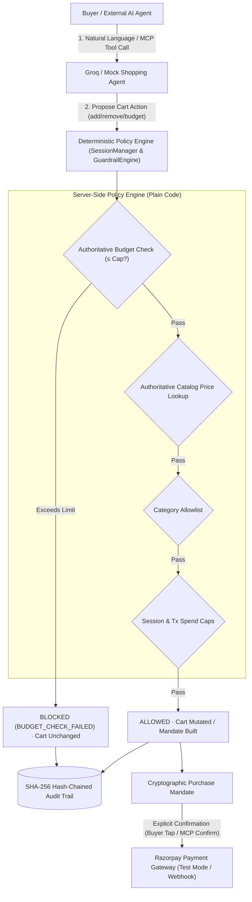

# Kaapi Copilot — Build Log & Project Spec

> **Original spec date:** 2026-08-26  
> **Last updated:** 2026-09-05  
> **Status:** ✅ Complete — 74 tests passing, deployed on Railway

---

## Original Brief (Track 01)

Build a working prototype called **Kaapi Copilot** that:

1. **Grows a merchant's revenue** via an AI agent running discovery, recommendation, upselling, and checkout inside a conversation — replacing a static product-listing page.
2. **Makes the merchant transactable by an external AI agent** — not just humans — by exposing catalog and checkout as agent-callable MCP tools.

Every money-moving action must be **explainable, bounded, and gated**, backed by a visible **audit trail**, with **at least one realistic failure handled gracefully**.

---

## Demo Merchant: Kaapi Roasters (D2C Filter Coffee)

| SKU | Item | Price (INR) | Upsell pair |
|---|---|---|---|
| `kr-filter-500` | Filter Coffee Powder, 500g | ₹450 | → `kr-steel-filter` |
| `kr-arabica-250` | Single-Origin Arabica Beans, 250g | ₹380 | → `kr-dripper` |
| `kr-steel-filter` | South Indian Steel Filter Set | ₹650 | — |
| `kr-dripper` | Pour-over Dripper | ₹900 | — |
| `kr-subscription` | Monthly Coffee Subscription (2 bags) | ₹700/mo | — |
| `kr-frother` | Milk Frother | ₹550 | — |
| `kr-filters-100` | Reusable Filter Papers, pack of 100 | ₹250 | → `kr-dripper` |

---

## Architecture



---

## Tech Stack (as built)

| Component | Technology |
|---|---|
| **Backend** | Python 3.12, FastAPI, Uvicorn |
| **Agent Intelligence** | Groq Chat Completions (`llama-3.3-70b-versatile`) + `MockShoppingAgent` fallback |
| **Payments** | Razorpay Python SDK — Test Mode Payment Links & Webhooks + `MockPaymentProvider` fallback |
| **Audit & Integrity** | SQLite (WAL mode) + SHA-256 hash-chained audit trail |
| **Frontend** | Pure HTML5 / CSS3 / Vanilla JS — zero build dependencies, dark mode |
| **Deployment** | Railway (backend) + Vercel (frontend) |

---

## Build Order (completed)

| Step | What was built | Commit |
|---|---|---|
| 1 | Project scaffold, config, data models, catalog seed data | `285e163` |
| 2 | MockPaymentProvider + RazorpayPaymentProvider abstraction | `285e163` |
| 3 | Guardrail / Mandate Engine (5-stage policy checks) | `285e163` |
| 4 | Order Service, audit trail (hash-chained), session manager | `285e163` |
| 5 | FastAPI backend — all Journey A & B endpoints | `285e163` |
| 6 | Frontend chat UI — dark mode, SSE streaming, cart panel, guardrail status | `f63358b` |
| 7 | Razorpay test-mode integration — real payment links, webhook verification | `8f7095d` |
| 8 | Graceful failure flow — UPI decline, staggered recovery timeline UI | `200b3f6` |
| 9 | Journey B — MCP tool surface + live tool-call log panel | `8a339f0` |
| 10 | Hard budget enforcement, remove_from_cart, conversation state machine | `3d2d705` |
| 11 | SQLite-backed session/spend state (replaces in-memory dict) | `33e780d` |
| 12 | Groq agent — reference resolution (`it`/`that`/ordinal/`both`) | `2f83a34` |
| 13 | Idempotent checkout — blocks duplicate orders and retry-after-failure | `23a9844` |
| 14 | Prompt-injection boundary tests (Groq tool boundary) | `d22d421` |
| 15 | Upsell gating function + `UPSELL_SUGGESTED` audit event | `eddfef6` |
| 16 | Static mandate example on page load, favicon | `1f8a664`, `9f3d109` |
| 17 | Fix real Razorpay payment links (payload fix, auto-open in new tab) | `7439aad` |
| 18 | README updated — 74 tests, per-module breakdown, correct model name | `bf92da9` |

---

## Guardrail Contract — 5-Stage Mandate Policy

Before any Razorpay call, `MandateEngine.build_mandate()` runs 5 deterministic code-level checks (not prompt instructions):

1. **`cart_not_empty`** — cart must contain at least one item
2. **`price_matches_catalog`** — every line-item price is re-read from catalog at mandate-build time; LLM-invented prices are rejected
3. **`category_allowlist`** — all SKUs must belong to approved merchant categories
4. **`transaction_spend_cap`** — total must be ≤ ₹3,000 (configurable via `TRANSACTION_SPEND_CAP_PAISE`)
5. **`buyer_budget_check`** — total must not exceed the buyer's active session budget

**Invariant:** Only a `confirmed` mandate may trigger `create_order` / `create_payment_link`. There is no code path from raw LLM output to a Razorpay call.

```json
{
  "mandate_id": "mnd_8f2a...",
  "session_id": "sess_193c...",
  "buyer_ref": "web_buyer",
  "items": [
    { "sku": "kr-filter-500", "name": "Filter Coffee Powder 500g", "qty": 1, "unit_price_paise": 45000 },
    { "sku": "kr-steel-filter", "name": "South Indian Steel Filter Set", "qty": 1, "unit_price_paise": 65000 }
  ],
  "currency": "INR",
  "total_paise": 110000,
  "policy_checks": [
    { "rule": "cart_not_empty", "status": "pass" },
    { "rule": "price_matches_catalog", "status": "pass" },
    { "rule": "category_allowlist", "status": "pass" },
    { "rule": "transaction_spend_cap", "limit_paise": 300000, "status": "pass" },
    { "rule": "buyer_budget_check", "status": "pass" }
  ],
  "confirmation": { "method": "buyer_tap", "status": "confirmed" }
}
```

---

## Razorpay Integration (Test Mode)

- **Payment provider:** `RazorpayPaymentProvider` wraps the official `razorpay` Python SDK
- **Flow:** `create_order` → `create_payment_link` → buyer pays via `rzp.io/...` link → Razorpay sends webhook → `verify_webhook_signature()` (HMAC-SHA256) → order state updated
- **Fallback:** If Razorpay test-mode quota is hit, `MockPaymentProvider` is used transparently and logged to stderr
- **Test UPI handles:** `success@razorpay` (instant success), `failure@razorpay` (instant decline)
- **Demo webhook simulation:** `POST /api/demo/trigger-webhook?order_id=...&outcome=success|failure`
- **Webhook security:** `X-Razorpay-Signature` verified via `hmac.compare_digest` before any state is trusted

---

## Failure Scenarios (both demonstrated)

### 1. UPI Payment Decline
1. Confirmed mandate → Razorpay order + payment link created
2. Buyer pays with `failure@razorpay` (or demo trigger button)
3. Webhook received: `payment.failed`
4. Order → `payment_failed` (never `paid`, no duplicate on retry)
5. Cart held for 10 minutes (configurable via `CART_HOLD_MINUTES`)
6. Staggered recovery timeline rendered in UI
7. All steps written to hash-chained audit trail

### 2. Guardrail Rejection (spend cap breach)
1. Buyer/agent attempts to add item that pushes cart over budget
2. `add_to_cart_validated` returns `ITEM_EXCEEDS_BUDGET` immediately
3. Cart remains unchanged; `BUDGET_CHECK_FAILED` logged to audit trail
4. Agent explains policy and offers to remove items or adjust

---

## Test Suite — 74 tests, 9 modules (all passing ✅)

```
python -m pytest kaapi_copilot/test/ -v
```

| Module | Tests | Coverage |
|---|---|---|
| `test_analytics.py` | 11 | AOV lift, upsell attach rate, orders paid |
| `test_api_regressions.py` | 6 | API endpoint contracts, webhook mapping |
| `test_budget_and_cart.py` | 25 | Hard budget enforcement, bulk pruning, remove-from-cart |
| `test_groq_prompt_injection_boundary.py` | 5 | Prompt injection resistance, LLM boundary isolation |
| `test_guardrails.py` | 7 | 5-stage mandate policy, spend caps, catalog price re-verification |
| `test_idempotency_and_injection.py` | 7 | Duplicate checkout prevention, idempotent webhooks |
| `test_lifecycle_regressions.py` | 4 | Full session lifecycle, payment failure recovery, cart hold |
| `test_reference_resolution.py` | 3 | Natural language references (`it`/`that`/ordinal/`both`) |
| `test_upsell.py` | 6 | Upsell suggestion, one-per-turn cap, budget-aware gating |
| **Total** | **74** | **All passing** |

---

## Environment Variables

| Variable | Required | Description |
|---|---|---|
| `PAYMENT_MODE` | Yes | `razorpay` or `mock` |
| `RAZORPAY_KEY_ID` | If razorpay | Test key from Razorpay Dashboard |
| `RAZORPAY_KEY_SECRET` | If razorpay | Test secret |
| `RAZORPAY_WEBHOOK_SECRET` | If razorpay | For HMAC webhook verification |
| `AGENT_MODE` | Yes | `groq` or `mock` |
| `GROQ_API_KEY` | If groq | Groq API key |
| `GROQ_MODEL` | No | Default: `llama-3.3-70b-versatile` |
| `SESSION_SPEND_CAP_PAISE` | No | Default: `500000` (₹5,000) |
| `TRANSACTION_SPEND_CAP_PAISE` | No | Default: `300000` (₹3,000) |
| `CART_HOLD_MINUTES` | No | Default: `10` |
| `WEBHOOK_BASE_URL` | No | Default: `http://localhost:8000` |
| `ALLOWED_ORIGINS` | No | Default: `*` (restrict in production) |

---

## Protocol Alignment

| This project | Aligned with |
|---|---|
| `PurchaseMandate` — explicit authorization object before any payment | Google AP2 *mandate* concept |
| Explicit buyer tap / `confirm_and_pay` MCP call required | NPCI UAP *user-authorization pattern* |
| `/api/mcp/*` tool surface for external AI buyers | OpenAI/Stripe ACP, x402 agentic commerce |

---

## Known Limitations

- Session spend state is in SQLite but not shared across multiple Uvicorn worker processes (single-process demo deployment only)
- MCP routes accept `session_id` as a plain field with no bearer-token ownership check (acceptable for test-mode demo; production would require auth)
- Razorpay test-mode has a hard cap of 30 payment links per account (falls back to mock transparently; reset by regenerating API keys in dashboard)
