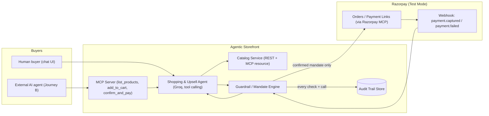

# AI Growth & Agentic Commerce — Agentic Storefront for Kaapi Roasters

AI Growth & Agentic Commerce turns a small D2C filter-coffee brand's storefront into an AI-agent-operated,
transactable business: a Groq-powered shopping agent runs discovery → recommendation →
one catalog-defined upsell → a guardrail-gated **Purchase Mandate** → Razorpay checkout for
human buyers (Journey A), and the identical catalog/cart/checkout is exposed as MCP-style
tools so an **external AI agent can shop and pay with no human in the loop** (Journey B).
In a smoke-test run, the agent-assisted average order value was **₹1,100 vs. a ₹450 baseline
single-item purchase — a 144% AOV lift** driven entirely by the one-upsell-per-turn rule.

Runs fully in **MOCK MODE** out of the box — no API keys required — and switches to live
Groq + Razorpay test-mode calls the moment real credentials are present.

## Architecture



## Provider abstraction (mock vs. real, swappable without touching business logic)

| Layer | Mock (default) | Real |
|---|---|---|
| Payments | `MockPaymentProvider` — in-memory orders/links/webhooks, recognizes `success@razorpay` / `failure@razorpay` | `RazorpayPaymentProvider` — official `razorpay` SDK, test-mode keys |
| Shopping agent | `MockShoppingAgent` — deterministic keyword matching against the catalog | `GroqShoppingAgent` — Groq Chat Completions API, tool calling, bounded loop |

Selected via env vars, with automatic fallback to mock if secrets are missing:

```
PAYMENT_MODE=mock            # or "razorpay"
AGENT_MODE=mock               # or "groq"
GROQ_API_KEY=...
RAZORPAY_KEY_ID=...
RAZORPAY_KEY_SECRET=...
RAZORPAY_WEBHOOK_SECRET=...
```

For persistent local configuration, copy `backend/.env.example` to `backend/.env` and
fill in the keys once. The backend loads `backend/.env` automatically on every start;
the file is ignored by Git. Use Razorpay **Test Mode** credentials only.

## Setup & run locally

```bash
cd kaapi_copilot/backend
pip install -r requirements.txt
uvicorn app.api.main:app --reload --port 8000
```

Open `kaapi_copilot/frontend/index.html` directly in a browser (it calls
`http://localhost:8000/api/*`). No build step, no separate catalog seed script —
`SEED_PRODUCTS` in `app/data/catalog_data.py` loads deterministically on import.

Run tests:
```bash
pytest kaapi_copilot/test/test_guardrails.py -v
```

## How the guardrails work

`MandateEngine.build_mandate()` is plain code, not a prompt instruction:

1. **Every line price is re-read from the catalog**, never taken from agent-stated text.
   A mismatch is a hard block (`price_matches_catalog: fail`) — never silently corrected.
2. **Session + per-transaction spend caps** are checked before any Razorpay call. A breach
   is a hard stop producing a `blocked` mandate — never a soft warning.
3. **Every mandate is written to the hash-chained audit trail before any Razorpay call.**
   `AuditTrail.verify_chain()` recomputes every SHA-256 link; tampering is detectable.
4. **Only a `confirmed` mandate may reach `OrderService.checkout()`** — the sole code path
   allowed to call `create_order` / `create_payment_link`. Journey A confirms via an explicit
   buyer tap; Journey B confirms via the explicit `confirm_and_pay` MCP tool call. There is no
   route from raw agent/LLM output straight to a payment call.
5. **Webhook-driven state only.** Orders flip to `paid` only from `payment.captured`; a
   `payment.failed` webhook holds the cart for 10 minutes and never marks the order paid.

## Demo flow

1. Chat: *"I want good filter coffee, nothing fancy"* → agent recommends Filter Coffee
   Powder (₹450) and proposes the catalog-defined upsell, the Steel Filter Set (₹650).
2. *"sure, add it"* → cart now ₹1,100.
3. Build Mandate → policy checks all `pass` → Proceed to Pay → checkout → simulate
   `success@razorpay` → order `paid`.
4. Failure demo: same flow, simulate `failure@razorpay` → order `payment_failed`, cart held,
   never `paid`.
5. Guardrail demo: push a cart over ₹3,000 → mandate `blocked` before any Razorpay call.
6. Journey B: click "Run Journey B demo" — an external agent calls `list_products`,
   `add_to_cart`, `create_checkout_mandate`, `confirm_and_pay` with zero human typing.
7. Ops panel: live audit trail + hash-chain validity + revenue analytics.

## API endpoints

- `GET /api/health` — mode summary
- `POST /api/chat` — Journey A conversational turn
- `POST /api/mandates/build`, `POST /api/mandates/confirm` — guardrail-gated mandate lifecycle
- `POST /api/checkout` — confirmed-mandate-only order + payment link creation
- `POST /api/webhooks/razorpay` — signature-verified webhook receiver
- `POST /api/demo/trigger-webhook` — demo-only mock webhook trigger
- `GET /api/audit`, `GET /api/analytics` — Ops panel data
- `GET /api/mcp/list_products`, `GET /api/mcp/get_product`, `POST /api/mcp/add_to_cart`,
  `GET /api/mcp/get_cart`, `POST /api/mcp/create_checkout_mandate`,
  `POST /api/mcp/confirm_and_pay` — Journey B MCP-style tool surface

## Switching to live Groq + Razorpay test mode

1. Set `GROQ_API_KEY` → `AGENT_MODE=groq` activates `GroqShoppingAgent`.
2. Generate Razorpay **test-mode** keys (Dashboard → Test Mode → Settings → API Keys), set
   `RAZORPAY_KEY_ID` / `RAZORPAY_KEY_SECRET` / `RAZORPAY_WEBHOOK_SECRET`, then
   `PAYMENT_MODE=razorpay`. Point Razorpay's webhook settings at
   `<public_url>/api/webhooks/razorpay`.
3. Use UPI test handles `success@razorpay` / `failure@razorpay` on the real payment link to
   exercise the happy path and the graceful-failure path against Razorpay's real test-mode
   infrastructure.

## Known limitations

- All state (sessions, orders, mandates, MCP carts) is in-memory except the audit log
  (SQLite); restarting the backend clears carts/sessions.
- `GroqShoppingAgent` and `RazorpayPaymentProvider` are implemented but not exercised in
  this environment (no live keys); mock-mode is the verified default path.
- Recurring/subscription billing (`RecurringMandateService`) simulates cycles on demand
  rather than running on a real scheduler.
- No authentication/authorization on the API — this is a demo prototype, not production.
- Campaign orchestrator (abandoned-cart nudges) from the stretch goals is not implemented.
