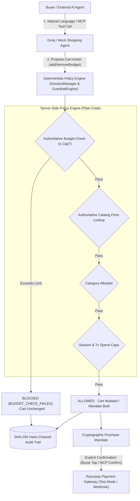

# Kaapi Copilot — AI Growth & Agentic Commerce

**Track 01: Agentic Storefront for Kaapi Roasters (D2C Filter Coffee)**

Kaapi Copilot transforms a D2C filter-coffee brand's storefront into an AI-agent-operated, guardrail-governed, transactable commerce engine. It supports both **Human Buyers (Journey A)** via conversational AI chat and **Autonomous AI Agents (Journey B)** via an MCP-compatible tool surface.

---

## 🛡️ Core Safety & Guardrail Architecture

The fundamental architectural invariant is: **The LLM is NEVER trusted with money, arithmetic, or cart totals.**



---

## 🚀 Key Features

### 1. Hard Server-Side Budget Enforcement
- When a buyer specifies a limit (*"Don't spend more than ₹500"*), the budget is stored authoritatively in session state outside the LLM.
- Every `add_to_cart` call is gated by server-side verification: `current_cart_total + catalog_price <= budget_limit`.
- Over-budget additions are rejected immediately with structured feedback (`ITEM_EXCEEDS_BUDGET`), preserving the cart untouched and logging `BUDGET_CHECK_FAILED` in the audit trail.

### 2. Full Cart Mutation & Contextual Intent
- **Real `remove_from_cart`**: Supports removing items via natural language (*"remove the steel filter"*, *"discard subscription from cart"*) or UI button.
- **Contextual intent disambiguation**: If a subscription is in the cart, *"discard/remove subscription"* removes it from the cart without erroneously triggering subscription-cancellation workflows.
- **Bulk budget pruning**: *"Remove everything above my limit"* selectively drops only items exceeding the budget.

### 3. Conversation State Machine
Session progression is governed by an explicit state machine:
`DISCOVERY` → `CART_BUILDING` → `CHECKOUT_REQUESTED` → `MANDATE_PENDING` → `PAYMENT_PENDING` → `PAYMENT_SUCCESS` / `PAYMENT_FAILED`
When the agent asks *"Would you like to checkout?"* and the buyer says *"yes"*, the agent cleanly initiates checkout rather than restarting product discovery.

### 4. 5-Stage Mandate Policy Engine
Before any payment call can occur, `MandateEngine.build_mandate()` executes 5 deterministic checks:
1. `cart_not_empty`: Cart must contain at least one item.
2. `price_matches_catalog`: Line prices are re-read from the catalog; LLM-invented prices are rejected.
3. `category_allowlist`: All SKUs must belong to approved merchant categories.
4. `transaction_spend_cap` & `session_spend_cap`: Global bounds (₹3,000 / ₹10,000) prevent runaway spend.
5. `buyer_budget_check`: Total must not exceed the buyer's active session budget.

### 5. Dual Journey Architecture
- **Journey A (Conversational UI)**: Real-time chat with Groq (`openai/gpt-oss-120b` or mock), dynamic cart updates, spend-guardrail status banner, explainability decision log, and Razorpay checkout simulation.
- **Journey B (Autonomous MCP Tool Surface)**: Complete MCP API surface (`/api/mcp/*`) allowing external AI buyer agents to autonomously list products, manage carts, build mandates, and confirm payments without human intervention — fully constrained by the same backend guardrails.

---

## 🛠️ Tech Stack & Provider Abstraction

| Component | Technology / Provider |
|---|---|
| **Backend** | Python 3.11+, FastAPI, Uvicorn, Pydantic |
| **Agent Intelligence** | Groq Chat Completions API (`openai/gpt-oss-120b` tool calling) + `MockShoppingAgent` fallback |
| **Payments** | Razorpay Python SDK (Test Mode Payment Links & Webhooks) + `MockPaymentProvider` |
| **Audit & Integrity** | SQLite with WAL mode, SHA-256 Hash Chain |
| **Frontend** | Pure HTML5/CSS3/Vanilla JS (zero build dependencies, dark mode) |

---

## 🏃 Running Locally & Testing

```powershell
# Run the complete test suite (37 tests)
python -m pytest kaapi_copilot/test/ -v
```
